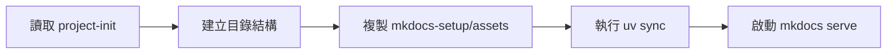
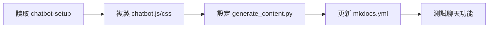
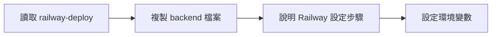
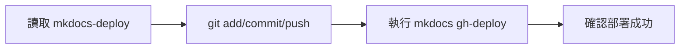
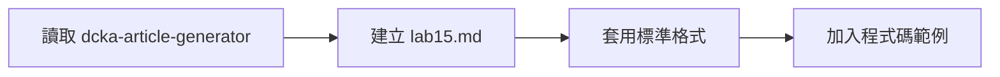
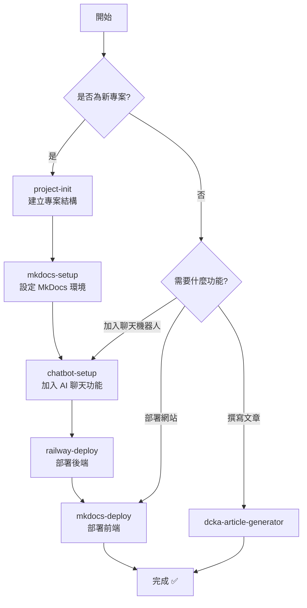

# .agent 資料夾說明

此資料夾用於存放 AI 助手的 Skills，讓新專案可以快速建立 MkDocs + AI Chatbot 網站。

---

## 💬 使用案例

### 案例 1：建立新的 MkDocs 專案

**使用者輸入：**
> 幫我建立一個新的 MkDocs 專案

**AI 會執行：**


---

### 案例 2：加入 AI 聊天機器人

**使用者輸入：**
> 幫我的網站加入 AI 聊天機器人

**AI 會執行：**


---

### 案例 3：部署後端到 Railway

**使用者輸入：**
> 幫我把後端部署到 Railway

**AI 會執行：**


---

### 案例 4：部署網站到 GitHub Pages

**使用者輸入：**
> 幫我部署網站

**AI 會執行：**


---

### 案例 5：撰寫新的課程文章

**使用者輸入：**
> 幫我撰寫 LAB 15 的課程內容

**AI 會執行：**


---

## 🔄 完整專案建置流程



---

## 🚀 快速啟動新專案（5 分鐘）

### 步驟 1：建立專案

```bash
mkdir my-course-site && cd my-course-site
git init
uv python pin 3.12
mkdir -p docs/assets/css docs/assets/js docs/assets/images hooks backend
```

### 步驟 2：複製範本檔案

```bash
# 前端 (MkDocs)
cp .agent/skills/mkdocs-setup/assets/pyproject.toml ./
cp .agent/skills/mkdocs-setup/assets/mkdocs.yml ./
cp .agent/skills/mkdocs-setup/assets/index.md ./docs/
cp .agent/skills/mkdocs-setup/assets/extra.css ./docs/assets/css/

# Chatbot
cp .agent/skills/chatbot-setup/assets/chatbot.js ./docs/assets/js/
cp .agent/skills/chatbot-setup/assets/chatbot.css ./docs/assets/css/
cp .agent/skills/chatbot-setup/assets/generate_content.py ./hooks/

# 後端 (Railway)
cp .agent/skills/railway-deploy/assets/* ./backend/
```

### 步驟 3：修改設定（搜尋 TODO）

**mkdocs.yml：**
```yaml
site_name: 你的網站名稱
site_url: https://YOUR-USERNAME.github.io/YOUR-REPO-NAME/
```

**chatbot.js：**
```javascript
window.BACKEND_API_URL = "https://YOUR-APP.up.railway.app";
const repoName = '/YOUR-REPO-NAME';
```

### 步驟 4：測試

```bash
uv sync
uv run mkdocs serve
```

### 步驟 5：部署

```bash
git add . && git commit -m "Initial commit" && git push -u origin main
uv run mkdocs gh-deploy --force
```

---

## 📁 Skills 結構（官方格式）

```
my-skill/
├── SKILL.md       # Required: instructions + metadata
├── scripts/       # Optional: executable code
├── references/    # Optional: documentation
└── assets/        # Optional: templates, resources
```

```
.agent/skills/
├── project-init/         # 🌟 快速啟動指南
├── mkdocs-setup/         # MkDocs + UV 環境 (4 個範本)
├── chatbot-setup/        # AI Chatbot (3 個範本)
├── railway-deploy/       # Railway 後端 (4 個範本)
├── mkdocs-deploy/        # GitHub Pages 部署
└── dcka-article-generator/  # 課程文章格式
```

---

## 📋 範本清單（共 11 個）

| Skill | assets/ 檔案 | 複製到 |
|-------|-------------|--------|
| **mkdocs-setup** | `mkdocs.yml` | `./` |
| | `pyproject.toml` | `./` |
| | `index.md` | `./docs/` |
| | `extra.css` | `./docs/assets/css/` |
| **chatbot-setup** | `chatbot.js` | `./docs/assets/js/` |
| | `chatbot.css` | `./docs/assets/css/` |
| | `generate_content.py` | `./hooks/` |
| **railway-deploy** | `chat_server.py` | `./backend/` |
| | `pyproject.toml` | `./backend/` |
| | `Dockerfile` | `./backend/` |
| | `.python-version` | `./backend/` |

---

## ✅ 驗證清單

- [ ] `uv run mkdocs serve` 正常啟動
- [ ] 右下角出現聊天圖示
- [ ] GitHub Pages 部署成功
- [ ] Railway 後端部署成功
- [ ] AI 可正常回覆

---

## 📖 Skills 觸發關鍵字

| Skill | 關鍵字 |
|-------|--------|
| **project-init** | 新專案、從零開始、初始化 |
| **mkdocs-setup** | UV、MkDocs、環境設定 |
| **chatbot-setup** | chatbot、AI 助教、聊天機器人 |
| **railway-deploy** | Railway、後端部署 |
| **mkdocs-deploy** | deploy、部署網站 |
| **dcka-article-generator** | 撰寫課程、新增章節 |
