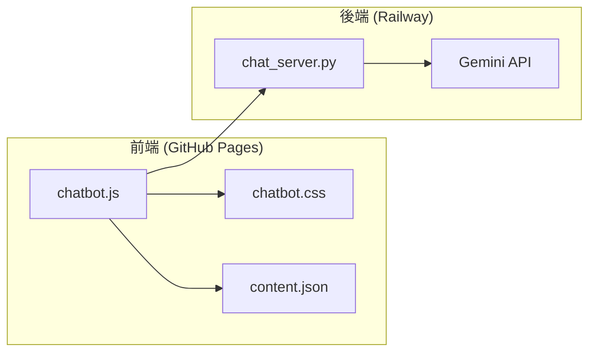

# AI Chatbot 設定與維護 Skill

## 概述

本 Skill 定義 DCKA 課程網站 AI Chatbot 的架構、設定與維護流程，包含完整的程式碼模板。

## 觸發條件

當使用者提到以下關鍵字時啟用：
- Chatbot、聊天機器人、AI 助教
- Gemini API、LLM
- 歡迎訊息、System Prompt

---

## 架構概覽



---

## 檔案結構

```
project/
├── docs/
│   └── assets/
│       ├── css/
│       │   ├── chatbot.css      # 聊天室樣式
│       │   └── extra.css        # 網站額外樣式
│       └── js/
│           └── chatbot.js       # 聊天室邏輯
├── hooks/
│   └── generate_content.py      # 自動生成 content.json
├── backend/
│   ├── chat_server.py           # FastAPI 後端
│   ├── Dockerfile
│   └── pyproject.toml
└── mkdocs.yml
```

範本檔案位於本 Skill 的 `assets/` 目錄。

---

## 1. MkDocs 設定 (mkdocs.yml)

在 `mkdocs.yml` 加入：

```yaml
# Hooks - 自動生成 content.json
hooks:
  - hooks/generate_content.py

# 載入 Chatbot JS 和 CSS
extra_javascript:
  - https://cdn.jsdelivr.net/npm/marked/marked.min.js
  - assets/js/chatbot.js

extra_css:
  - assets/stylesheets/extra.css
  - assets/css/chatbot.css
```

---

## 2. generate_content.py (完整程式碼)

建立 `hooks/generate_content.py`：

```python
"""
MkDocs Hook: 在 build 完成後自動生成 content.json
這個檔案會被 MkDocs 自動載入並執行
"""

import json
from pathlib import Path


def on_post_build(config, **kwargs):
    """
    在 MkDocs build 完成後執行
    生成 content.json 供 chatbot 使用
    """
    
    site_dir = Path(config['site_dir'])
    docs_dir = Path(config['docs_dir'])
    
    print("=" * 50)
    print("Generating content.json...")
    
    content = []
    
    for md_file in sorted(docs_dir.rglob('*.md')):
        try:
            with open(md_file, 'r', encoding='utf-8') as f:
                text = f.read()
            
            site_url = config.get('site_url', '').rstrip('/')
            rel_path = md_file.relative_to(docs_dir)
            url_path = '/' + str(rel_path).replace('\\', '/').replace('.md', '/')
            
            if url_path.endswith('index/'):
                url_path = url_path[:-6]
            if url_path == '/index/':
                url_path = '/'
            
            full_url = site_url + url_path
            
            # 提取標題
            title = md_file.stem.replace('-', ' ').replace('_', ' ').title()
            lines = text.split('\n')
            for line in lines:
                if line.strip().startswith('# '):
                    title = line.strip()[2:].strip()
                    break
            
            content.append({
                'title': title,
                'url': full_url,
                'content': text
            })
            
            print(f"  [OK] {md_file.name} -> {full_url}")
            
        except Exception as e:
            print(f"  [ERROR] {md_file}: {e}")
    
    output_file = site_dir / 'content.json'
    
    with open(output_file, 'w', encoding='utf-8') as f:
        json.dump(content, f, ensure_ascii=False, indent=2)
    
    print("=" * 50)
    print(f"[SUCCESS] Generated {output_file}")
    print(f"[SUCCESS] Processed {len(content)} pages")
```

---

## 3. chatbot.js 關鍵設定

### API URL (第 14 行)
```javascript
window.BACKEND_API_URL = "https://your-app.up.railway.app";
```

### content.json URL (第 16-19 行)
```javascript
const isGitHubPages = window.location.hostname.includes('github.io');
const repoName = '/your-repo-name';
const basePath = isGitHubPages ? repoName : '';
window.ALL_CONTENT_URL = `${basePath}/content.json`;
```

### 歡迎訊息 (第 21 行)
```javascript
window.INITIAL_PROMPT = "嗨！我是 DCKA 課程助教 🕶️\n\n我可以幫你解答 Docker 與 Kubernetes 的問題。\n\n試試問我：\n- 如何安裝 Docker？\n- 什麼是 Kubernetes？";
```

### System Prompt (第 188-210 行)
```javascript
const systemInstruction = `你是 DCKA 課程的 AI 助教。

## 回答規則
1. **語言**：使用繁體中文回答
2. **連結**：使用文件中的完整 URL
3. **格式**：使用 Markdown 格式
4. **程式碼**：使用 \`\`\`bash 格式
5. **忽略特殊語法**：不要輸出 :octicons-xxx: 等 icon 語法

## 連結格式
- 正確：[LAB 02](https://example.com/lab02/)
- 錯誤：[LAB 02](/lab02/)

## 課程文件
${allDocsContent}`;
```

### 連結修正函數 (第 61-85 行)
```javascript
function fixBrokenLinks(text) {
    const baseUrl = 'https://caocharles.github.io/dcka-class-notes';
    
    // 修正相對路徑
    text = text.replace(/\[([^\]]+)\]\(\/(?!dcka-class-notes)([^)]+)\)/g, 
        `[$1](${baseUrl}/$2)`);
    
    // 修正重複路徑
    text = text.replace(/dcka-class-notes\/dcka-class-notes/g, 
        'dcka-class-notes');
    
    return text;
}
```

---

## 4. chatbot.css 配色設定

### 淺色模式 (第 6-32 行)
```css
:root {
    --chatbot-header-bg: linear-gradient(135deg, #512da8 0%, #673ab7 100%);
    --chatbot-header-text: #ffffff;
    --chatbot-button-bg: #673ab7;
    --chatbot-user-bubble-border: #673ab7;
    --chatbot-link-color: #512da8;
}
```

### 深色模式 (第 34-60 行)
```css
[data-md-color-scheme="slate"] {
    --chatbot-header-bg: linear-gradient(135deg, #0f0f17 0%, #1e1e2e 100%);
    --chatbot-bot-bubble-bg: #3a3a4f;
    --chatbot-link-color: #b39ddb;
}
```

### 按鈕圖示 (chatbot.js 第 252-266 行)
```html
<!-- 垃圾桶圖示 - 清除歷史 -->
<button id="clear-history-btn" title="清除歷史">
  <svg viewBox="0 0 24 24">
    <path d="M6 19c0 1.1.9 2 2 2h8c1.1 0 2-.9 2-2V7H6v12zM19 4h-3.5l-1-1h-5l-1 1H5v2h14V4z"/>
  </svg>
</button>

<!-- 全螢幕圖示 -->
<button id="toggle-fullscreen-btn" title="全螢幕">
  <svg viewBox="0 0 24 24">
    <path d="M7 14H5v5h5v-2H7v-3zm-2-4h2V7h3V5H5v5zm12 7h-3v2h5v-5h-2v3zM14 5v2h3v3h2V5h-5z"/>
  </svg>
</button>
```

---

## 5. 維護指南

### 更新歡迎訊息
編輯 `chatbot.js` 第 21 行的 `INITIAL_PROMPT`

### 更新 System Prompt
編輯 `chatbot.js` 第 188-210 行的 `systemInstruction`

### 更新配色
編輯 `chatbot.css` 中的 CSS 變數

### 更新 AI Model
編輯 `backend/chat_server.py` 的 `MODEL_ID`

---

## 6. 故障排除

| 問題 | 解決方式 |
|------|----------|
| 聊天室沒出現 | 檢查 mkdocs.yml 的 extra_javascript |
| AI 回覆錯誤 | 檢查 Railway logs 和 API Key |
| 連結格式錯誤 | 更新 fixBrokenLinks() |
| content.json 缺失 | 確認 hooks 設定正確 |

---

## 相關 Skills

- **railway-deploy** - 後端部署詳細步驟
- **mkdocs-deploy** - 前端部署到 GitHub Pages
