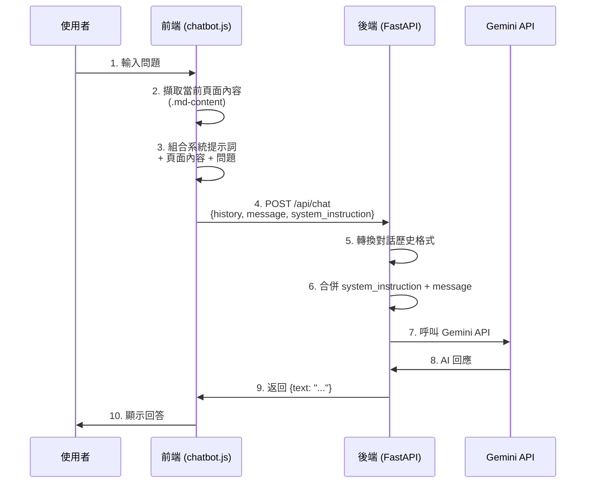
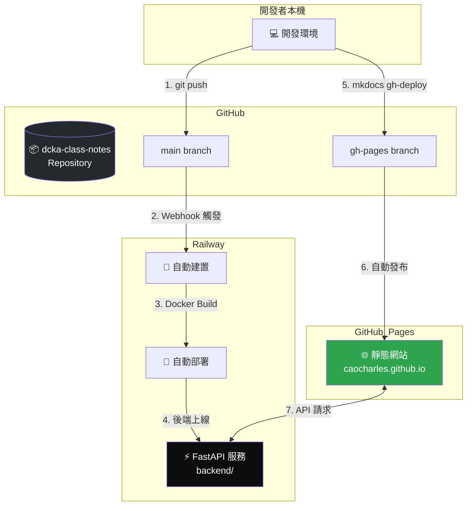

# AI 聊天機器人後端服務

本目錄包含 DCKA 課程文件網站的 AI 聊天機器人後端服務，使用 FastAPI 建置並整合 Google Gemini API。


---

## 📌 為什麼需要後端服務？

直接在前端呼叫 Gemini API 會導致 **API Key 外洩**，因為：

1. JavaScript 程式碼可在瀏覽器開發者工具中被檢視
2. API Key 一旦外洩，可能被濫用產生高額費用
3. 無法控制誰可以使用你的 API 配額

**解決方案**：建立後端 Proxy 服務，將 API Key 安全地存放在伺服器端。

---

## 🏗️ 系統架構

```
┌─────────────────────────────────────────────────────────────────────────┐
│                            使用者瀏覽器                                   │
└─────────────────────────────────────────────────────────────────────────┘
                                    │
                                    │ 1. 訪問 GitHub Pages
                                    ▼
┌─────────────────────────────────────────────────────────────────────────┐
│                   GitHub Pages (前端靜態網站)                            │
│  ┌─────────────┐  ┌─────────────┐  ┌─────────────┐                     │
│  │  MkDocs     │  │ chatbot.js  │  │ chatbot.css │                     │
│  │  HTML 頁面  │  │  聊天邏輯   │  │  聊天樣式   │                     │
│  └─────────────┘  └─────────────┘  └─────────────┘                     │
└─────────────────────────────────────────────────────────────────────────┘
                                    │
                                    │ 2. POST /api/chat
                                    │    (傳送聊天訊息)
                                    ▼
┌─────────────────────────────────────────────────────────────────────────┐
│                     Railway (後端 API 服務)                              │
│  ┌─────────────────────────────────────────────────────────┐           │
│  │  FastAPI (chat_server.py)                               │           │
│  │  - 接收前端請求                                          │           │
│  │  - 組合對話歷史 + 系統指令                                │           │
│  │  - 安全存放 GEMINI_API_KEY                               │           │
│  └─────────────────────────────────────────────────────────┘           │
└─────────────────────────────────────────────────────────────────────────┘
                                    │
                                    │ 3. 呼叫 Gemini API
                                    │    (附帶 API Key)
                                    ▼
┌─────────────────────────────────────────────────────────────────────────┐
│                   Google Cloud (Gemini API)                             │
│  ┌─────────────────────────────────────────────────────────┐           │
│  │  Gemini 2.5 Flash                                      │           │
│  │  - 上下文窗口: 1,000,000 (1M) Tokens                     │           │
│  │  - 生成 AI 回應                                          │           │
│  └─────────────────────────────────────────────────────────┘           │
└─────────────────────────────────────────────────────────────────────────┘
                                    │
                                    │ 4. 返回 AI 回應
                                    ▼
                              使用者瀏覽器
```

---

## 📁 檔案結構

```
backend/
├── chat_server.py      # FastAPI 主程式
├── Dockerfile          # Docker 容器設定 (Python 3.12 + uv)
├── pyproject.toml      # Python 依賴套件（uv 格式）
├── requirements.txt    # Python 依賴套件（pip 格式，備用）
└── README.md           # 本文件
```

---

## 🤖 使用的模型資訊：Gemini 2.5 Flash

本專案使用 **Gemini 2.5 Flash** (`gemini-2.5-flash`)，這是 Google 穩定版的高效能模型。

### 模型規格

- **模型名稱**: Gemini 2.5 Flash
- **Context Window (上下文窗口)**: 1,000,000 (100 萬) Tokens
- **特點**: 
  - 穩定版模型，適合生產環境
  - 高效能，適合 RAG 應用
  - 100 萬 tokens 足以放入數百篇教學文章

### 費用參考 (2026/01)

| 項目 | 價格 (每百萬 Tokens) |
|------|----------------------|
| **Input (輸入)** | **$0.10** |
| **Output (輸出)** | **$0.40** |

### 相關連結

- [Gemini 模型列表與定價](https://ai.google.dev/gemini-api/docs/models/gemini)
- [Google AI Studio](https://aistudio.google.com/)

---

## 🔧 chat_server.py 運作原理

### 1. API 端點

| 端點 | 方法 | 說明 |
|------|------|------|
| `/` | GET | 健康檢查，回傳 `{"status": "ok"}` |
| `/api/chat` | POST | 處理聊天請求 |

### 2. 請求格式

```json
{
  "history": [
    {"role": "user", "parts": [{"text": "什麼是 Docker？"}]},
    {"role": "model", "parts": [{"text": "Docker 是一個容器化平台..."}]}
  ],
  "message": "如何安裝 Docker？",
  "system_instruction": "你是課程助教，請根據以下頁面內容回答..."
}
```

| 欄位 | 說明 |
|------|------|
| `history` | 完整對話歷史（無狀態設計） |
| `message` | 使用者的新訊息 |
| `system_instruction` | RAG 上下文（當前頁面內容） |

### 3. 回應格式

```json
{
  "text": "要安裝 Docker，請執行以下步驟..."
}
```

### 4. 程式碼流程

```python
# 1. 接收請求
@app.post("/api/chat")
async def chat_endpoint(request: ChatRequest):
    
    # 2. 轉換對話歷史格式（user/bot → user/model）
    gemini_history = []
    for msg in request.history:
        role = "user" if msg.role == "user" else "model"
        gemini_history.append({...})
    
    # 3. 建立聊天會話
    chat = model.start_chat(history=gemini_history)
    
    # 4. 組合系統指令 + 使用者訊息
    final_message = f"{system_instruction}\n\nUser: {message}"
    
    # 5. 發送到 Gemini API
    response = chat.send_message(final_message)
    
    # 6. 返回結果
    return {"text": response.text}
```

---

## 🧠 RAG 提示詞與文章串接流程

本聊天機器人使用 **RAG（Retrieval-Augmented Generation）** 技術，將當前頁面內容作為上下文傳遞給 AI，讓回答更精準。

### RAG 資料流程



### 完整 System Prompt 範例（v2.0 - 全站預載版）

> ⚠️ **v2.0 更新**：現在使用 `content.json` 預載全站文件，而非僅抓取當前頁面。

前端 `chatbot.js` 會在使用者開啟聊天視窗時，載入 `content.json` 並組合以下系統提示詞：

```javascript
// 載入全站文件
const res = await fetch('./content.json');
const data = await res.json();

// 組合成 DOCUMENTATION 字串
allDocsContent = data
  .map(doc => `Page: ${doc.title}\nURL: ${doc.url}\nContent:\n${doc.content}`)
  .join("\n\n---\n\n");

// 系統提示詞
const systemInstruction = `你是 DCKA 課程（Docker Containers 與 Kubernetes 系統管理）的 AI 助教。

## 回答規則
1. **語言**：使用繁體中文回答
2. **連結**：當提到相關主題時，提供文章的 Markdown 連結（使用 URL 欄位）
3. **格式**：使用清晰的 Markdown 格式（標題、列點、程式碼區塊）
4. **精準**：優先使用文件內容回答，如果沒有相關內容才用一般知識
5. **程式碼**：提供可執行的命令範例時，使用 \`\`\`bash 格式

## 連結格式範例
當提到某個主題時，這樣提供連結：
- 想了解更多，請參考 [LAB 02 安裝 Docker](/lab02_docker_install/)
- 詳細步驟請見 [Private Registry 建置](/lab05_private_registry/)

## 課程文件
以下是完整的課程文件內容，請根據這些內容回答：

---
${allDocsContent}  // ← 全站 24 個頁面的完整內容
---`;
```

### content.json 生成機制

`content.json` 由 MkDocs Hook 自動生成：

```
hooks/
└── generate_content.py  # 在 mkdocs build 時自動執行
```

**生成流程：**

1. `mkdocs build` 或 `mkdocs gh-deploy` 執行
2. Hook `on_post_build()` 自動觸發
3. 掃描 `docs/` 目錄下所有 `.md` 檔案
4. 輸出 `site/content.json`

### 提示詞組成結構

| 組成部分 | 來源 | 說明 |
|----------|------|------|
| **角色設定** | 寫死在程式碼 | "你是 DCKA 課程的 AI 助教" |
| **回答規則** | 寫死在程式碼 | 繁體中文、提供連結、格式要求 |
| **全站文件** | `content.json` (動態載入) | 24 個頁面的完整 Markdown 內容 |
| **對話歷史** | sessionStorage | 保持對話上下文連貫 |

### 後端如何處理提示詞

```python
# chat_server.py 第 77-80 行
final_message = request.message
if request.system_instruction:
    # 將 RAG 上下文與使用者問題合併
    final_message = f"{request.system_instruction}\n\nUser Question: {request.message}"
```

---

## 🔄 CI/CD：Railway 與 GitHub 互動流程



### 部署流程說明

| 步驟 | 動作 | 說明 |
|------|------|------|
| 1 | `git push` | 推送程式碼到 GitHub main 分支 |
| 2 | Webhook | Railway 偵測到變更自動觸發 |
| 3 | Docker Build | Railway 執行 `backend/Dockerfile` |
| 4 | 自動部署 | 後端服務更新上線 |
| 5 | `mkdocs gh-deploy` | 建置並推送到 gh-pages 分支 |
| 6 | GitHub Pages | 自動發布靜態網站 |
| 7 | API 請求 | 前端透過 HTTPS 呼叫後端 API |

---

## 🚀 本地開發

### 1. 設定環境變數

在專案根目錄建立 `.env` 檔案：

```
GEMINI_API_KEY=your_api_key_here
```

> 📌 **取得 API Key**：前往 [Google AI Studio](https://aistudio.google.com/apikey) 建立

### 2. 啟動後端服務

```bash
# 方法 1：使用 uv（從專案根目錄）
uv run uvicorn backend.chat_server:app --reload --port 8001

# 方法 2：進入 backend 目錄
cd backend
pip install -r requirements.txt
uvicorn chat_server:app --reload --port 8001
```

### 3. 測試 API

```bash
# 健康檢查
curl http://localhost:8001/

# 測試聊天
curl -X POST http://localhost:8001/api/chat \
  -H "Content-Type: application/json" \
  -d '{
    "history": [],
    "message": "什麼是 Docker？",
    "system_instruction": ""
  }'
```

---

## ☁️ 部署到 Railway（免費方案）

Railway 提供每月 **$5 免費額度**，適合個人專案使用。

### Step 1：建立 Railway 帳號

1. 前往 [Railway.app](https://railway.app/)
2. 使用 GitHub 帳號登入

### Step 2：建立新專案

1. 點選 **New Project**
2. 選擇 **Deploy from GitHub repo**
3. 選擇你的 `dcka-class-notes` Repository
4. 授權 Railway 存取

### Step 3：設定部署目錄

Railway 預設會部署整個 Repository，但我們只需要 `backend` 目錄：

1. 進入專案 **Settings**
2. 找到 **Root Directory**
3. 設定為：`backend`


### Step 4：設定環境變數

1. 進入專案 **Variables** 標籤
2. 點選 **New Variable**
3. 新增：

| Variable | Value |
|----------|-------|
| `GEMINI_API_KEY` | `your_api_key_here` |

### Step 5：確認啟動指令

Railway 會自動偵測 Dockerfile，但你也可以手動設定：

1. 進入 **Settings** → **Deploy**
2. 確認 Start Command：

```bash
uvicorn chat_server:app --host 0.0.0.0 --port $PORT
```

### Step 6：部署並取得 URL

1. Railway 會自動開始部署
2. 部署完成後，點選 **Settings** → **Networking**
3. 點選 **Generate Domain** 取得公開網址

本專案網址：`https://dcka-class-notes-production.up.railway.app`

### Step 7：更新前端 API URL

編輯 `docs/assets/js/chatbot.js`，將第 47 行改為：

```javascript
// 修改前（本地開發）
window.BACKEND_API_URL = window.BACKEND_API_URL || "http://localhost:8001";

// 修改後（生產環境）
window.BACKEND_API_URL = window.BACKEND_API_URL || "https://dcka-class-notes-production.up.railway.app";
```

### Step 8：重新部署 GitHub Pages

```bash
uv run mkdocs gh-deploy --force
```

---

## 💰 Railway 免費額度說明

| 項目 | 免費額度 |
|------|----------|
| 每月執行時間 | 500 小時 |
| 每月費用 | $5 |
| RAM | 512 MB |
| vCPU | 共享 |

> ⚠️ **注意**：免費方案的服務會在閒置時「睡眠」，首次請求可能需要幾秒鐘喚醒。

### 降低使用量的技巧

1. **使用 Starter Plan**：新帳號自動獲得 $5 額度
2. **服務會自動睡眠**：閒置時不消耗資源
3. **監控使用量**：在 Dashboard 查看每月消耗

---

## 🔒 安全性考量

### CORS 設定

目前 `chat_server.py` 設定為允許所有來源（開發方便）：

```python
allow_origins=["*"]  # 開發環境
```

**生產環境建議**：限制只允許你的網站：

```python
allow_origins=[
    "https://caocharles.github.io",
    "http://localhost:8000"
]
```

### API Key 保護

- ✅ API Key 存放在 Railway 環境變數中
- ✅ 不納入 Git 版控（在 `.gitignore` 中）
- ✅ 前端無法直接存取 API Key

---

## 🐛 疑難排解

### Q1: Railway 顯示 "Build Failed"

**原因**：可能是 Dockerfile 或 requirements.txt 問題

**解決**：
1. 檢查 Railway 的 Build Logs
2. 確認 `requirements.txt` 套件名稱正確
3. 本地先測試 Docker 建置：

```bash
cd backend
docker build -t test-backend .
docker run -p 8001:8000 -e GEMINI_API_KEY=xxx test-backend
```

### Q2: 前端顯示 "CORS Error"

**原因**：後端 CORS 設定未包含前端網址

**解決**：修改 `chat_server.py` 的 `allow_origins`

### Q3: Railway 服務回應很慢

**原因**：免費方案服務會睡眠

**解決**：
- 這是正常現象，首次請求需要喚醒
- 升級付費方案可避免睡眠

### Q4: Gemini API 返回錯誤

**原因**：API Key 無效或配額用盡

**解決**：
1. 確認 Railway 環境變數設定正確
2. 到 Google AI Studio 檢查 API 使用狀況
3. 確認 API Key 未過期

---

## 📚 相關資源

- [FastAPI 官方文件](https://fastapi.tiangolo.com/)
- [Railway 官方文件](https://docs.railway.app/)
- [Google Gemini API 文件](https://ai.google.dev/gemini-api/docs)
- [Uvicorn 官方文件](https://www.uvicorn.org/)
