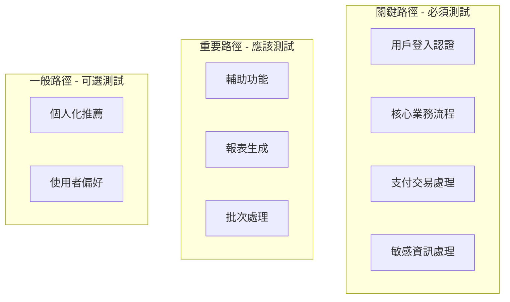
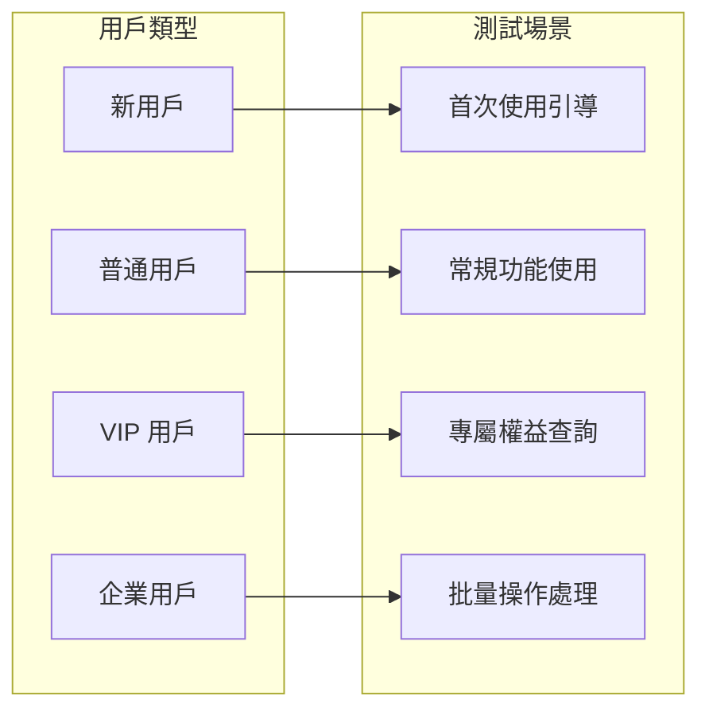
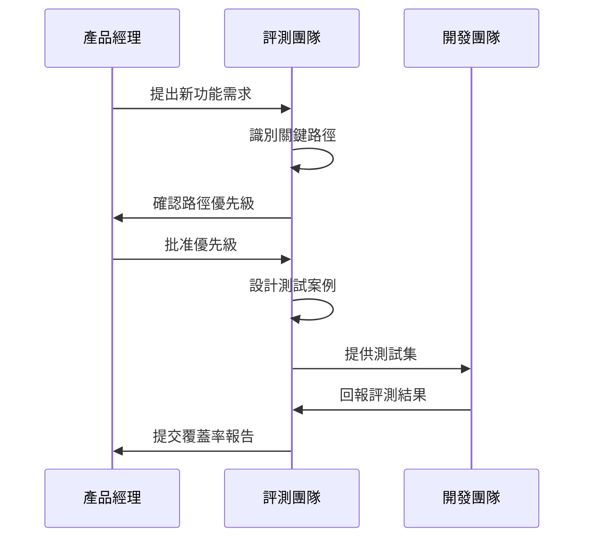

# 業務關鍵路徑覆蓋

確保評測數據集覆蓋所有業務關鍵路徑，是保障 AI 系統線上穩定運行的基礎。本文介紹如何系統性地識別、設計和驗證關鍵路徑測試案例。

## 什麼是關鍵路徑



!!! info "路徑優先級定義"
    - **關鍵路徑 (P0)**：系統核心功能，故障會直接影響業務收入或用戶體驗
    - **重要路徑 (P1)**：重要輔助功能，故障會降低系統可用性
    - **一般路徑 (P2)**：增值功能，故障影響有限

---

## 關鍵路徑識別方法

### 1. 業務流程分析

從用戶旅程出發，識別每個階段的關鍵互動點：

```python
from dataclasses import dataclass
from enum import Enum

class PathPriority(Enum):
    CRITICAL = "P0"  # 關鍵
    IMPORTANT = "P1"  # 重要
    NORMAL = "P2"     # 一般

@dataclass
class BusinessPath:
    """業務路徑定義"""
    name: str
    description: str
    priority: PathPriority
    user_journey_stage: str
    expected_frequency: str  # daily, weekly, monthly
    failure_impact: str
    
# 範例：電商客服系統關鍵路徑
ECOMMERCE_PATHS = [
    BusinessPath(
        name="訂單狀態查詢",
        description="用戶詢問訂單配送進度",
        priority=PathPriority.CRITICAL,
        user_journey_stage="售後服務",
        expected_frequency="daily",
        failure_impact="用戶無法獲取訂單資訊，可能產生投訴"
    ),
    BusinessPath(
        name="退款申請處理",
        description="用戶請求退款或換貨",
        priority=PathPriority.CRITICAL,
        user_journey_stage="售後服務",
        expected_frequency="daily",
        failure_impact="退款流程受阻，影響用戶滿意度和資金流"
    ),
    BusinessPath(
        name="產品推薦諮詢",
        description="用戶詢問產品差異和推薦",
        priority=PathPriority.IMPORTANT,
        user_journey_stage="購買決策",
        expected_frequency="daily",
        failure_impact="可能流失潛在銷售機會"
    ),
]
```

### 2. 數據驅動識別

基於線上日誌分析高頻和高影響場景：

| 分析維度 | 資料來源 | 識別方法 |
|----------|----------|----------|
| 請求頻率 | API 日誌 | 統計 Top 20% 高頻意圖 |
| 失敗率 | 錯誤日誌 | 識別失敗率 > 5% 的場景 |
| 業務價值 | 訂單數據 | 關聯交易金額和轉化率 |
| 用戶反饋 | 評價系統 | 分析負面評價的共同點 |

```python
import pandas as pd
from collections import Counter

def identify_critical_paths_from_logs(
    log_data: pd.DataFrame,
    frequency_threshold: float = 0.8,
    failure_rate_threshold: float = 0.05
) -> list[str]:
    """
    從日誌數據識別關鍵路徑
    
    Args:
        log_data: 包含 intent, success 欄位的日誌
        frequency_threshold: 累積頻率閾值
        failure_rate_threshold: 失敗率閾值
    """
    # 計算意圖頻率
    intent_counts = Counter(log_data["intent"])
    total = sum(intent_counts.values())
    
    # 識別高頻意圖
    cumulative = 0
    high_frequency_intents = []
    for intent, count in intent_counts.most_common():
        cumulative += count / total
        high_frequency_intents.append(intent)
        if cumulative >= frequency_threshold:
            break
    
    # 識別高失敗率意圖
    failure_rates = log_data.groupby("intent")["success"].apply(
        lambda x: 1 - x.mean()
    )
    high_failure_intents = failure_rates[
        failure_rates > failure_rate_threshold
    ].index.tolist()
    
    # 合併結果
    critical = set(high_frequency_intents) | set(high_failure_intents)
    return list(critical)
```

---

## 測試案例設計

### 覆蓋率矩陣

建立意圖-場景覆蓋矩陣，確保無遺漏：

| 意圖 / 場景 | 正常流程 | 異常輸入 | 邊界條件 | 多輪對話 |
|-------------|----------|----------|----------|----------|
| 訂單查詢 | ✅ 3 | ✅ 2 | ✅ 2 | ✅ 1 |
| 退款申請 | ✅ 3 | ✅ 3 | ✅ 2 | ✅ 2 |
| 產品諮詢 | ✅ 2 | ✅ 1 | ⚠️ 0 | ✅ 1 |
| 投訴處理 | ✅ 2 | ✅ 2 | ⚠️ 1 | ✅ 2 |

!!! warning "覆蓋缺口"
    矩陣中標記 ⚠️ 的單元格表示測試案例不足，需要補充。

### 案例設計模板

```yaml
# test_case_template.yaml
test_case_id: "TC-ORDER-001"
path_name: "訂單狀態查詢"
priority: "P0"

# 輸入定義
input:
  query: "我的訂單什麼時候到？訂單號是 ABC123456"
  context:
    user_id: "U001"
    order_id: "ABC123456"
    order_status: "shipping"

# 預期輸出
expected:
  intent: "order_status_query"
  entities:
    order_id: "ABC123456"
  response_contains:
    - "配送中"
    - "預計到達時間"
  
# 評測標準
evaluation:
  metrics:
    - name: "intent_accuracy"
      threshold: 1.0
    - name: "entity_extraction_f1"
      threshold: 0.9
    - name: "response_relevancy"
      threshold: 0.85

# 元資料
metadata:
  created_by: "evaluation_team"
  created_at: "2026-02-01"
  last_reviewed: "2026-02-01"
  tags: ["high-frequency", "order-management"]
```

---

## 多維度覆蓋策略

### 1. 用戶角色覆蓋



### 2. 語言風格覆蓋

| 風格類型 | 範例 | 挑戰點 |
|----------|------|--------|
| 正式書面 | 「請問貴公司的退貨政策為何？」 | 專業術語理解 |
| 口語化 | 「欸這個東西可以退嗎」 | 語法不完整 |
| 簡略式 | 「退貨 條件」 | 意圖推斷 |
| 帶錯字 | 「我想退或」 | 糾錯能力 |
| 混合語言 | 「這個 item 可以 refund 嗎」 | 中英混雜 |

### 3. 時序場景覆蓋

```python
from datetime import datetime, timedelta

TEMPORAL_SCENARIOS = [
    {
        "name": "營業時間內諮詢",
        "time_range": ("09:00", "18:00"),
        "expected_behavior": "即時回覆"
    },
    {
        "name": "非營業時間諮詢",
        "time_range": ("18:00", "09:00"),
        "expected_behavior": "自動回覆 + 工單建立"
    },
    {
        "name": "促銷活動期間",
        "date_range": ("2026-11-11", "2026-11-12"),
        "expected_behavior": "高併發處理 + 優先隊列"
    },
    {
        "name": "系統維護期間",
        "expected_behavior": "友善提示 + 替代方案"
    }
]
```

---

## 覆蓋率度量

### 覆蓋率計算

```python
from typing import TypedDict

class CoverageReport(TypedDict):
    total_paths: int
    covered_paths: int
    coverage_rate: float
    uncovered_paths: list[str]
    coverage_by_priority: dict[str, float]

def calculate_coverage(
    all_paths: list[BusinessPath],
    test_cases: list[dict]
) -> CoverageReport:
    """計算關鍵路徑覆蓋率"""
    covered = set()
    for case in test_cases:
        covered.add(case["path_name"])
    
    all_path_names = {p.name for p in all_paths}
    uncovered = all_path_names - covered
    
    # 按優先級統計
    priority_coverage = {}
    for priority in PathPriority:
        priority_paths = [p for p in all_paths if p.priority == priority]
        if priority_paths:
            covered_count = sum(
                1 for p in priority_paths if p.name in covered
            )
            priority_coverage[priority.value] = (
                covered_count / len(priority_paths)
            )
    
    return CoverageReport(
        total_paths=len(all_path_names),
        covered_paths=len(covered),
        coverage_rate=len(covered) / len(all_path_names),
        uncovered_paths=list(uncovered),
        coverage_by_priority=priority_coverage
    )
```

### 覆蓋率目標

| 優先級 | 最低覆蓋率 | 建議覆蓋率 |
|--------|------------|------------|
| P0 (關鍵) | 100% | 100% |
| P1 (重要) | 90% | 95% |
| P2 (一般) | 70% | 85% |

!!! danger "關鍵路徑必須 100% 覆蓋"
    任何 P0 路徑如果沒有對應的測試案例，都應該視為嚴重的評測缺陷，必須在發布前補齊。

---

## 持續維護

### 新增路徑的流程



### 定期審查

!!! tip "維護建議"
    
    1. **月度審查**：檢查新增業務功能是否已納入測試
    2. **季度分析**：基於線上數據更新路徑優先級
    3. **年度重構**：全面審視覆蓋矩陣，淘汰過時路徑

---

## 最佳實踐

!!! success "關鍵路徑覆蓋要點"

    1. **業務導向**：從用戶旅程和業務價值出發識別路徑
    2. **數據驅動**：結合線上數據驗證路徑的重要性
    3. **分層設計**：按優先級分配測試資源
    4. **矩陣思維**：使用覆蓋矩陣確保無盲點
    5. **持續更新**：建立路徑識別和案例補充的常態機制

## 延伸閱讀

- [User Story Mapping](https://www.jpattonassociates.com/user-story-mapping/) - 用戶故事地圖方法
- [Risk-Based Testing](https://www.istqb.org/references/glossary/risk-based-testing) - 風險導向測試
