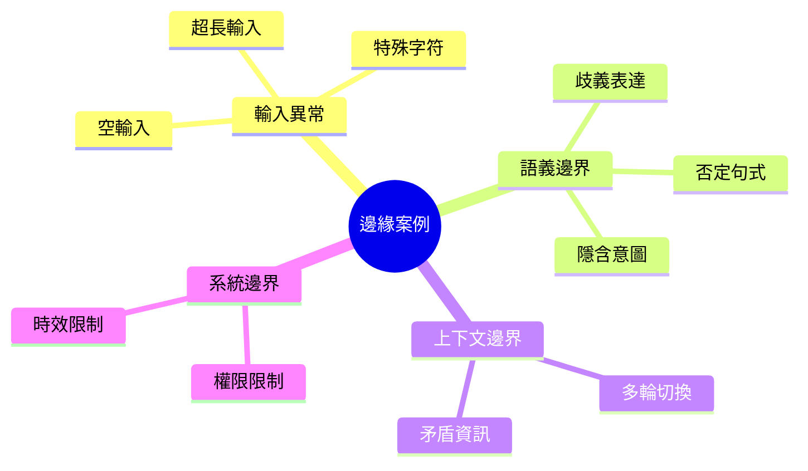

# 邊緣案例設計

邊緣案例（Edge Cases）是評測 AI 系統穩健性的關鍵。本文介紹如何系統性地設計邊緣測試案例。

## 邊緣案例分類



---

## 輸入異常類

### 長度邊界

| 類型 | 測試案例 | 預期行為 |
|------|----------|----------|
| 空輸入 | `""` 或純空白 | 友善提示 |
| 單字符 | `"?"` | 請求澄清 |
| 超長輸入 | 10,000+ 字符 | 截斷處理 |

```python
def generate_length_edge_cases(base_text: str) -> list[dict]:
    """生成長度相關的邊緣案例"""
    return [
        {"type": "empty", "input": ""},
        {"type": "whitespace", "input": "   \n\t  "},
        {"type": "very_long", "input": base_text * 1000},
    ]
```

### 特殊字符處理

```yaml
special_character_cases:
  - name: "Emoji 處理"
    input: "我想退貨 😭😭😭"
    expected: "正常理解意圖"
    
  - name: "HTML/SQL 注入"
    input: "<script>alert('xss')</script>"
    expected: "安全過濾"
```

---

## 語義邊界類

### 歧義表達

```python
AMBIGUITY_CASES = [
    {
        "input": "它壞了",
        "ambiguity": "「它」指代不明確",
        "expected": "詢問具體對象",
    },
    {
        "input": "這個可以便宜點嗎",
        "ambiguity": "「這個」不確定",
        "expected": "詢問具體商品",
    },
]
```

### 否定與反諷

| 表達類型 | 範例 | 真實意圖 |
|----------|------|----------|
| 直接否定 | 「不要退款」 | 不退款 |
| 雙重否定 | 「不是不想買」 | 想買 |
| 反諷 | 「太好了」（負評） | 不滿意 |

---

## 上下文邊界類

### 多輪對話切換

```yaml
context_switch_cases:
  - name: "話題突然切換"
    dialogue:
      - user: "查訂單"
      - assistant: "請提供訂單號"
      - user: "對了你們有賣 iPhone 嗎"
    expected: "識別切換，回應新問題"
    
  - name: "矛盾指令"
    dialogue:
      - user: "我要退貨"
      - assistant: "請問原因"
      - user: "不退了，換貨"
    expected: "接受更新意圖"
```

### 資訊不足

| 情境 | 範例 | 處理策略 |
|------|------|----------|
| 資訊不足 | 「查訂單」無號 | 詢問必要資訊 |
| 資訊矛盾 | 兩個地址 | 確認正確資訊 |

---

## 系統邊界類

### 功能與權限邊界

```yaml
boundary_cases:
  - name: "超出服務範圍"
    input: "幫我訂機票"
    expected: "說明範圍，提供建議"
    
  - name: "權限不足"
    input: "調高我的 VIP 等級"
    expected: "說明無權限"
```

---

## 優先級排序

| 發生機率 / 影響 | 高影響 | 中影響 | 低影響 |
|-----------------|--------|--------|--------|
| **高機率** | P0 必測 | P1 應測 | P2 選測 |
| **中機率** | P1 應測 | P2 選測 | P3 可略 |
| **低機率** | P2 選測 | P3 可略 | P3 可略 |

!!! success "邊緣案例設計要點"
    1. **分類系統化**：按輸入、語義、上下文、系統組織
    2. **風險導向**：優先覆蓋高風險場景
    3. **真實來源**：從線上 Bad Case 補充
    4. **自動生成**：使用規則輔助生成變體
