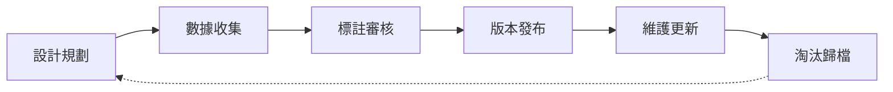
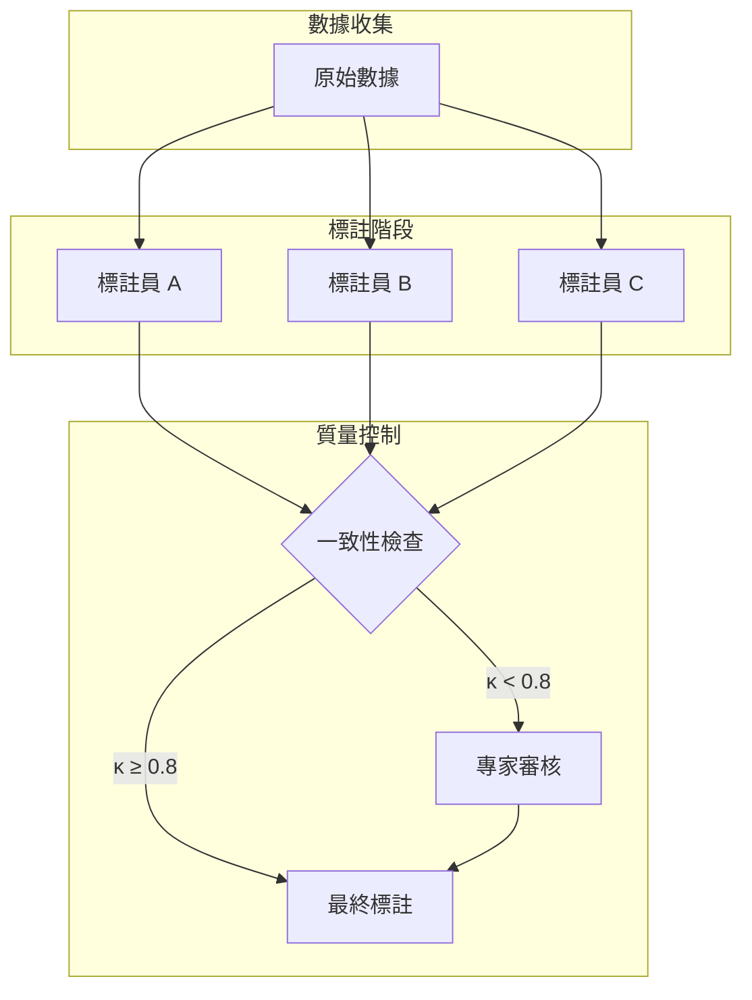
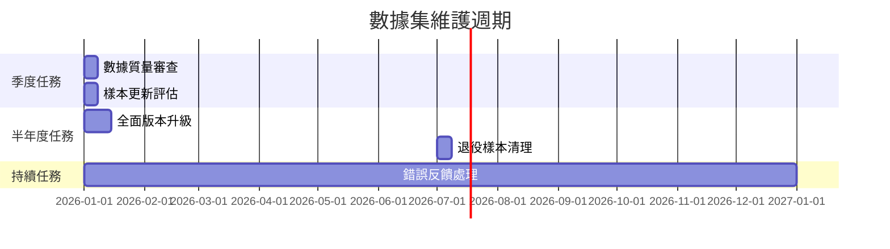

# 數據集生命週期

建立完善的測試數據集生命週期管理，是確保評測系統長期穩定運作的關鍵。本文介紹從創建到淘汰的完整流程。

## 生命週期概覽



---

## 第一階段：設計規劃

### 需求分析

在創建數據集之前，需要明確以下問題：

!!! question "核心問題清單"
    - 這個數據集要評測什麼能力？
    - 目標覆蓋哪些業務場景？
    - 預期的數據規模是多少？
    - 標註標準如何定義？

### 設計文檔模板

```yaml
# dataset_design.yaml
dataset_name: "customer_service_qa_v1"
purpose: "評測客服問答系統的準確性與相關性"
scope:
  domains:
    - 訂單查詢
    - 退換貨政策
    - 產品諮詢
  languages: ["zh-TW"]
  difficulty_levels: ["easy", "medium", "hard"]


expected_size:
  minimum: 500
  target: 1000
  maximum: 2000

annotation_guidelines:
  format: "question-answer pairs with metadata"
  labelers_count: 3
  agreement_threshold: 0.8
```

---

## 第二階段：數據收集

### 數據來源

| 來源類型 | 優點 | 缺點 | 適用場景 |
|----------|------|------|----------|
| 生產日誌 | 真實、相關性高 | 可能含敏感資訊 | 線上系統優化 |
| 人工創建 | 可控、針對性強 | 成本高、可能缺乏多樣性 | 邊緣案例測試 |
| 公開數據集 | 成本低、可比較 | 可能與業務不符 | 基準對比 |
| 合成生成 | 規模大、成本低 | 質量難保證 | 數據增強 |

### 數據收集流程

```python
from dataclasses import dataclass
from datetime import datetime
from enum import Enum

class DataSource(Enum):
    PRODUCTION = "production"
    MANUAL = "manual"
    PUBLIC = "public"
    SYNTHETIC = "synthetic"

@dataclass
class DataCollectionRecord:
    """數據收集記錄"""
    source: DataSource
    collected_at: datetime
    collector: str
    sample_count: int
    quality_checked: bool = False
    
    def to_metadata(self) -> dict:
        return {
            "source": self.source.value,
            "collected_at": self.collected_at.isoformat(),
            "collector": self.collector,
            "sample_count": self.sample_count
        }
```

---

## 第三階段：標註審核

### 標註流程設計



### 一致性度量

使用 Fleiss' Kappa 或 Cohen's Kappa 評估標註一致性：

```python
from sklearn.metrics import cohen_kappa_score
import numpy as np

def calculate_inter_annotator_agreement(
    annotations: list[list[str]]
) -> float:
    """
    計算多標註員一致性
    annotations: 每個標註員的標註列表
    """
    # 兩兩計算 Kappa，取平均
    n_annotators = len(annotations)
    kappas = []
    
    for i in range(n_annotators):
        for j in range(i + 1, n_annotators):
            kappa = cohen_kappa_score(
                annotations[i], 
                annotations[j]
            )
            kappas.append(kappa)
    
    return np.mean(kappas)

# 一致性解讀標準
KAPPA_INTERPRETATION = {
    (0.81, 1.00): "幾乎完全一致",
    (0.61, 0.80): "高度一致",
    (0.41, 0.60): "中等一致",
    (0.21, 0.40): "低度一致",
    (0.00, 0.20): "輕微一致",
}
```

!!! warning "一致性不足時的處理"
    當 Kappa < 0.6 時，應該：
    
    1. 檢查標註指南是否清晰
    2. 組織標註員校準會議
    3. 對有爭議的樣本進行專家仲裁
    4. 必要時修訂標註標準

---

## 第四階段：版本發布

### 語意化版本控制

採用 `MAJOR.MINOR.PATCH` 版本號：

| 版本類型 | 觸發條件 | 範例 |
|----------|----------|------|
| MAJOR | 結構變更、不兼容更新 | 1.0.0 → 2.0.0 |
| MINOR | 新增樣本、擴充場景 | 1.0.0 → 1.1.0 |
| PATCH | 錯誤修正、標註調整 | 1.0.0 → 1.0.1 |

### 版本發布清單

```markdown
## Release Checklist

### 發布前
- [ ] 所有樣本完成標註
- [ ] 一致性檢查通過 (κ ≥ 0.8)
- [ ] 數據格式驗證通過
- [ ] README 文檔更新
- [ ] CHANGELOG 更新

### 發布時
- [ ] 創建 Git Tag
- [ ] 生成數據集 Hash
- [ ] 上傳至數據倉庫
- [ ] 更新版本索引

### 發布後
- [ ] 通知相關團隊
- [ ] 記錄基準測試結果
- [ ] 監控使用情況
```

### 數據集元資料

```json
{
  "name": "customer_service_qa",
  "version": "1.2.0",
  "release_date": "2026-02-01",
  "size": {
    "samples": 1250,
    "file_size_mb": 45
  },
  "splits": {
    "train": 800,
    "validation": 200,
    "test": 250
  },
  "statistics": {
    "avg_question_length": 32.5,
    "avg_answer_length": 128.7,
    "unique_intents": 45
  },
  "hash": {
    "algorithm": "sha256",
    "value": "abc123..."
  }
}
```

---

## 第五階段：維護更新

### 定期審查週期



### 維護流程

!!! tip "維護最佳實踐"
    
    1. **錯誤反饋機制**：建立評測失敗樣本的回報管道
    2. **時效性檢查**：定期驗證樣本是否過時
    3. **覆蓋率監控**：追蹤數據集對業務場景的覆蓋情況
    4. **版本相容性**：確保新版本向後相容

```python
@dataclass
class MaintenanceRecord:
    """維護記錄"""
    date: datetime
    action: str  # "add", "remove", "modify"
    samples_affected: int
    reason: str
    reviewer: str

class DatasetMaintainer:
    def __init__(self, dataset_path: str):
        self.dataset_path = dataset_path
        self.maintenance_log: list[MaintenanceRecord] = []
    
    def add_samples(
        self, 
        samples: list, 
        reason: str,
        reviewer: str
    ) -> None:
        """新增樣本並記錄"""
        # 驗證樣本格式
        self._validate_samples(samples)
        # 執行新增
        self._append_to_dataset(samples)
        # 記錄維護日誌
        self.maintenance_log.append(
            MaintenanceRecord(
                date=datetime.now(),
                action="add",
                samples_affected=len(samples),
                reason=reason,
                reviewer=reviewer
            )
        )
```

---

## 第六階段：淘汰歸檔

### 淘汰條件

當數據集符合以下任一條件時，應考慮淘汰：

| 條件 | 說明 | 處理方式 |
|------|------|----------|
| 業務下線 | 相關功能已停止服務 | 歸檔保存 |
| 版本過舊 | 已有新版本取代 | 遷移至新版本 |
| 質量問題 | 標註錯誤率過高 | 重建或修復 |
| 合規要求 | 數據保留期限到期 | 安全刪除 |

### 歸檔策略

```yaml
# archival_policy.yaml
retention_period:
  active: "2 years"      # 活躍使用期限
  archived: "5 years"    # 歸檔保存期限
  deleted: "permanent"   # 合規刪除

archival_format:
  compress: true
  algorithm: "gzip"
  include_metadata: true
  include_history: true

storage:
  primary: "s3://datasets-archive/"
  backup: "gs://datasets-backup/"
```

---

## 最佳實踐總結

!!! success "數據集生命週期管理要點"

    1. **完整記錄**：每個階段都要有詳細的文檔和記錄
    2. **版本控制**：使用語意化版本號，保持歷史可追溯
    3. **質量第一**：寧可規模小但質量高，不要大而粗糙
    4. **自動化**：盡可能自動化驗證、發布和監控流程
    5. **協作機制**：建立跨團隊的數據集共享和反饋機制

## 延伸閱讀

- [Datasheets for Datasets](https://arxiv.org/abs/1803.09010) - 數據集文檔化標準
- [Data Version Control (DVC)](https://dvc.org/) - 數據版本管理工具
- [HuggingFace Datasets](https://huggingface.co/docs/datasets) - 數據集管理最佳實踐
