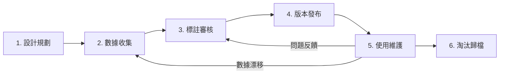
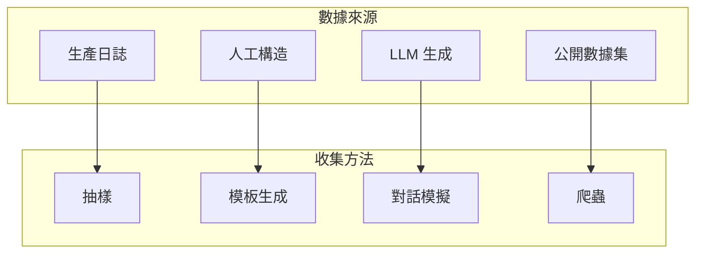
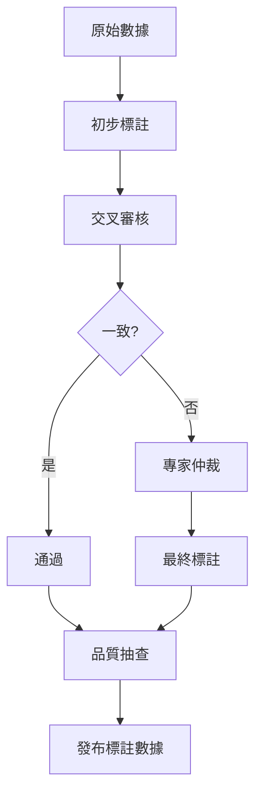

# 數據集生命週期

建立完善的測試數據集生命週期管理，是確保評測系統長期穩定運作的關鍵。本文詳細介紹從創建到淘汰的完整流程，並提供實用的工具和方法。

## 生命週期概覽



| 階段 | 目標 | 關鍵活動 | 產出物 |
|------|------|----------|--------|
| 設計規劃 | 確定範圍 | 需求分析、指標定義 | 設計文檔 |
| 數據收集 | 獲取數據 | 來源篩選、生成擴增 | 原始數據 |
| 標註審核 | 確保質量 | 人工標註、品質檢驗 | 標註數據 |
| 版本發布 | 正式使用 | 版本控制、文檔撰寫 | 發布版本 |
| 使用維護 | 持續監控 | 效果追蹤、問題修復 | 監控報告 |
| 淘汰歸檔 | 有序退役 | 依賴檢查、歷史保存 | 歸檔記錄 |

---

## 第一階段：設計規劃

### 需求分析

在開始收集數據前，需要明確回答以下問題：

```python
from dataclasses import dataclass, field
from typing import Optional
from datetime import date

@dataclass
class DatasetDesignDoc:
    """數據集設計文檔"""
    
    # 基本資訊
    name: str
    version: str
    owner: str
    created_at: date
    
    # 目標定義
    purpose: str  # 這個數據集要回答什麼問題？
    target_systems: list[str]  # 用於評測哪些系統？
    success_criteria: str  # 什麼樣的結果代表成功？
    
    # 範圍定義
    domains: list[str]  # 涵蓋哪些業務領域？
    languages: list[str]  # 支援哪些語言？
    difficulty_levels: list[str] = field(
        default_factory=lambda: ["easy", "medium", "hard"]
    )
    
    # 規模預估
    target_size: int  # 目標樣本數
    sampling_strategy: str  # 抽樣策略
    
    # 品質要求
    annotation_guidelines: str  # 標註指南
    quality_thresholds: dict = field(
        default_factory=lambda: {
            "agreement_rate": 0.8,
            "coverage": 0.9,
        }
    )
    
    def validate(self) -> tuple[bool, list[str]]:
        """驗證設計文檔完整性"""
        issues = []
        
        if not self.purpose:
            issues.append("未定義數據集目的")
        if self.target_size < 100:
            issues.append("目標樣本數過少，建議至少 100 條")
        if not self.annotation_guidelines:
            issues.append("未提供標註指南")
        
        return len(issues) == 0, issues


# 設計文檔範例
design = DatasetDesignDoc(
    name="customer_service_intent_v1",
    version="1.0.0",
    owner="evaluation_team",
    created_at=date.today(),
    purpose="評測客服意圖識別模型的準確率",
    target_systems=["gpt-4-customer-bot", "claude-customer-bot"],
    success_criteria="意圖識別準確率 > 90%",
    domains=["訂單查詢", "退款處理", "帳戶管理", "一般諮詢"],
    languages=["zh-TW"],
    target_size=500,
    sampling_strategy="按業務類別分層抽樣",
    annotation_guidelines="docs/annotation_guide.md",
)

is_valid, issues = design.validate()
print(f"設計文檔有效: {is_valid}, 問題: {issues}")
```

### 指標體系設計

```yaml
# metrics_design.yaml
dataset_metrics:
  coverage:
    description: "數據集對業務場景的覆蓋度"
    calculation: "已覆蓋場景數 / 總場景數"
    target: "> 0.9"
    
  balance:
    description: "類別分布平衡度"
    calculation: "使用基尼係數或熵值"
    target: "基尼係數 < 0.3"
    
  difficulty_distribution:
    description: "難度分布情況"
    target: "Easy:Medium:Hard = 3:5:2"
    
  freshness:
    description: "數據時效性"
    calculation: "最近更新時間"
    threshold: "< 90 days"

quality_metrics:
  annotation_agreement:
    description: "標註者一致性"
    calculation: "Cohen's Kappa 或 Fleiss' Kappa"
    threshold: "> 0.8"
    
  clean_rate:
    description: "清洗後數據完整率"
    target: "> 0.95"
```

---

## 第二階段：數據收集

### 數據來源策略



### 數據收集實現

```python
import random
from abc import ABC, abstractmethod
from datetime import datetime
from typing import Optional

class DataCollector(ABC):
    """數據收集器抽象類"""
    
    @abstractmethod
    def collect(self, n: int) -> list[dict]:
        pass
    
    @abstractmethod
    def validate_sample(self, sample: dict) -> bool:
        pass


class ProductionLogCollector(DataCollector):
    """生產日誌收集器"""
    
    def __init__(self, log_source: str, filters: dict = None):
        self.log_source = log_source
        self.filters = filters or {}
    
    def collect(self, n: int) -> list[dict]:
        """從生產日誌中抽樣"""
        # 連接日誌源
        logs = self._fetch_logs()
        
        # 過濾
        filtered = [
            log for log in logs
            if self._apply_filters(log)
        ]
        
        # 分層抽樣
        return self._stratified_sample(filtered, n)
    
    def _stratified_sample(self, logs: list, n: int) -> list:
        """分層抽樣確保類別平衡"""
        by_category = {}
        for log in logs:
            cat = log.get("category", "other")
            by_category.setdefault(cat, []).append(log)
        
        samples = []
        per_category = n // len(by_category)
        
        for cat, items in by_category.items():
            samples.extend(random.sample(
                items, 
                min(per_category, len(items))
            ))
        
        return samples[:n]
    
    def validate_sample(self, sample: dict) -> bool:
        required_fields = ["input", "timestamp", "user_id"]
        return all(f in sample for f in required_fields)


class LLMDataGenerator(DataCollector):
    """LLM 數據生成器"""
    
    def __init__(self, model: str, domain: str):
        self.model = model
        self.domain = domain
    
    def collect(self, n: int) -> list[dict]:
        """使用 LLM 生成測試數據"""
        samples = []
        
        # 定義生成模板
        prompt_template = f"""
你是一個數據生成專家。請為「{self.domain}」領域生成一條測試用例。

輸出格式：
- input: 用戶輸入
- expected_intent: 預期意圖
- expected_entities: 預期實體（如有）
- difficulty: 難度（easy/medium/hard）

請確保：
1. 輸入自然真實
2. 涵蓋各種表達方式
3. 包含邊緣情況
"""
        
        for i in range(n):
            # 調用 LLM 生成
            response = self._call_llm(prompt_template)
            sample = self._parse_response(response)
            sample["generated_at"] = datetime.now().isoformat()
            sample["generator"] = self.model
            samples.append(sample)
        
        return samples
    
    def validate_sample(self, sample: dict) -> bool:
        required = ["input", "expected_intent", "difficulty"]
        return all(f in sample for f in required)
    
    def _call_llm(self, prompt: str) -> str:
        # 實際的 LLM 調用
        pass
    
    def _parse_response(self, response: str) -> dict:
        # 解析 LLM 回應
        pass


class DataPipeline:
    """數據收集流水線"""
    
    def __init__(self, collectors: list[tuple[DataCollector, float]]):
        """
        Args:
            collectors: (收集器, 佔比) 列表
        """
        self.collectors = collectors
    
    def run(self, total_samples: int) -> list[dict]:
        """執行收集流水線"""
        all_samples = []
        
        for collector, ratio in self.collectors:
            n = int(total_samples * ratio)
            samples = collector.collect(n)
            
            # 驗證
            valid_samples = [
                s for s in samples
                if collector.validate_sample(s)
            ]
            
            all_samples.extend(valid_samples)
            print(f"收集 {len(valid_samples)} 條有效樣本")
        
        return all_samples


# 使用範例
pipeline = DataPipeline([
    (ProductionLogCollector("logs/customer_service"), 0.6),
    (LLMDataGenerator("gpt-4", "客服對話"), 0.4),
])

dataset = pipeline.run(500)
print(f"共收集 {len(dataset)} 條數據")
```

---

## 第三階段：標註審核

### 標註流程設計



### 標註品質管理

```python
from collections import Counter
import numpy as np

class AnnotationManager:
    """標註管理器"""
    
    def __init__(self, annotators: list[str]):
        self.annotators = annotators
        self.annotations: dict[str, list[dict]] = {}
    
    def assign_task(self, sample_id: str, sample: dict):
        """分配標註任務（至少 2 人）"""
        assigned = random.sample(self.annotators, min(2, len(self.annotators)))
        return {
            "sample_id": sample_id,
            "sample": sample,
            "assigned_to": assigned,
        }
    
    def submit_annotation(
        self, 
        sample_id: str, 
        annotator: str, 
        annotation: dict
    ):
        """提交標註結果"""
        if sample_id not in self.annotations:
            self.annotations[sample_id] = []
        
        self.annotations[sample_id].append({
            "annotator": annotator,
            "annotation": annotation,
            "timestamp": datetime.now().isoformat(),
        })
    
    def calculate_agreement(self, sample_id: str) -> dict:
        """計算標註一致性"""
        sample_annotations = self.annotations.get(sample_id, [])
        
        if len(sample_annotations) < 2:
            return {"status": "insufficient", "agreement": None}
        
        labels = [a["annotation"].get("intent") for a in sample_annotations]
        
        # 完全一致
        if len(set(labels)) == 1:
            return {
                "status": "agreed",
                "agreement": 1.0,
                "final_label": labels[0]
            }
        
        # 多數一致
        counter = Counter(labels)
        most_common, count = counter.most_common(1)[0]
        agreement = count / len(labels)
        
        if agreement >= 0.5:
            return {
                "status": "majority",
                "agreement": agreement,
                "final_label": most_common,
                "needs_review": True
            }
        
        return {
            "status": "disagreed",
            "agreement": agreement,
            "needs_arbitration": True
        }
    
    def calculate_cohens_kappa(
        self, 
        annotator1: str, 
        annotator2: str
    ) -> float:
        """計算 Cohen's Kappa 係數"""
        # 獲取兩位標註者的共同樣本
        common_samples = []
        for sample_id, annotations in self.annotations.items():
            a1 = next((a for a in annotations if a["annotator"] == annotator1), None)
            a2 = next((a for a in annotations if a["annotator"] == annotator2), None)
            if a1 and a2:
                common_samples.append((
                    a1["annotation"]["intent"],
                    a2["annotation"]["intent"]
                ))
        
        if not common_samples:
            return 0.0
        
        # 計算 Kappa
        labels1, labels2 = zip(*common_samples)
        all_labels = list(set(labels1) | set(labels2))
        
        # 觀察一致性
        po = sum(l1 == l2 for l1, l2 in common_samples) / len(common_samples)
        
        # 期望一致性
        pe = sum(
            (labels1.count(l) / len(labels1)) * (labels2.count(l) / len(labels2))
            for l in all_labels
        )
        
        kappa = (po - pe) / (1 - pe) if pe < 1 else 1.0
        return kappa
    
    def get_quality_report(self) -> dict:
        """生成品質報告"""
        total = len(self.annotations)
        agreed = sum(
            1 for sid in self.annotations
            if self.calculate_agreement(sid)["status"] == "agreed"
        )
        
        return {
            "total_samples": total,
            "agreed_count": agreed,
            "agreement_rate": agreed / total if total > 0 else 0,
            "needs_arbitration": total - agreed,
        }
```

---

## 第四階段：版本發布

### 版本規範

```yaml
# 版本命名規則：MAJOR.MINOR.PATCH
# MAJOR: 重大變更（不向後兼容）
# MINOR: 內容擴充（向後兼容）
# PATCH: 錯誤修正

versioning:
  examples:
    - version: "1.0.0"
      description: "首次發布"
      
    - version: "1.1.0"
      description: "新增 200 條退款場景樣本"
      
    - version: "1.0.1"
      description: "修正 5 條標註錯誤"
      
    - version: "2.0.0"
      description: "更新標註規範，重新標註全部數據"
```

### 發布清單

```python
from dataclasses import dataclass
import hashlib
import json

@dataclass
class DatasetRelease:
    """數據集發布"""
    
    name: str
    version: str
    release_date: str
    
    # 統計資訊
    total_samples: int
    category_distribution: dict
    difficulty_distribution: dict
    
    # 品質指標
    annotation_agreement: float
    review_coverage: float
    
    # 來源追蹤
    data_sources: list[str]
    
    # 文件資訊
    files: list[dict]  # [{"name": "...", "hash": "...", "size": ...}]
    
    def generate_manifest(self) -> dict:
        """生成發布清單"""
        return {
            "name": self.name,
            "version": self.version,
            "release_date": self.release_date,
            "statistics": {
                "total_samples": self.total_samples,
                "categories": self.category_distribution,
                "difficulty": self.difficulty_distribution,
            },
            "quality": {
                "annotation_agreement": self.annotation_agreement,
                "review_coverage": self.review_coverage,
            },
            "sources": self.data_sources,
            "files": self.files,
        }
    
    def save_manifest(self, path: str):
        """保存清單文件"""
        manifest = self.generate_manifest()
        with open(path, 'w', encoding='utf-8') as f:
            json.dump(manifest, f, ensure_ascii=False, indent=2)


def calculate_file_hash(filepath: str) -> str:
    """計算文件 hash"""
    sha256 = hashlib.sha256()
    with open(filepath, 'rb') as f:
        for block in iter(lambda: f.read(4096), b""):
            sha256.update(block)
    return sha256.hexdigest()
```

---

## 第五階段：使用維護

### 監控指標

```python
class DatasetMonitor:
    """數據集使用監控"""
    
    def __init__(self, dataset_id: str):
        self.dataset_id = dataset_id
        self.usage_logs: list[dict] = []
        self.performance_history: list[dict] = []
    
    def log_usage(self, user: str, purpose: str, samples_used: int):
        """記錄使用情況"""
        self.usage_logs.append({
            "timestamp": datetime.now().isoformat(),
            "user": user,
            "purpose": purpose,
            "samples_used": samples_used,
        })
    
    def log_performance(self, model: str, metrics: dict):
        """記錄評測表現"""
        self.performance_history.append({
            "timestamp": datetime.now().isoformat(),
            "model": model,
            "metrics": metrics,
        })
    
    def detect_data_drift(self) -> dict:
        """檢測數據漂移"""
        if len(self.performance_history) < 2:
            return {"status": "insufficient_data"}
        
        recent = self.performance_history[-5:]
        baseline = self.performance_history[:5]
        
        recent_scores = [p["metrics"].get("accuracy", 0) for p in recent]
        baseline_scores = [p["metrics"].get("accuracy", 0) for p in baseline]
        
        recent_avg = sum(recent_scores) / len(recent_scores)
        baseline_avg = sum(baseline_scores) / len(baseline_scores)
        
        drift = abs(recent_avg - baseline_avg)
        
        return {
            "status": "drift_detected" if drift > 0.1 else "stable",
            "baseline_avg": baseline_avg,
            "recent_avg": recent_avg,
            "drift_magnitude": drift,
        }
    
    def get_usage_report(self) -> dict:
        """生成使用報告"""
        from collections import Counter
        
        users = Counter(log["user"] for log in self.usage_logs)
        purposes = Counter(log["purpose"] for log in self.usage_logs)
        
        return {
            "total_usages": len(self.usage_logs),
            "unique_users": len(users),
            "by_user": dict(users.most_common()),
            "by_purpose": dict(purposes.most_common()),
        }
```

### 維護策略

| 維護類型 | 觸發條件 | 行動 |
|----------|----------|------|
| 定期審查 | 每季度 | 檢查數據時效性和覆蓋率 |
| 問題修復 | 發現錯誤標註 | 修正並發布 PATCH 版本 |
| 擴充更新 | 新場景需求 | 收集新數據，發布 MINOR 版本 |
| 緊急響應 | 重大品質問題 | 暫停使用，評估影響，修正發布 |

---

## 第六階段：淘汰歸檔

### 淘汰條件

```python
class DatasetRetirementChecker:
    """數據集淘汰評估器"""
    
    def __init__(self, dataset_id: str):
        self.dataset_id = dataset_id
    
    def check_retirement_criteria(self, dataset: dict) -> dict:
        """檢查是否應該淘汰"""
        reasons = []
        
        # 時效性檢查
        last_update = datetime.fromisoformat(dataset["last_updated"])
        age_days = (datetime.now() - last_update).days
        if age_days > 365:
            reasons.append("超過 1 年未更新")
        
        # 使用率檢查
        if dataset.get("usage_count_30d", 0) == 0:
            reasons.append("過去 30 天無使用記錄")
        
        # 被替代檢查
        if dataset.get("superseded_by"):
            reasons.append(f"已被 {dataset['superseded_by']} 替代")
        
        # 品質問題
        if dataset.get("critical_issues", 0) > 10:
            reasons.append("存在過多未解決的品質問題")
        
        return {
            "should_retire": len(reasons) > 0,
            "reasons": reasons,
        }
```

### 歸檔流程

```yaml
retirement_process:
  steps:
    - name: "依賴檢查"
      description: "確認沒有活躍系統仍在使用"
      checklist:
        - 查詢使用記錄
        - 通知相關團隊
        - 確認替代方案
    
    - name: "歷史保存"
      description: "保存完整歷史記錄"
      actions:
        - 創建最終快照
        - 記錄元數據
        - 保存評測報告
    
    - name: "標記淘汰"
      description: "在系統中標記為已淘汰"
      actions:
        - 更新狀態為 DEPRECATED
        - 添加淘汰說明
        - 指向替代方案
    
    - name: "歸檔存儲"
      description: "移至歸檔存儲"
      actions:
        - 壓縮數據文件
        - 移至冷存儲
        - 保留 3 年
```

---

## 最佳實踐總結

!!! success "生命週期管理要點"
    1. **文檔先行**：每個階段都需要充分的文檔記錄
    2. **版本可追溯**：所有變更都應該可追溯
    3. **品質持續監控**：不是發布就結束，要持續關注
    4. **及時淘汰**：過時的數據集可能比沒有更糟糕
    5. **團隊協作**：建立明確的責任分工

!!! warning "常見錯誤"
    - ❌ 沒有設計文檔就開始收集數據
    - ❌ 只有單人標註，無品質審核
    - ❌ 發布後不追蹤使用和表現
    - ❌ 遲遲不淘汰過時數據集

## 延伸閱讀

- [Data Version Control (DVC)](https://dvc.org/)
- [Great Expectations](https://greatexpectations.io/)
- [ML Data Management Best Practices](https://ml-ops.org/content/data-management)
