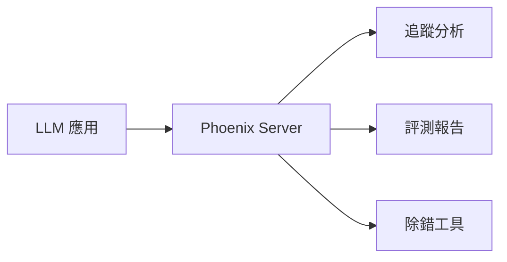

# Arize Phoenix 完整指南

Arize Phoenix 是一個開源的 ML 可觀測性平台，專注於 LLM 和 RAG 系統的追蹤與評測。

## 概述



---

## 安裝與配置

```bash
# 安裝
pip install arize-phoenix

# 啟動 Phoenix Server
python -m phoenix.server.main serve
```

訪問 `http://localhost:6006` 開啟 UI 介面。

---

## 核心功能

### 追蹤整合

```python
from openinference.instrumentation.openai import OpenAIInstrumentor
from phoenix.otel import register

# 設置追蹤
tracer_provider = register(endpoint="http://localhost:6006/v1/traces")
OpenAIInstrumentor().instrument(tracer_provider=tracer_provider)
```

### LLM 評測

```python
from phoenix.evals import llm_classify, OpenAIModel

# 配置評測模型
model = OpenAIModel(model="gpt-4")

# 執行評測
results = llm_classify(
    dataframe=df,
    model=model,
    template="Is this response relevant? {response}",
    rails=["relevant", "not_relevant"],
)
```

---

## RAG 評測

### 檢索品質分析

```python
from phoenix.evals import HallucinationEvaluator

evaluator = HallucinationEvaluator(model)
scores = evaluator.evaluate(
    inputs=questions,
    outputs=answers,
    contexts=retrieved_contexts,
)
```

---

## UI 功能

| 功能 | 說明 |
|------|------|
| Traces | 查看完整的請求追蹤 |
| Spans | 分析各步驟延遲 |
| Evaluations | 檢視評測結果 |
| Datasets | 管理評測數據集 |

---

## 最佳實踐

!!! success "使用建議"
    1. 開發階段啟用完整追蹤
    2. 生產環境使用採樣策略
    3. 定期導出評測報告
    4. 結合告警監控關鍵指標

## 延伸閱讀

- [Phoenix 官方文檔](https://docs.arize.com/phoenix/)
- [Phoenix GitHub](https://github.com/Arize-ai/phoenix)
