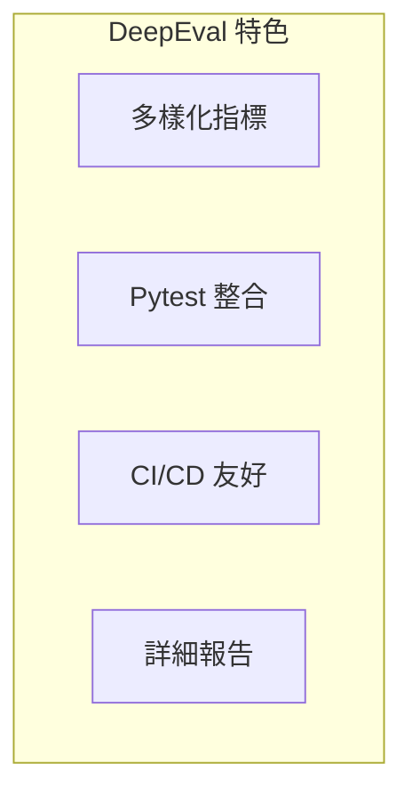

# DeepEval 完整指南

DeepEval 是一個開源的 LLM 評測框架，提供豐富的評測指標和便捷的測試整合。

## 概述



---

## 安裝與配置

```bash
# 安裝
pip install deepeval

# 設置 API Key
export OPENAI_API_KEY="your-key"
```

---

## 核心指標

### Answer Relevancy

```python
from deepeval.metrics import AnswerRelevancyMetric
from deepeval.test_case import LLMTestCase

metric = AnswerRelevancyMetric(threshold=0.7)

test_case = LLMTestCase(
    input="什麼是 Python？",
    actual_output="Python 是一種程式語言...",
)

metric.measure(test_case)
print(f"Score: {metric.score}")
print(f"Passed: {metric.is_successful()}")
```

### Faithfulness

```python
from deepeval.metrics import FaithfulnessMetric

metric = FaithfulnessMetric(threshold=0.8)

test_case = LLMTestCase(
    input="Python 的特點？",
    actual_output="Python 簡單易學...",
    retrieval_context=["Python 是簡潔的程式語言..."],
)

metric.measure(test_case)
```

### Hallucination

```python
from deepeval.metrics import HallucinationMetric

metric = HallucinationMetric(threshold=0.5)
metric.measure(test_case)
```

---

## Pytest 整合

### 測試文件結構

```python
# test_llm.py
import pytest
from deepeval import assert_test
from deepeval.metrics import AnswerRelevancyMetric
from deepeval.test_case import LLMTestCase

def test_answer_relevancy():
    metric = AnswerRelevancyMetric(threshold=0.7)
    
    test_case = LLMTestCase(
        input="如何學習程式設計？",
        actual_output="可以從基礎語法開始...",
    )
    
    assert_test(test_case, [metric])
```

### 執行測試

```bash
# 運行測試
deepeval test run test_llm.py

# 使用 pytest
pytest test_llm.py
```

---

## 批次評測

```python
from deepeval import evaluate
from deepeval.test_case import LLMTestCase

test_cases = [
    LLMTestCase(input="問題1", actual_output="回答1"),
    LLMTestCase(input="問題2", actual_output="回答2"),
]

results = evaluate(test_cases, [AnswerRelevancyMetric()])
print(results)
```

---

## 自定義指標

```python
from deepeval.metrics import BaseMetric
from deepeval.test_case import LLMTestCase

class CustomMetric(BaseMetric):
    def __init__(self, threshold: float = 0.5):
        self.threshold = threshold
        
    def measure(self, test_case: LLMTestCase) -> float:
        # 自定義評測邏輯
        score = len(test_case.actual_output) / 100
        self.score = min(score, 1.0)
        return self.score
    
    def is_successful(self) -> bool:
        return self.score >= self.threshold
    
    @property
    def __name__(self):
        return "Custom Metric"
```

---

## CI/CD 整合

```yaml
# .github/workflows/eval.yml
name: LLM Evaluation

on: [push]

jobs:
  test:
    runs-on: ubuntu-latest
    steps:
      - uses: actions/checkout@v4
      - uses: actions/setup-python@v4
        with:
          python-version: '3.11'
      - run: pip install deepeval
      - run: deepeval test run tests/
        env:
          OPENAI_API_KEY: ${{ secrets.OPENAI_API_KEY }}
```

---

## 最佳實踐

!!! success "DeepEval 使用建議"
    1. 使用 Pytest 整合進行結構化測試
    2. 設置合理的閾值避免過嚴或過鬆
    3. 結合多個指標進行全面評估
    4. 保存評測結果用於趨勢分析

## 延伸閱讀

- [DeepEval 官方文檔](https://docs.confident-ai.com/)
- [DeepEval GitHub](https://github.com/confident-ai/deepeval)
