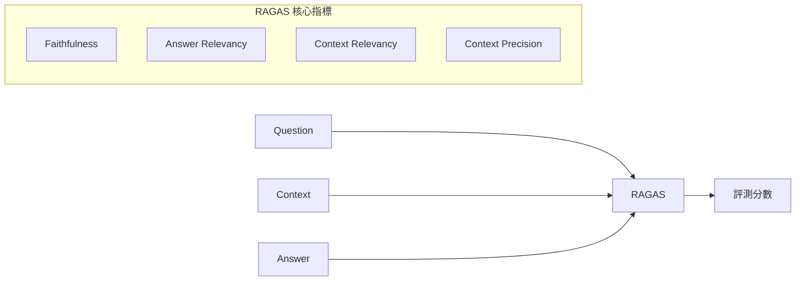

# RAGAS 完整指南

RAGAS（Retrieval Augmented Generation Assessment）是專為 RAG 系統設計的評測框架。本文提供完整的安裝、配置和使用指南。

## 概述



---

## 安裝與配置

### 安裝

```bash
# 使用 pip 安裝
pip install ragas

# 使用 uv 安裝
uv pip install ragas
```

### 基本配置

```python
import os
from ragas import evaluate
from ragas.metrics import (
    faithfulness,
    answer_relevancy,
    context_precision,
    context_recall,
)

# 配置 OpenAI API
os.environ["OPENAI_API_KEY"] = "your-api-key"
```

---

## 核心指標

### Faithfulness（忠實度）

衡量答案是否基於給定的上下文，避免幻覺。

```python
from ragas.metrics import faithfulness

# 評測範例
result = evaluate(
    dataset,
    metrics=[faithfulness],
)
print(f"Faithfulness: {result['faithfulness']:.4f}")
```

**分數解讀：**

| 分數範圍 | 含義 | 建議 |
|----------|------|------|
| 0.9 - 1.0 | 高度忠實 | 理想狀態 |
| 0.7 - 0.9 | 大致忠實 | 可接受 |
| < 0.7 | 存在幻覺 | 需優化 |

### Answer Relevancy（答案相關性）

衡量答案與問題的相關程度。

```python
from ragas.metrics import answer_relevancy

result = evaluate(
    dataset,
    metrics=[answer_relevancy],
)
```

### Context Precision（上下文精確度）

衡量檢索到的上下文中，相關資訊排序是否靠前。

### Context Recall（上下文召回率）

衡量檢索是否涵蓋回答問題所需的所有資訊。

---

## 完整評測流程

### 準備數據

```python
from datasets import Dataset

# 準備評測數據
data = {
    "question": [
        "什麼是機器學習？",
        "如何安裝 Python？",
    ],
    "answer": [
        "機器學習是人工智慧的一個分支...",
        "可以從官網下載安裝包...",
    ],
    "contexts": [
        ["機器學習是一種讓電腦從數據中學習的方法..."],
        ["Python 可以從 python.org 下載..."],
    ],
    "ground_truth": [
        "機器學習是 AI 的分支，通過數據學習模式",
        "從 python.org 下載並運行安裝程序",
    ],
}

dataset = Dataset.from_dict(data)
```

### 執行評測

```python
from ragas import evaluate
from ragas.metrics import (
    faithfulness,
    answer_relevancy,
    context_precision,
    context_recall,
)

result = evaluate(
    dataset,
    metrics=[
        faithfulness,
        answer_relevancy,
        context_precision,
        context_recall,
    ],
)

# 輸出結果
print(result)
print(result.to_pandas())
```

---

## 自定義配置

### 使用不同的 LLM

```python
from ragas.llms import LangchainLLMWrapper
from langchain_openai import ChatOpenAI

# 使用 GPT-4
llm = LangchainLLMWrapper(ChatOpenAI(model="gpt-4"))

result = evaluate(
    dataset,
    metrics=[faithfulness],
    llm=llm,
)
```

### 批次處理

```python
from ragas import evaluate

# 設置批次大小
result = evaluate(
    dataset,
    metrics=[faithfulness, answer_relevancy],
    raise_exceptions=False,
)
```

---

## 與 CI/CD 整合

### GitHub Actions 範例

```yaml
name: RAG Evaluation

on:
  push:
    branches: [main]

jobs:
  evaluate:
    runs-on: ubuntu-latest
    steps:
      - uses: actions/checkout@v4
      
      - name: Set up Python
        uses: actions/setup-python@v4
        with:
          python-version: '3.11'
          
      - name: Install dependencies
        run: pip install ragas datasets
        
      - name: Run evaluation
        env:
          OPENAI_API_KEY: ${{ secrets.OPENAI_API_KEY }}
        run: python evaluate_rag.py
```

---

## 最佳實踐

!!! tip "RAGAS 使用建議"
    1. **基準建立**：首次評測建立基準線
    2. **版本追蹤**：記錄每次評測的配置和結果
    3. **閾值設定**：基於業務需求設定通過閾值
    4. **定期回歸**：每次更新後執行評測

!!! warning "注意事項"
    - RAGAS 需要 LLM 作為評估者，有 API 成本
    - 不同 LLM 評估結果可能有差異
    - 建議結合人工評測驗證自動評測結果

## 延伸閱讀

- [RAGAS 官方文檔](https://docs.ragas.io/)
- [RAGAS GitHub](https://github.com/explodinggradients/ragas)
