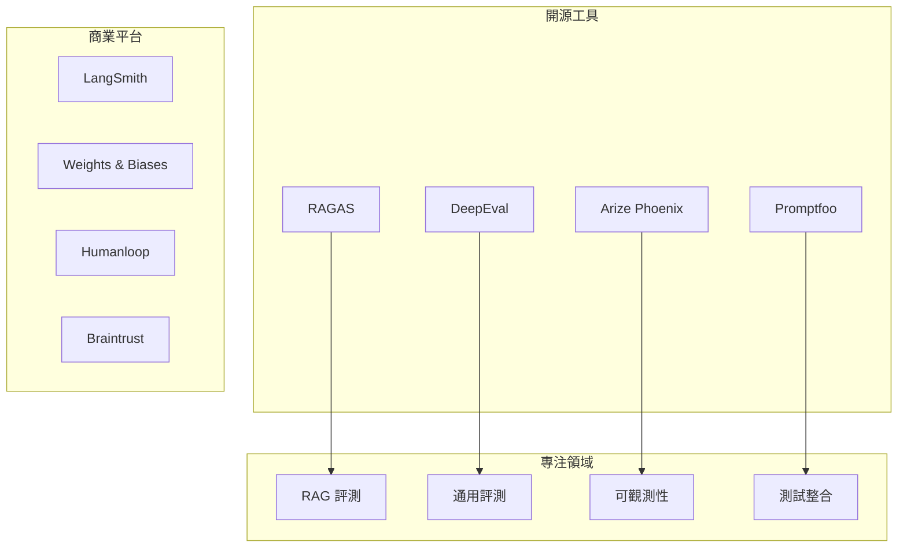
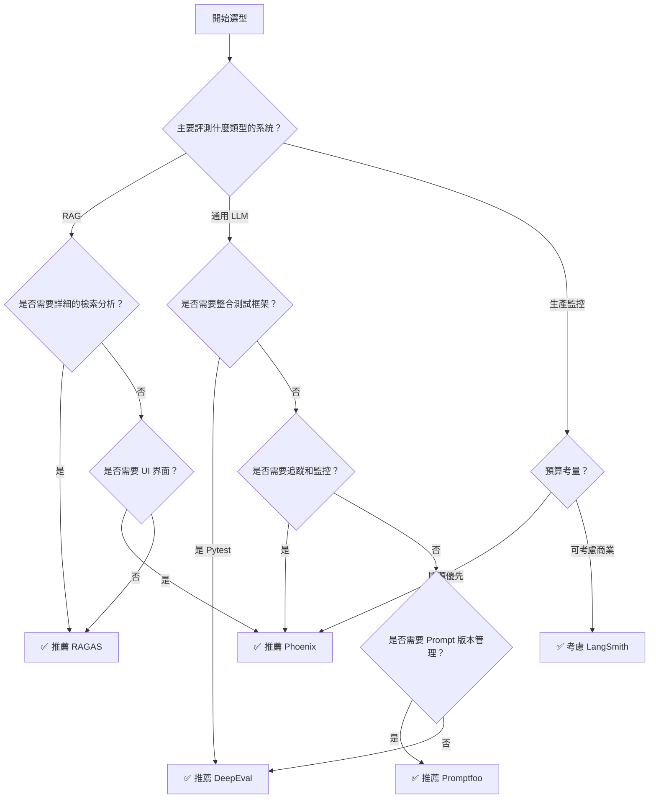
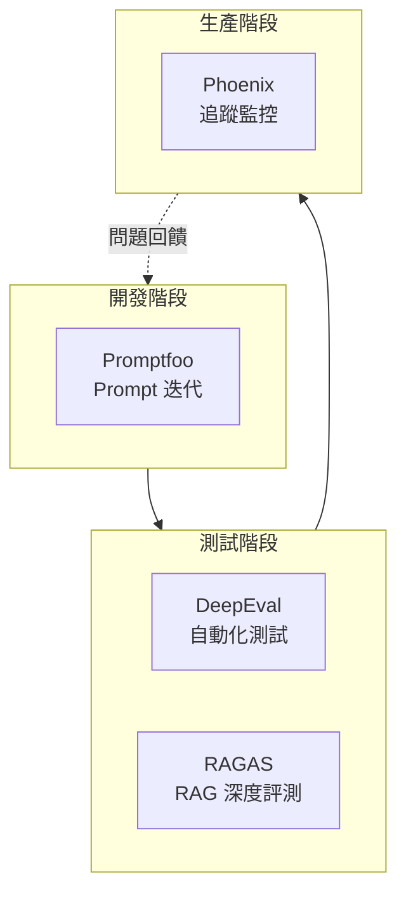

# 工具選型決策

選擇合適的 LLM 評測工具是建立評測體系的重要一步。本文提供系統化的選型決策指南，幫助團隊根據需求選擇最適合的工具組合。

## 主流工具概覽

### 工具定位矩陣



---

## 詳細工具對比

### 核心功能對比

| 功能 | RAGAS | DeepEval | Phoenix | Promptfoo | LangSmith |
|------|-------|----------|---------|-----------|-----------|
| **主要用途** | RAG 評測 | LLM 測試 | 追蹤分析 | Prompt 測試 | 全流程 |
| **開源** | ✅ | ✅ | ✅ | ✅ | 部分 |
| **安裝難度** | 簡單 | 簡單 | 中等 | 簡單 | 中等 |
| **學習曲線** | 低 | 低 | 中 | 低 | 中 |
| **維護活躍度** | 高 | 高 | 高 | 高 | 高 |

### 指標支援對比

| 指標類型 | RAGAS | DeepEval | Phoenix |
|----------|-------|----------|---------|
| Faithfulness | ✅ 內建 | ✅ 內建 | ✅ 外掛 |
| Answer Relevancy | ✅ 內建 | ✅ 內建 | ✅ 外掛 |
| Context Precision | ✅ 內建 | ❌ | ❌ |
| Context Recall | ✅ 內建 | ❌ | ❌ |
| Hallucination | ✅ 內建 | ✅ 內建 | ✅ 外掛 |
| Toxicity | ❌ | ✅ 內建 | ❌ |
| Bias | ❌ | ✅ 內建 | ❌ |
| 自定義指標 | ✅ | ✅ | ✅ |

### 整合能力對比

| 整合項目 | RAGAS | DeepEval | Phoenix | Promptfoo |
|----------|-------|----------|---------|-----------|
| Pytest | ❌ | ✅ 原生 | ❌ | ❌ |
| GitHub Actions | ✅ | ✅ | ✅ | ✅ |
| LangChain | ✅ | ✅ | ✅ | ❌ |
| OpenTelemetry | ❌ | ❌ | ✅ | ❌ |
| Jupyter | ✅ | ✅ | ✅ | ❌ |
| Web UI | ❌ | 付費 | ✅ 免費 | ✅ 免費 |

---

## 場景化選型指南

### 決策流程圖



### 場景一：RAG 系統評測

**需求特點**：

- 需要評估檢索品質
- 需要評估生成忠實度
- 需要分析 Context 使用情況

**推薦方案**：

```python
# 主要使用 RAGAS
from ragas import evaluate
from ragas.metrics import (
    faithfulness,
    answer_relevancy,
    context_precision,
    context_recall,
)

# 評測配置
metrics = [faithfulness, answer_relevancy, context_precision, context_recall]

result = evaluate(
    dataset=eval_dataset,
    metrics=metrics,
)

print(result.to_pandas())
```

**補充工具**：

- Arize Phoenix：追蹤 RAG 流程，分析延遲
- DeepEval：整合到 CI/CD

---

### 場景二：LLM 應用自動化測試

**需求特點**：

- 需要整合到現有測試框架
- 需要在 CI/CD 中運行
- 需要多維度評測

**推薦方案**：

```python
# 使用 DeepEval + Pytest
# test_llm.py

import pytest
from deepeval import assert_test
from deepeval.metrics import (
    AnswerRelevancyMetric,
    FaithfulnessMetric,
    ToxicityMetric,
)
from deepeval.test_case import LLMTestCase

class TestCustomerServiceBot:
    """客服機器人測試套件"""
    
    @pytest.fixture
    def metrics(self):
        return [
            AnswerRelevancyMetric(threshold=0.7),
            ToxicityMetric(threshold=0.1),
        ]
    
    def test_order_query(self, metrics):
        """測試訂單查詢功能"""
        test_case = LLMTestCase(
            input="我的訂單什麼時候到？",
            actual_output="請提供您的訂單號，我來幫您查詢配送進度。",
        )
        assert_test(test_case, metrics)
    
    def test_refund_request(self, metrics):
        """測試退款請求處理"""
        test_case = LLMTestCase(
            input="我要退款",
            actual_output="好的，請問您要退款的訂單號是什麼？我來幫您處理。",
        )
        assert_test(test_case, metrics)

# 運行測試
# pytest test_llm.py -v
# 或 deepeval test run test_llm.py
```

**CI/CD 配置**：

```yaml
# .github/workflows/llm-test.yml
name: LLM Evaluation

on:
  push:
    branches: [main]
  pull_request:

jobs:
  test:
    runs-on: ubuntu-latest
    steps:
      - uses: actions/checkout@v4
      
      - name: Set up Python
        uses: actions/setup-python@v4
        with:
          python-version: '3.11'
      
      - name: Install dependencies
        run: |
          pip install deepeval pytest
      
      - name: Run LLM tests
        env:
          OPENAI_API_KEY: ${{ secrets.OPENAI_API_KEY }}
        run: deepeval test run tests/
      
      - name: Upload results
        uses: actions/upload-artifact@v3
        with:
          name: eval-results
          path: .deepeval/
```

---

### 場景三：生產環境監控

**需求特點**：

- 需要追蹤每個請求
- 需要分析延遲和成本
- 需要即時發現問題

**推薦方案**：

```python
# 使用 Arize Phoenix
import phoenix as px
from phoenix.otel import register
from openinference.instrumentation.openai import OpenAIInstrumentor

# 啟動 Phoenix
px.launch_app()

# 設置追蹤
tracer_provider = register(
    project_name="my-llm-app",
    endpoint="http://localhost:6006/v1/traces"
)

# 自動追蹤 OpenAI 調用
OpenAIInstrumentor().instrument(tracer_provider=tracer_provider)

# 之後的所有 OpenAI 調用都會被追蹤
import openai
client = openai.OpenAI()

response = client.chat.completions.create(
    model="gpt-4",
    messages=[{"role": "user", "content": "Hello!"}]
)

# 在 http://localhost:6006 查看追蹤
```

**監控儀表板要點**：

| 監控項目 | 指標 | 告警閾值 |
|----------|------|----------|
| 請求延遲 | P99 Latency | > 5s |
| 錯誤率 | Error Rate | > 1% |
| Token 成本 | Daily Cost | > $100 |
| 評測分數 | Avg Score | < 0.7 |

---

### 場景四：Prompt 開發與測試

**需求特點**：

- 需要比較多個 Prompt 版本
- 需要系統化的測試用例
- 需要快速迭代

**推薦方案**：

```yaml
# promptfoo 配置 - promptfooconfig.yaml
prompts:
  - id: v1
    prompt: |
      你是客服助手。
      用戶問題：{{question}}
  
  - id: v2
    prompt: |
      你是專業的客服代表，請簡潔有禮地回答。
      用戶問題：{{question}}

providers:
  - openai:gpt-4
  - openai:gpt-3.5-turbo

tests:
  - vars:
      question: "我的訂單什麼時候到？"
    assert:
      - type: contains
        value: "訂單"
      - type: llm-rubric
        value: "回答是否禮貌且有幫助"
  
  - vars:
      question: "怎麼退款？"
    assert:
      - type: contains
        value: "退款"
```

```bash
# 運行評測
npx promptfoo eval

# 查看報告
npx promptfoo view
```

---

## 成本考量

### 直接成本對比

| 工具 | 軟體成本 | LLM API 成本 | 基礎設施成本 |
|------|----------|--------------|--------------|
| RAGAS | 免費 | 中（需要 LLM 評估） | 無 |
| DeepEval | 免費/付費 | 中 | 無 |
| Phoenix | 免費 | 低（追蹤為主） | 低（本地運行） |
| Promptfoo | 免費 | 中 | 無 |
| LangSmith | 付費 | 包含 | 無 |

### 隱藏成本考量

```python
def estimate_monthly_cost(
    daily_evaluations: int,
    avg_tokens_per_eval: int,
    tool: str
) -> dict:
    """估算月度評測成本"""
    
    monthly_evals = daily_evaluations * 30
    total_tokens = monthly_evals * avg_tokens_per_eval
    
    # LLM API 成本（以 GPT-4 為例）
    llm_cost = (total_tokens / 1000) * 0.03  # $0.03/1K tokens
    
    # 工具特定成本
    tool_costs = {
        "ragas": 0,
        "deepeval": 0,  # 開源版
        "deepeval_pro": 99,  # 專業版
        "phoenix": 0,
        "langsmith": 39,  # 起步價
    }
    
    return {
        "monthly_evaluations": monthly_evals,
        "total_tokens": total_tokens,
        "llm_api_cost": llm_cost,
        "tool_cost": tool_costs.get(tool, 0),
        "total": llm_cost + tool_costs.get(tool, 0),
    }

# 範例
cost = estimate_monthly_cost(
    daily_evaluations=100,
    avg_tokens_per_eval=500,
    tool="ragas"
)
print(f"月度成本估計: ${cost['total']:.2f}")
```

---

## 組合使用策略

### 推薦組合



### 整合架構

```python
class EvaluationPipeline:
    """整合多工具的評測流水線"""
    
    def __init__(self):
        self.ragas_evaluator = RAGASEvaluator()
        self.deepeval_runner = DeepEvalRunner()
        self.phoenix_tracer = PhoenixTracer()
    
    def run_development_eval(self, test_cases: list) -> dict:
        """開發階段評測"""
        # 使用 DeepEval 快速測試
        return self.deepeval_runner.run(test_cases)
    
    def run_release_eval(self, dataset) -> dict:
        """發布前深度評測"""
        # 使用 RAGAS 詳細評測 RAG 系統
        results = self.ragas_evaluator.evaluate(dataset)
        
        # 設定門檻
        thresholds = {
            "faithfulness": 0.85,
            "answer_relevancy": 0.80,
            "context_precision": 0.75,
        }
        
        passed = all(
            results[metric] >= threshold
            for metric, threshold in thresholds.items()
        )
        
        return {"results": results, "passed": passed}
    
    def setup_production_monitoring(self):
        """配置生產監控"""
        self.phoenix_tracer.start()
```

---

## 選型清單

```markdown
## 工具選型評估清單

### 需求確認
- [ ] 確定評測目標（RAG/通用 LLM/監控）
- [ ] 確定預算範圍（開源優先/可接受付費）
- [ ] 確定技術棧（Python/Node.js/其他）
- [ ] 確定整合需求（CI/CD/測試框架）

### 功能評估
- [ ] 核心指標是否滿足需求
- [ ] 自定義指標的靈活性
- [ ] UI 介面是否必要
- [ ] 報告導出格式是否符合需求

### 技術評估
- [ ] 安裝配置複雜度
- [ ] 文檔和社區支援
- [ ] 維護活躍度
- [ ] 安全性考量

### 試用驗證
- [ ] 小規模 POC 測試
- [ ] 效能評估（延遲/記憶體）
- [ ] 團隊學習曲線評估
- [ ] 與現有系統整合測試
```

---

## 最佳實踐

!!! success "選型建議"
    1. **需求驅動**：先明確評測目標再選工具
    2. **漸進採用**：從簡單方案開始，逐步擴展
    3. **組合使用**：不同工具各有專長，組合效果更佳
    4. **成本意識**：考慮長期的 LLM API 成本
    5. **社區活躍**：選擇維護活躍的工具

!!! warning "常見錯誤"
    - ❌ 過度追求功能豐富
    - ❌ 忽略學習成本
    - ❌ 沒有考慮擴展性
    - ❌ 僅看軟體成本忽略 API 成本

## 延伸閱讀

- [RAGAS 官方文檔](https://docs.ragas.io/)
- [DeepEval 官方文檔](https://docs.confident-ai.com/)
- [Arize Phoenix 官方文檔](https://docs.arize.com/phoenix/)
- [Promptfoo 官方文檔](https://www.promptfoo.dev/)
