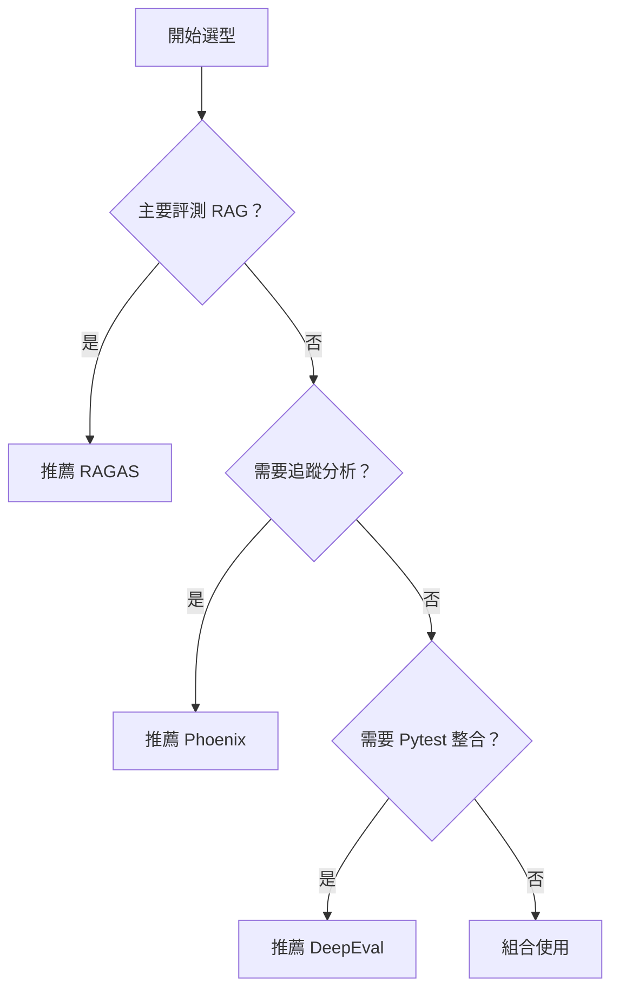

# 工具選型決策

選擇合適的 LLM 評測工具是建立評測體系的重要一步。本文提供系統化的選型決策指南。

## 工具對比概覽

| 特性 | RAGAS | DeepEval | Arize Phoenix |
|------|-------|----------|---------------|
| 主要用途 | RAG 評測 | 通用 LLM 測試 | 可觀測性 + 評測 |
| 安裝難度 | 簡單 | 簡單 | 中等 |
| CI/CD 整合 | ✅ | ✅ Pytest | ✅ |
| UI 介面 | ❌ | ✅ 付費版 | ✅ 免費 |
| 開源 | ✅ | ✅ | ✅ |
| 追蹤功能 | ❌ | ❌ | ✅ |

---

## 決策流程



---

## 場景推薦

### 場景一：專注 RAG 評測

**推薦：RAGAS**

- 專為 RAG 設計的指標體系
- 輕量級，易於整合
- 社區活躍，持續更新

### 場景二：通用 LLM 測試

**推薦：DeepEval**

- 豐富的內建指標
- Pytest 原生整合
- 便於建立測試套件

### 場景三：生產環境監控

**推薦：Arize Phoenix**

- 完整的追蹤可視化
- 即時監控能力
- 除錯與分析工具

### 場景四：完整評測體系

**推薦：組合使用**

```python
# 開發階段：Phoenix 追蹤 + DeepEval 測試
# 上線前：RAGAS RAG 評測
# 生產環境：Phoenix 監控
```

---

## 成本考量

| 工具 | 軟體成本 | LLM API 成本 | 維運成本 |
|------|----------|--------------|----------|
| RAGAS | 免費 | 中 | 低 |
| DeepEval | 免費/付費 | 中 | 低 |
| Phoenix | 免費 | 低-中 | 中 |

---

## 選型清單

```markdown
## 工具選型評估

### 需求確認
- [ ] 確定評測目標（RAG/通用 LLM/監控）
- [ ] 確定預算範圍
- [ ] 確定技術棧相容性

### 功能評估
- [ ] 核心指標是否滿足需求
- [ ] CI/CD 整合是否順暢
- [ ] 報告輸出是否符合需求

### 試用驗證
- [ ] 小規模 POC 測試
- [ ] 效能評估
- [ ] 團隊學習曲線評估
```

---

## 最佳實踐

!!! tip "選型建議"
    1. 先明確評測目標再選工具
    2. 從簡單方案開始，逐步擴展
    3. 考慮未來擴展性
    4. 重視社區活躍度

!!! success "組合策略"
    實務上，許多團隊會組合使用多個工具：
    - 開發階段用 DeepEval 快速測試
    - 發布前用 RAGAS 深度評測
    - 線上用 Phoenix 持續監控
