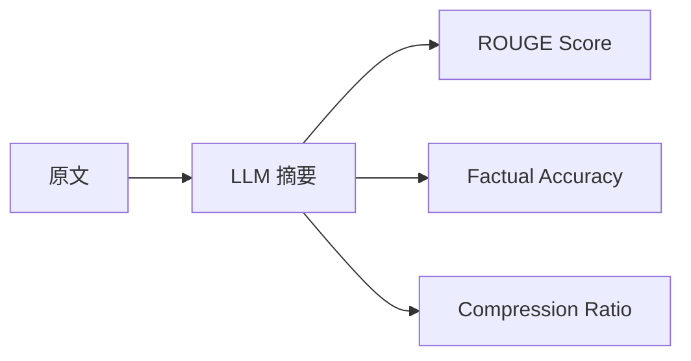

# LLM 應用案例

本文分享 LLM 直接應用（非 RAG）的評測案例。

## 案例一：寫作助手

### 背景

- **功能**：協助用戶撰寫各類文章
- **用戶**：內容創作者

### 評測維度

| 維度 | 說明 | 指標 |
|------|------|------|
| 品質 | 語言流暢度 | Fluency Score |
| 創意 | 內容獨特性 | Creativity Score |
| 一致性 | 風格保持 | Style Consistency |
| 安全性 | 無有害內容 | Toxicity < 0.01 |

### 評測方法

```python
evaluation_framework = {
    "automatic": [
        "perplexity",
        "diversity_score",
        "toxicity_check",
    ],
    "human": [
        "overall_quality",
        "helpfulness",
        "creativity",
    ]
}
```

---

## 案例二：程式碼助手

### 背景

- **功能**：程式碼生成與解釋
- **語言**：Python、JavaScript

### 評測指標

```yaml
code_metrics:
  correctness:
    syntax_valid: 0.98
    test_pass_rate: 0.85
    
  quality:
    code_style: 0.90
    complexity: "適中"
    
  safety:
    no_vulnerabilities: True
```

### 關鍵發現

1. **簡單任務**：通過率 > 95%
2. **複雜任務**：通過率 60-70%
3. **錯誤類型**：邊界條件處理不足

---

## 案例三：摘要生成

### 評測框架



### 結果

| 指標 | 目標 | 實際 |
|------|------|------|
| ROUGE-1 | > 0.45 | 0.52 |
| ROUGE-L | > 0.35 | 0.41 |
| Factual | > 0.90 | 0.88 |

---

## 經驗總結

!!! success "LLM 應用評測要點"
    1. 結合自動和人工評測
    2. 針對任務設計專屬指標
    3. 建立多層級難度測試集
    4. 關注邊界情況表現
