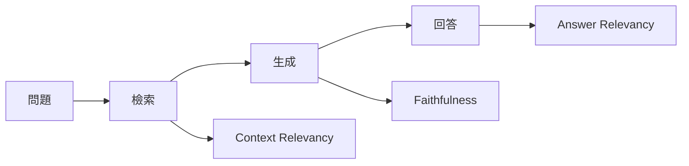
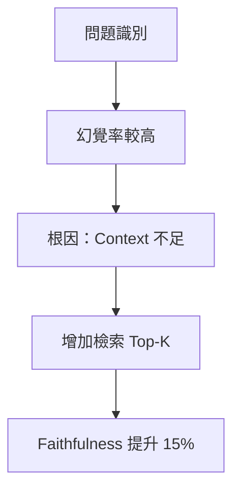

# RAG 系統案例

本文分享 RAG 系統評測的實戰案例與經驗。

## 案例一：企業知識問答系統

### 背景

- **系統類型**：內部知識庫問答
- **用戶規模**：5000+ 員工
- **知識庫**：10,000+ 文檔

### 評測框架



### 評測結果

| 指標 | 基線 | 優化後 | 改善 |
|------|------|--------|------|
| Context Relevancy | 0.72 | 0.85 | +18% |
| Faithfulness | 0.78 | 0.92 | +18% |
| Answer Relevancy | 0.80 | 0.88 | +10% |

### 優化關鍵

1. **檢索優化**：調整 chunk 大小從 512 到 1024
2. **重排序**：添加 Reranker 提升相關性
3. **Prompt 優化**：強調「僅基於提供資訊回答」

---

## 案例二：客服智能助手

### 背景

- **應用場景**：電商客服
- **日均對話**：10,000+ 輪

### 核心指標

```yaml
metrics:
  accuracy:
    intent_accuracy: 0.95
    answer_accuracy: 0.88
    
  efficiency:
    avg_response_time: 1.2s
    resolution_rate: 0.75
    
  safety:
    toxicity_rate: 0.001
    pii_leakage: 0
```

### 優化過程



---

## 經驗總結

!!! success "RAG 評測要點"
    1. **檢索與生成分開評測**：便於定位問題
    2. **關注 Faithfulness**：是 RAG 核心指標
    3. **建立領域測試集**：覆蓋業務場景
    4. **持續監控**：上線後定期回歸

!!! tip "常見問題"
    - 幻覺 → 檢查 Context 品質
    - 不相關 → 優化檢索策略
    - 格式錯誤 → 改進 Prompt
