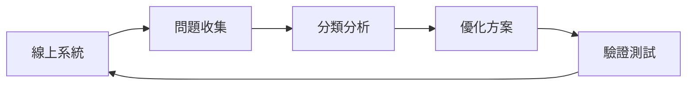
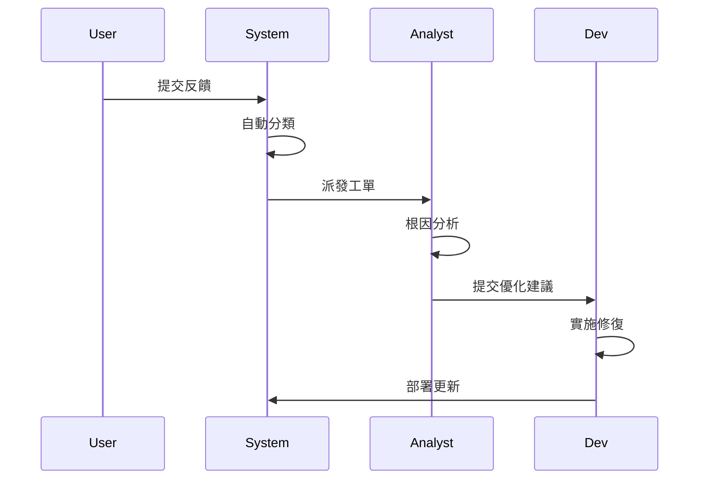

# Feedback Loop 機制

錯誤反饋迴圈是持續改進 AI 系統品質的核心機制。

## 機制概覽



---

## 問題收集

### 收集渠道

| 渠道 | 類型 | 優先級 |
|------|------|--------|
| 用戶反饋 | 直接投訴 | 高 |
| 評分系統 | 滿意度評分 | 中 |
| 自動監控 | 異常檢測 | 高 |
| 人工審核 | 抽樣檢查 | 中 |

### 收集格式

```python
from dataclasses import dataclass
from datetime import datetime

@dataclass
class FeedbackCase:
    case_id: str
    timestamp: datetime
    input: str
    output: str
    expected: str
    feedback_type: str  # negative, bug, suggestion
    source: str
    severity: str
```

---

## 分類體系

```yaml
feedback_categories:
  accuracy:
    - incorrect_answer
    - hallucination
    - outdated_info
    
  relevance:
    - off_topic
    - partial_answer
    
  safety:
    - inappropriate_content
    - pii_exposure
    
  experience:
    - too_slow
    - format_issue
```

---

## 處理流程

### 標準流程



### SLA 要求

| 嚴重程度 | 響應時間 | 解決時間 |
|----------|----------|----------|
| 緊急 | 1 小時 | 24 小時 |
| 高 | 4 小時 | 3 天 |
| 中 | 1 天 | 1 週 |
| 低 | 3 天 | 2 週 |

---

## 指標追蹤

```python
class FeedbackMetrics:
    def __init__(self):
        self.total_cases = 0
        self.resolved_cases = 0
        self.avg_resolution_time = 0
    
    def get_resolution_rate(self) -> float:
        return self.resolved_cases / self.total_cases
    
    def get_repeat_rate(self, category: str) -> float:
        """計算同類問題重複率"""
        pass
```

---

## 最佳實踐

!!! success "機制建設要點"
    1. 降低反饋門檻，鼓勵用戶回報
    2. 自動化分類減少人工負擔
    3. 建立明確的 SLA 和責任人
    4. 追蹤改進效果驗證閉環
