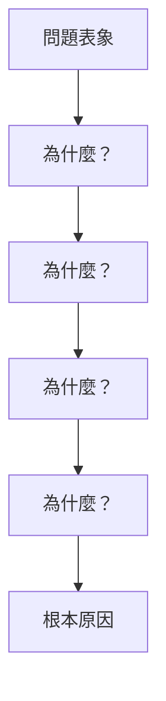
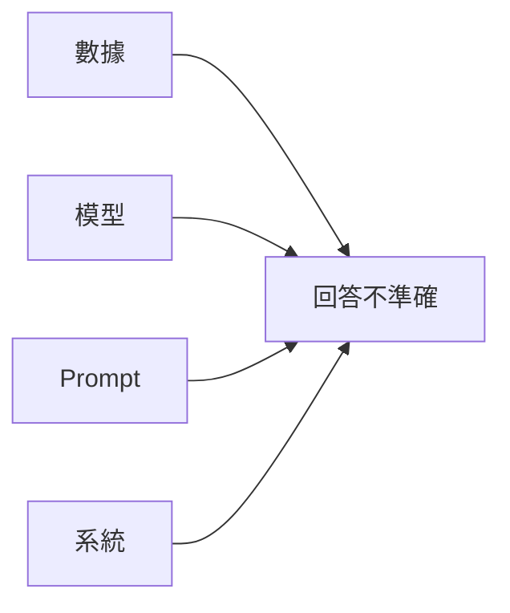

# Bad Case 根因分析

系統化的根因分析（RCA）是解決 AI 系統問題的關鍵。

## 分析框架



---

## 問題分類

### 常見根因類型

| 類別 | 根因 | 解決方向 |
|------|------|----------|
| 數據 | 訓練數據不足 | 數據增強 |
| 模型 | 能力邊界 | 模型升級 |
| 檢索 | 索引品質 | 優化 Embedding |
| Prompt | 指令不清 | 優化 Prompt |
| 系統 | 上下文丟失 | 架構修復 |

---

## 分析模板

```yaml
rca_template:
  case_id: "CASE-2026-001"
  
  symptom:
    description: "回答與問題無關"
    frequency: "5%"
    impact: "用戶滿意度下降"
    
  analysis:
    immediate_cause: "檢索結果不相關"
    contributing_factors:
      - "查詢改寫失敗"
      - "Embedding 相似度閾值過低"
    root_cause: "Embedding 模型對特定領域表現不佳"
    
  solution:
    short_term: "調高相似度閾值"
    long_term: "微調領域 Embedding"
    
  verification:
    metric: "Answer Relevancy"
    target: "> 0.85"
    current: "0.72"
```

---

## 分析流程

### 5 Whys 方法

```python
def five_whys_analysis(symptom: str) -> list:
    """5 Whys 分析結構"""
    analysis = [{"level": 0, "question": symptom}]
    
    for i in range(1, 6):
        analysis.append({
            "level": i,
            "question": f"為什麼會發生第 {i-1} 層的問題？",
            "answer": "",  # 待填寫
        })
    
    return analysis
```

### 魚骨圖分類



---

## 案例庫管理

```python
class RCACaseLibrary:
    def __init__(self):
        self.cases: list = []
    
    def add_case(self, case: dict) -> None:
        self.cases.append(case)
    
    def search_similar(self, symptom: str) -> list:
        """搜尋相似案例"""
        return [c for c in self.cases if symptom in c["symptom"]]
    
    def get_common_root_causes(self) -> dict:
        """統計常見根因"""
        from collections import Counter
        return Counter(c["root_cause"] for c in self.cases)
```

---

## 最佳實踐

!!! success "RCA 要點"
    1. 深入挖掘，不止於表象
    2. 量化問題影響範圍
    3. 驗證解決方案效果
    4. 建立案例庫避免重複問題
