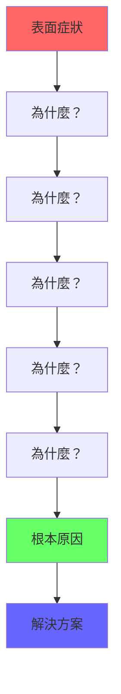
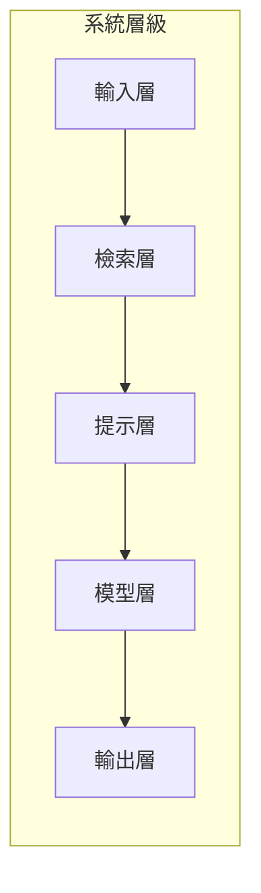
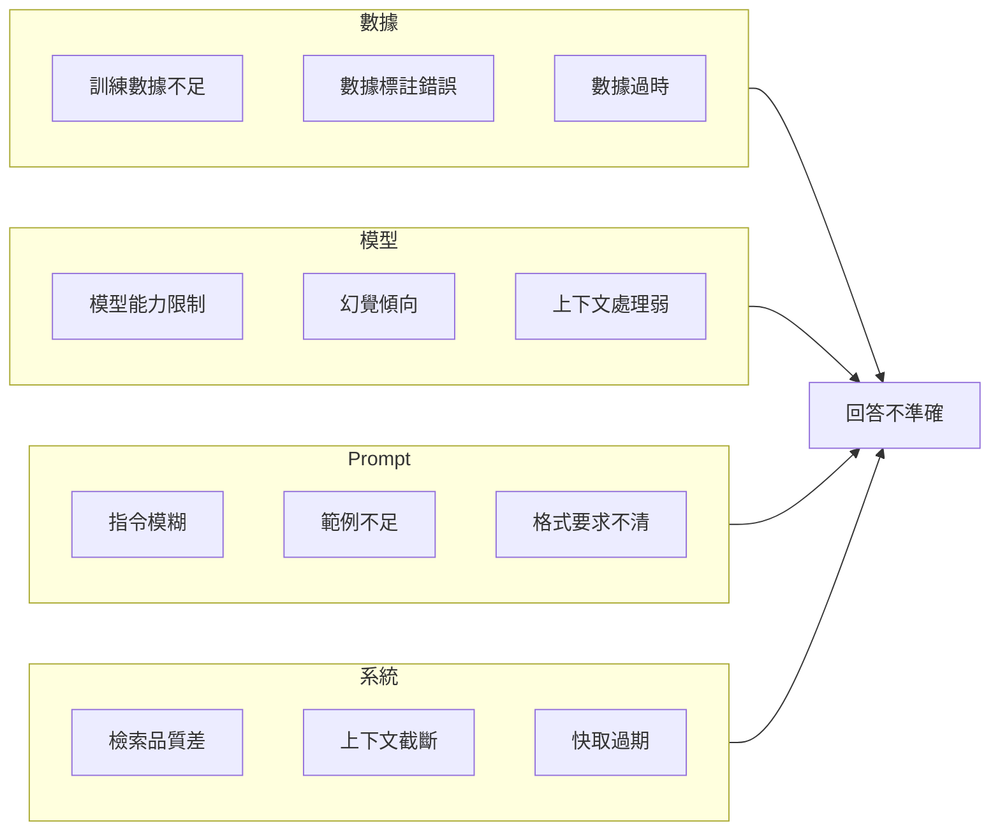

# Bad Case 根因分析

系統化的根因分析（Root Cause Analysis, RCA）是解決 AI 系統問題、持續改進模型表現的關鍵方法論。本文詳細介紹 RCA 的完整流程、分析框架和實戰技巧。

## 什麼是 RCA

根因分析是一種問題解決方法，目標是找出問題的根本原因而非僅處理表面症狀。在 LLM 評測中，RCA 幫助我們：

- 理解 Bad Case 的真正成因
- 避免「治標不治本」的優化
- 建立可複用的問題解決模式
- 預防同類問題再次發生



---

## 問題分類框架

### 按表現分類

| 問題類型 | 表現 | 常見根因 |
|----------|------|----------|
| **幻覺** | 回答包含虛假資訊 | Context 不足、模型過度自信 |
| **不相關** | 回答與問題無關 | 意圖識別錯誤、檢索失敗 |
| **不完整** | 回答缺少關鍵資訊 | Context 截斷、Prompt 設計 |
| **格式錯誤** | 輸出格式不符要求 | 指令不清、Few-shot 不足 |
| **安全問題** | 輸出不當內容 | 過濾器失效、Prompt 注入 |
| **效能問題** | 回應過慢 | 系統瓶頸、Token 過長 |

### 按系統層級分類



各層常見問題：

| 層級 | 問題類型 | 診斷方法 |
|------|----------|----------|
| **輸入層** | 解析錯誤、意圖誤判 | 檢查輸入預處理 |
| **檢索層** | 檢索不相關、排序錯誤 | 評估 Context Relevancy |
| **提示層** | 指令不清、範例不足 | 審查 Prompt 設計 |
| **模型層** | 能力不足、幻覺傾向 | 評估模型基準表現 |
| **輸出層** | 格式錯誤、過濾失敗 | 檢查後處理邏輯 |

---

## 分析方法詳解

### 5 Whys 分析法

5 Whys 是最經典的 RCA 方法，通過連續追問「為什麼」來挖掘根因。

```python
from dataclasses import dataclass, field
from datetime import datetime
from typing import Optional

@dataclass
class FiveWhysAnalysis:
    """5 Whys 分析結構"""
    case_id: str
    symptom: str
    analyst: str
    created_at: datetime = field(default_factory=datetime.now)
    
    why_1: str = ""
    why_2: str = ""
    why_3: str = ""
    why_4: str = ""
    why_5: str = ""
    
    root_cause: str = ""
    solution: str = ""
    
    def is_complete(self) -> bool:
        """檢查分析是否完成"""
        return bool(self.root_cause and self.solution)
    
    def to_report(self) -> str:
        """生成分析報告"""
        return f"""
# 5 Whys 分析報告

**案例 ID**: {self.case_id}
**分析人員**: {self.analyst}
**分析日期**: {self.created_at.strftime('%Y-%m-%d')}

## 問題表象
{self.symptom}

## 分析過程
1. **為什麼？** {self.why_1}
2. **為什麼？** {self.why_2}
3. **為什麼？** {self.why_3}
4. **為什麼？** {self.why_4}
5. **為什麼？** {self.why_5}

## 根本原因
{self.root_cause}

## 解決方案
{self.solution}
"""


# 使用範例
analysis = FiveWhysAnalysis(
    case_id="CASE-2026-0123",
    symptom="客服機器人對訂單查詢回答錯誤的配送時間",
    analyst="評測團隊",
)

analysis.why_1 = "回答中的日期與實際系統數據不符"
analysis.why_2 = "模型沒有使用檢索到的訂單資訊"
analysis.why_3 = "檢索結果被放在 Prompt 的末尾，模型忽略了"
analysis.why_4 = "Prompt 模板設計將 Context 放在不顯眼位置"
analysis.why_5 = "Prompt 設計時沒有進行位置敏感性測試"

analysis.root_cause = "Prompt 模板設計缺陷：Context 位置導致模型注意力不足"
analysis.solution = "重新設計 Prompt 模板，將 Context 放在更顯著位置，並增加明確的引用指令"
```

### 魚骨圖分析法

魚骨圖（石川圖）幫助系統性地識別可能原因。



### 故障樹分析（FTA）

```python
from enum import Enum
from typing import Optional

class NodeType(Enum):
    AND = "and"  # 所有子節點都需滿足
    OR = "or"    # 任一子節點滿足即可
    LEAF = "leaf"  # 葉子節點（基本原因）

@dataclass
class FaultTreeNode:
    """故障樹節點"""
    name: str
    node_type: NodeType
    probability: float = 0.0
    children: list["FaultTreeNode"] = field(default_factory=list)
    
    def calculate_probability(self) -> float:
        """計算節點發生機率"""
        if self.node_type == NodeType.LEAF:
            return self.probability
        
        child_probs = [c.calculate_probability() for c in self.children]
        
        if self.node_type == NodeType.AND:
            # 所有條件都滿足
            result = 1.0
            for p in child_probs:
                result *= p
            return result
        else:  # OR
            # 任一條件滿足
            result = 1.0
            for p in child_probs:
                result *= (1 - p)
            return 1 - result


# 建立故障樹範例
fault_tree = FaultTreeNode(
    name="回答產生幻覺",
    node_type=NodeType.OR,
    children=[
        FaultTreeNode(
            name="Context 問題",
            node_type=NodeType.OR,
            children=[
                FaultTreeNode("檢索不到相關資訊", NodeType.LEAF, 0.15),
                FaultTreeNode("Context 被截斷", NodeType.LEAF, 0.10),
                FaultTreeNode("Context 本身有誤", NodeType.LEAF, 0.05),
            ]
        ),
        FaultTreeNode(
            name="模型問題",
            node_type=NodeType.OR,
            children=[
                FaultTreeNode("模型過度自信", NodeType.LEAF, 0.20),
                FaultTreeNode("訓練數據偏差", NodeType.LEAF, 0.08),
            ]
        ),
        FaultTreeNode(
            name="Prompt 問題",
            node_type=NodeType.AND,
            children=[
                FaultTreeNode("缺乏忠實度指令", NodeType.LEAF, 0.30),
                FaultTreeNode("無 grounding 範例", NodeType.LEAF, 0.40),
            ]
        ),
    ]
)

print(f"幻覺發生機率: {fault_tree.calculate_probability():.2%}")
```

---

## 診斷工具與技巧

### 日誌分析

```python
import json
from collections import Counter

class BadCaseAnalyzer:
    """Bad Case 批量分析器"""
    
    def __init__(self, logs: list[dict]):
        self.logs = logs
    
    def categorize_by_error_type(self) -> dict:
        """按錯誤類型分類統計"""
        counter = Counter(log.get("error_type", "unknown") for log in self.logs)
        return dict(counter.most_common())
    
    def categorize_by_intent(self) -> dict:
        """按意圖分類統計失敗率"""
        by_intent = {}
        for log in self.logs:
            intent = log.get("intent", "unknown")
            if intent not in by_intent:
                by_intent[intent] = {"total": 0, "failed": 0}
            by_intent[intent]["total"] += 1
            if not log.get("success", True):
                by_intent[intent]["failed"] += 1
        
        # 計算失敗率
        for intent, stats in by_intent.items():
            stats["failure_rate"] = stats["failed"] / stats["total"]
        
        return by_intent
    
    def find_common_patterns(self) -> list[dict]:
        """發現共同模式"""
        patterns = []
        
        # 檢查常見的輸入特徵
        failed_inputs = [log["input"] for log in self.logs if not log.get("success")]
        
        # 長度分析
        avg_len = sum(len(i) for i in failed_inputs) / len(failed_inputs)
        patterns.append({
            "type": "input_length",
            "observation": f"失敗案例平均輸入長度: {avg_len:.0f}",
        })
        
        # 關鍵詞分析
        word_counter = Counter()
        for inp in failed_inputs:
            word_counter.update(inp.split())
        
        common_words = word_counter.most_common(10)
        patterns.append({
            "type": "common_keywords",
            "observation": f"失敗案例常見關鍵詞: {common_words}",
        })
        
        return patterns
    
    def generate_summary_report(self) -> str:
        """生成摘要報告"""
        total = len(self.logs)
        failed = sum(1 for log in self.logs if not log.get("success"))
        
        return f"""
# Bad Case 分析摘要

## 概覽
- 總案例數: {total}
- 失敗案例: {failed}
- 失敗率: {failed/total:.2%}

## 按錯誤類型分布
{json.dumps(self.categorize_by_error_type(), indent=2, ensure_ascii=False)}

## 按意圖分布
{json.dumps(self.categorize_by_intent(), indent=2, ensure_ascii=False)}

## 共同模式
{json.dumps(self.find_common_patterns(), indent=2, ensure_ascii=False)}
"""
```

### A/B 比對分析

```python
def ab_comparison(
    base_responses: list[str],
    test_responses: list[str],
    ground_truths: list[str]
) -> dict:
    """A/B 版本對比分析"""
    from difflib import SequenceMatcher
    
    results = {
        "base_scores": [],
        "test_scores": [],
        "improvements": [],
        "regressions": [],
    }
    
    for i, (base, test, truth) in enumerate(zip(
        base_responses, test_responses, ground_truths
    )):
        base_score = SequenceMatcher(None, base, truth).ratio()
        test_score = SequenceMatcher(None, test, truth).ratio()
        
        results["base_scores"].append(base_score)
        results["test_scores"].append(test_score)
        
        if test_score > base_score * 1.1:  # 改善 10% 以上
            results["improvements"].append(i)
        elif test_score < base_score * 0.9:  # 退化 10% 以上
            results["regressions"].append(i)
    
    return {
        "avg_base_score": sum(results["base_scores"]) / len(results["base_scores"]),
        "avg_test_score": sum(results["test_scores"]) / len(results["test_scores"]),
        "improvement_count": len(results["improvements"]),
        "regression_count": len(results["regressions"]),
        "net_improvement": (
            len(results["improvements"]) - len(results["regressions"])
        ),
    }
```

---

## RCA 案例庫管理

### 案例模板

```yaml
# rca_case_template.yaml
case_id: "CASE-2026-0123"
created_at: "2026-02-04"
analyst: "評測團隊"
status: "resolved"  # open, in_progress, resolved, wont_fix

# 問題描述
symptom:
  summary: "客服機器人回答訂單配送時間錯誤"
  frequency: "約 5% 的訂單查詢"
  impact: "用戶投訴增加，滿意度下降"
  sample_cases:
    - input: "我的訂單 ABC123 什麼時候到"
      actual: "預計明天到達"
      expected: "預計 2/6 到達"

# 分析過程  
analysis:
  method: "5 Whys"
  layers_affected:
    - "retrieval"
    - "prompt"
  immediate_cause: "模型沒有使用檢索到的訂單資訊"
  root_cause: "Prompt 模板設計將 Context 放在不顯眼位置"
  contributing_factors:
    - "檢索結果過長被截斷"
    - "缺乏引用 Context 的明確指令"

# 解決方案
solution:
  short_term:
    action: "調整 Prompt 模板，將 Context 放在更顯著位置"
    effort: "2 hours"
    deadline: "2026-02-05"
  long_term:
    action: "增加 Context 位置敏感性的自動化測試"
    effort: "1 week"
    deadline: "2026-02-15"

# 驗證
verification:
  metric: "訂單查詢準確率"
  baseline: 0.85
  target: 0.95
  actual: 0.93
  verified_at: "2026-02-08"

# 經驗總結
learnings:
  - "Prompt 中 Context 的位置會顯著影響模型注意力"
  - "需要增加針對 Context 使用的評測項目"

# 標籤
tags:
  - "prompt-design"
  - "context-placement"
  - "order-query"
```

### 案例庫查詢

```python
from typing import Optional
import yaml

class RCACaseLibrary:
    """RCA 案例庫"""
    
    def __init__(self):
        self.cases: list[dict] = []
    
    def add_case(self, case: dict) -> None:
        self.cases.append(case)
    
    def search_by_symptom(self, keyword: str) -> list[dict]:
        """按症狀關鍵詞搜尋"""
        return [
            c for c in self.cases
            if keyword.lower() in c.get("symptom", {}).get("summary", "").lower()
        ]
    
    def search_by_tag(self, tag: str) -> list[dict]:
        """按標籤搜尋"""
        return [
            c for c in self.cases
            if tag in c.get("tags", [])
        ]
    
    def search_by_layer(self, layer: str) -> list[dict]:
        """按影響層級搜尋"""
        return [
            c for c in self.cases
            if layer in c.get("analysis", {}).get("layers_affected", [])
        ]
    
    def get_common_root_causes(self) -> dict:
        """統計常見根因"""
        from collections import Counter
        root_causes = [
            c.get("analysis", {}).get("root_cause", "unknown")
            for c in self.cases
        ]
        return dict(Counter(root_causes).most_common(10))
    
    def get_effective_solutions(self) -> list[dict]:
        """獲取驗證有效的解決方案"""
        effective = []
        for case in self.cases:
            verification = case.get("verification", {})
            if verification.get("actual", 0) >= verification.get("target", 0):
                effective.append({
                    "root_cause": case.get("analysis", {}).get("root_cause"),
                    "solution": case.get("solution"),
                    "improvement": verification["actual"] - verification.get("baseline", 0),
                })
        return effective
```

---

## 自動化 RCA 輔助

### 使用 LLM 輔助分析

```python
async def llm_assisted_rca(
    symptom: str,
    context: dict,
    similar_cases: list[dict]
) -> dict:
    """LLM 輔助根因分析"""
    
    prompt = f"""你是一位資深的 AI 系統問題分析專家。
    
## 問題症狀
{symptom}

## 上下文資訊
- 系統類型: {context.get('system_type')}
- 錯誤率: {context.get('error_rate')}
- 受影響意圖: {context.get('affected_intents')}

## 相似歷史案例
{format_similar_cases(similar_cases)}

## 任務
請使用 5 Whys 方法分析此問題的根本原因，並提供：
1. 每層 Why 的分析
2. 根本原因
3. 短期和長期解決建議
4. 驗證方法

請以結構化 JSON 格式回覆。
"""
    
    response = await call_llm(prompt)
    return parse_rca_response(response)
```

### 自動分類器

```python
from sklearn.feature_extraction.text import TfidfVectorizer
from sklearn.naive_bayes import MultinomialNB

class RCAClassifier:
    """根因自動分類器"""
    
    def __init__(self):
        self.vectorizer = TfidfVectorizer()
        self.classifier = MultinomialNB()
        self.trained = False
    
    def train(self, symptoms: list[str], root_causes: list[str]) -> None:
        """訓練分類器"""
        X = self.vectorizer.fit_transform(symptoms)
        self.classifier.fit(X, root_causes)
        self.trained = True
    
    def predict(self, symptom: str) -> tuple[str, float]:
        """預測根因類別"""
        if not self.trained:
            raise ValueError("分類器未訓練")
        
        X = self.vectorizer.transform([symptom])
        prediction = self.classifier.predict(X)[0]
        probability = max(self.classifier.predict_proba(X)[0])
        
        return prediction, probability
```

---

## 最佳實踐總結

!!! success "RCA 成功要素"
    1. **深入挖掘**：不要停在第一個原因，繼續追問
    2. **數據驅動**：用數據驗證假設，避免主觀臆斷
    3. **系統思維**：考慮各層級的相互影響
    4. **知識沉澱**：建立案例庫，避免重複分析
    5. **閉環驗證**：解決方案必須通過指標驗證

!!! warning "常見錯誤"
    - ❌ 急於解決問題而跳過分析
    - ❌ 只看單一案例而忽略模式
    - ❌ 分析後沒有驗證解決效果
    - ❌ 沒有記錄和分享分析結果

## 延伸閱讀

- [Root Cause Analysis Handbook](https://www.asq.org/quality-resources/root-cause-analysis)
- [5 Whys Technique](https://kanbanize.com/lean-management/improvement/5-whys-analysis-tool)
- [Fault Tree Analysis](https://en.wikipedia.org/wiki/Fault_tree_analysis)
