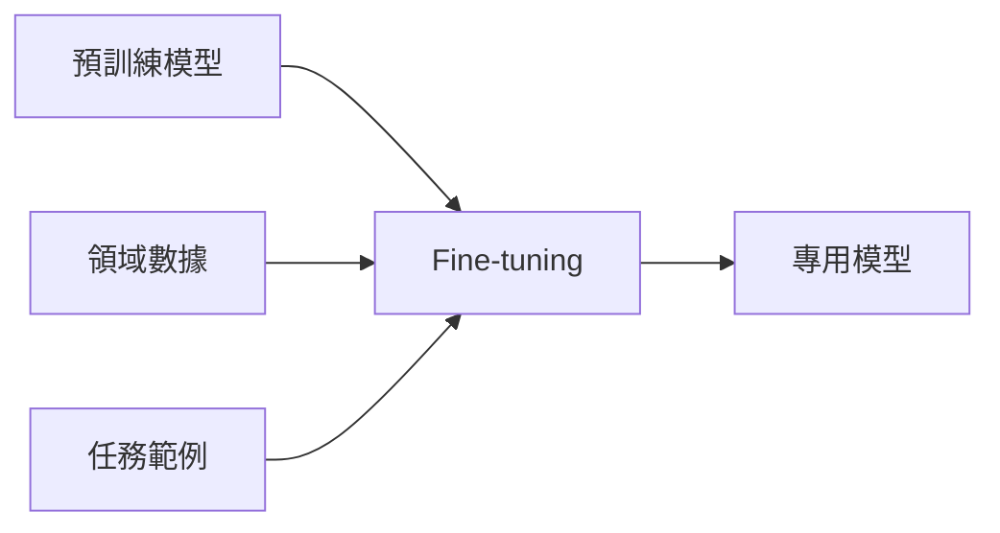
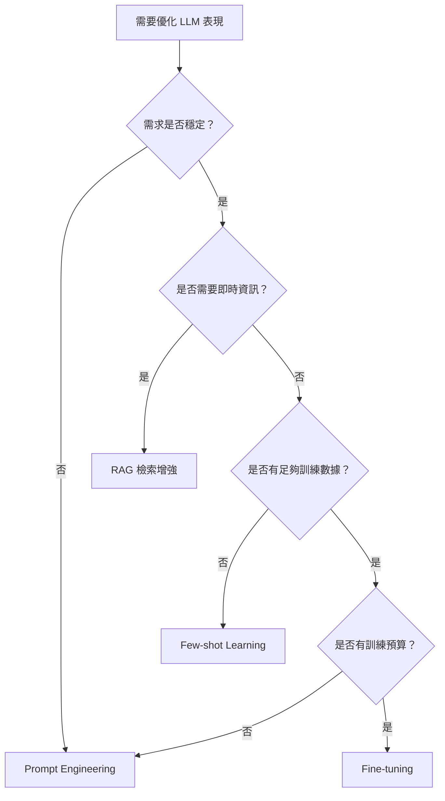

# Fine-tuning 策略

Fine-tuning（微調）是在預訓練模型基礎上，使用特定領域數據進行進一步訓練，使模型更好地適應特定任務的重要技術。本文詳細介紹 Fine-tuning 的完整策略與最佳實踐。

## 什麼是 Fine-tuning

Fine-tuning 是遷移學習（Transfer Learning）的一種形式，通過在已經預訓練的大型語言模型上進行額外訓練，讓模型學習特定的：

- **輸出風格**：如特定的語氣、格式、長度
- **領域知識**：如專業術語、行業規範
- **任務模式**：如分類、抽取、生成的特定方式



---

## 適用場景分析

### 適合 Fine-tuning 的場景

| 場景 | 說明 | 預期效果 |
|------|------|----------|
| **特定風格輸出** | 需要固定的語氣、格式 | 減少 Prompt 長度，提升一致性 |
| **專業術語學習** | 行業特有表達方式 | 更自然地使用專業用語 |
| **複雜任務模式** | 多步驟推理流程 | 更可靠地遵循任務模式 |
| **降低推理成本** | 減少 Few-shot 範例 | 降低 Token 消耗 |

### 不適合 Fine-tuning 的場景

| 場景 | 原因 | 替代方案 |
|------|------|----------|
| **即時資訊需求** | 訓練後知識固定 | RAG 檢索增強 |
| **頻繁變更需求** | 重新訓練成本高 | Prompt Engineering |
| **資料量不足** | 可能過擬合 | Few-shot Learning |
| **多樣性要求高** | 可能降低創意 | 保持基礎模型 |

### 決策流程



---

## 數據準備詳解

### 數據格式規範

#### OpenAI Chat 格式

```json
{
  "messages": [
    {
      "role": "system",
      "content": "你是一個專業的客服助手，回答簡潔有禮。"
    },
    {
      "role": "user", 
      "content": "我的訂單什麼時候能到？"
    },
    {
      "role": "assistant",
      "content": "請提供您的訂單號，我來幫您查詢配送進度。"
    }
  ]
}
```

#### 多輪對話格式

```json
{
  "messages": [
    {"role": "system", "content": "你是客服助手"},
    {"role": "user", "content": "查訂單"},
    {"role": "assistant", "content": "請提供訂單號"},
    {"role": "user", "content": "ABC123"},
    {"role": "assistant", "content": "訂單 ABC123 正在配送中，預計明天到達。"}
  ]
}
```

### 數據數量建議

| 任務類型 | 最少數量 | 建議數量 | 最佳數量 |
|----------|----------|----------|----------|
| 風格調整 | 50 | 100-200 | 500+ |
| 任務學習 | 100 | 300-500 | 1000+ |
| 領域適應 | 200 | 500-1000 | 2000+ |
| 複雜推理 | 500 | 1000-2000 | 5000+ |

### 數據品質要求

```python
from dataclasses import dataclass
from typing import Optional

@dataclass
class TrainingExample:
    """訓練樣本品質檢查"""
    messages: list[dict]
    
    def validate(self) -> tuple[bool, list[str]]:
        errors = []
        
        # 檢查必要欄位
        if not self.messages:
            errors.append("messages 不能為空")
            
        # 檢查角色順序
        roles = [m.get("role") for m in self.messages]
        if roles[0] not in ["system", "user"]:
            errors.append("對話必須以 system 或 user 開始")
            
        # 檢查內容非空
        for i, msg in enumerate(self.messages):
            if not msg.get("content", "").strip():
                errors.append(f"第 {i+1} 條消息內容為空")
                
        # 檢查結尾
        if roles[-1] != "assistant":
            errors.append("對話必須以 assistant 結尾")
            
        return len(errors) == 0, errors


class DatasetValidator:
    """數據集驗證器"""
    
    def __init__(self, min_samples: int = 100):
        self.min_samples = min_samples
        self.errors: list[str] = []
        self.warnings: list[str] = []
    
    def validate_dataset(self, examples: list[TrainingExample]) -> dict:
        # 數量檢查
        if len(examples) < self.min_samples:
            self.warnings.append(
                f"樣本數 {len(examples)} 少於建議的 {self.min_samples}"
            )
        
        # 逐條驗證
        valid_count = 0
        for i, example in enumerate(examples):
            is_valid, errs = example.validate()
            if is_valid:
                valid_count += 1
            else:
                for err in errs:
                    self.errors.append(f"樣本 {i}: {err}")
        
        # 多樣性檢查
        unique_inputs = set(
            m["content"] for ex in examples 
            for m in ex.messages if m["role"] == "user"
        )
        diversity_ratio = len(unique_inputs) / len(examples)
        if diversity_ratio < 0.8:
            self.warnings.append(
                f"輸入多樣性偏低 ({diversity_ratio:.2%})"
            )
        
        return {
            "total": len(examples),
            "valid": valid_count,
            "error_count": len(self.errors),
            "warning_count": len(self.warnings),
            "diversity_ratio": diversity_ratio,
        }
```

### 數據增強技術

```python
import random

class DataAugmenter:
    """訓練數據增強"""
    
    def paraphrase(self, text: str) -> list[str]:
        """同義改寫（需要 LLM 輔助）"""
        # 通過 LLM 生成同義表達
        pass
    
    def add_noise(self, text: str) -> str:
        """添加自然噪音"""
        noise_patterns = [
            lambda t: "嗯，" + t,
            lambda t: t + "？",
            lambda t: "那個..." + t,
            lambda t: t.replace("。", ""),
        ]
        return random.choice(noise_patterns)(text)
    
    def create_negative(self, example: dict) -> dict:
        """創建負面案例"""
        # 用於教模型識別錯誤回答
        pass
```

---

## 訓練流程詳解

### 使用 OpenAI API

```python
import openai
from openai import OpenAI

client = OpenAI()

# 1. 上傳訓練數據
def upload_training_file(file_path: str) -> str:
    with open(file_path, "rb") as f:
        response = client.files.create(
            file=f,
            purpose="fine-tune"
        )
    return response.id

# 2. 創建訓練任務
def create_fine_tuning_job(
    training_file_id: str,
    model: str = "gpt-3.5-turbo",
    validation_file_id: str = None,
    hyperparameters: dict = None
) -> str:
    params = {
        "training_file": training_file_id,
        "model": model,
    }
    
    if validation_file_id:
        params["validation_file"] = validation_file_id
    
    if hyperparameters:
        params["hyperparameters"] = hyperparameters
    
    response = client.fine_tuning.jobs.create(**params)
    return response.id

# 3. 監控訓練進度
def monitor_job(job_id: str):
    while True:
        job = client.fine_tuning.jobs.retrieve(job_id)
        print(f"Status: {job.status}")
        
        if job.status in ["succeeded", "failed", "cancelled"]:
            break
        
        # 獲取訓練事件
        events = client.fine_tuning.jobs.list_events(job_id, limit=10)
        for event in events.data:
            print(f"  {event.created_at}: {event.message}")
        
        time.sleep(60)
    
    return job

# 完整流程
def run_fine_tuning(
    training_data_path: str,
    validation_data_path: str = None
):
    # 上傳數據
    train_file_id = upload_training_file(training_data_path)
    val_file_id = (upload_training_file(validation_data_path) 
                   if validation_data_path else None)
    
    # 創建任務
    job_id = create_fine_tuning_job(
        training_file_id=train_file_id,
        validation_file_id=val_file_id,
        hyperparameters={
            "n_epochs": 3,
            "batch_size": 4,
            "learning_rate_multiplier": 1.0,
        }
    )
    
    # 監控完成
    job = monitor_job(job_id)
    
    if job.status == "succeeded":
        print(f"訓練成功！模型 ID: {job.fine_tuned_model}")
        return job.fine_tuned_model
    else:
        print(f"訓練失敗: {job.error}")
        return None
```

### 超參數配置

| 參數 | 說明 | 建議值 |
|------|------|--------|
| `n_epochs` | 訓練輪數 | 3-5（小數據集可適當增加） |
| `batch_size` | 批次大小 | 1-32（取決於數據量） |
| `learning_rate_multiplier` | 學習率倍數 | 0.5-2.0（預設 1.0） |

```yaml
# 推薦配置
small_dataset:  # < 200 樣本
  n_epochs: 5
  batch_size: 1
  learning_rate_multiplier: 0.5

medium_dataset:  # 200-1000 樣本
  n_epochs: 3
  batch_size: 4
  learning_rate_multiplier: 1.0

large_dataset:  # > 1000 樣本
  n_epochs: 2
  batch_size: 16
  learning_rate_multiplier: 1.5
```

---

## 評測與驗證

### 評測框架

```python
from dataclasses import dataclass
from typing import Callable

@dataclass
class EvaluationResult:
    metric_name: str
    score: float
    details: dict

class FineTuningEvaluator:
    """Fine-tuned 模型評測器"""
    
    def __init__(
        self,
        base_model: str,
        finetuned_model: str,
        test_cases: list[dict]
    ):
        self.base_model = base_model
        self.finetuned_model = finetuned_model
        self.test_cases = test_cases
    
    def evaluate_format_accuracy(self) -> EvaluationResult:
        """評估格式準確率"""
        correct = 0
        for case in self.test_cases:
            response = self._get_response(self.finetuned_model, case["input"])
            if self._check_format(response, case["expected_format"]):
                correct += 1
        
        return EvaluationResult(
            metric_name="format_accuracy",
            score=correct / len(self.test_cases),
            details={"correct": correct, "total": len(self.test_cases)}
        )
    
    def evaluate_regression(self) -> EvaluationResult:
        """評估能力退化"""
        base_scores = []
        ft_scores = []
        
        for case in self.test_cases:
            base_response = self._get_response(self.base_model, case["input"])
            ft_response = self._get_response(self.finetuned_model, case["input"])
            
            base_scores.append(self._score_response(base_response, case))
            ft_scores.append(self._score_response(ft_response, case))
        
        avg_base = sum(base_scores) / len(base_scores)
        avg_ft = sum(ft_scores) / len(ft_scores)
        
        return EvaluationResult(
            metric_name="regression_check",
            score=avg_ft / avg_base,  # > 1 表示改進
            details={
                "base_avg": avg_base,
                "finetuned_avg": avg_ft,
                "improvement": avg_ft - avg_base
            }
        )
    
    def compare_models(self) -> dict:
        """全面比較基礎模型和微調模型"""
        return {
            "format_accuracy": self.evaluate_format_accuracy(),
            "regression_check": self.evaluate_regression(),
            # 添加更多評測維度
        }
```

### 評測清單

```markdown
## Fine-tuning 評測清單

### 功能性評測
- [ ] 目標任務準確率 > 基礎模型
- [ ] 輸出格式一致性 > 95%
- [ ] 指令遵循度 > 90%

### 退化評測
- [ ] 通用能力無明顯下降
- [ ] 語言流暢度維持
- [ ] 創意能力維持（如適用）

### 安全性評測
- [ ] 安全邊界維持
- [ ] 無新的偏見引入
- [ ] PII 處理正確

### 效能評測
- [ ] 推理延遲可接受
- [ ] Token 用量符合預期
```

---

## 常見問題與解決

### 過擬合

**症狀**：訓練集表現好，驗證集表現差

```python
# 診斷過擬合
def detect_overfitting(training_loss: list, validation_loss: list) -> bool:
    # 當驗證損失開始上升而訓練損失持續下降時
    if len(validation_loss) < 2:
        return False
    
    recent_val_trend = validation_loss[-1] - validation_loss[-3]
    recent_train_trend = training_loss[-1] - training_loss[-3]
    
    return recent_val_trend > 0 and recent_train_trend < 0
```

**解決方案**：

1. 減少訓練輪數 (`n_epochs`)
2. 增加訓練數據多樣性
3. 降低學習率
4. 使用早停（Early Stopping）

### 欠擬合

**症狀**：訓練集和驗證集表現都不好

**解決方案**：

1. 增加訓練輪數
2. 增加訓練數據量
3. 提高學習率
4. 檢查數據質量

### 能力退化

**症狀**：目標任務改善但其他能力下降

**解決方案**：

1. 混合通用數據訓練
2. 使用較小的學習率
3. 減少訓練輪數
4. 考慮 LoRA 等參數高效方法

---

## 成本估算

### OpenAI Fine-tuning 成本

```python
def estimate_fine_tuning_cost(
    num_samples: int,
    avg_tokens_per_sample: int,
    epochs: int,
    model: str = "gpt-3.5-turbo"
) -> dict:
    """估算 Fine-tuning 成本"""
    
    # 價格（美元/1K tokens，以 2024 年為例）
    training_prices = {
        "gpt-3.5-turbo": 0.008,
        "gpt-4": 0.03,
    }
    
    inference_prices = {
        "gpt-3.5-turbo": 0.012,  # Fine-tuned 模型
        "gpt-4": 0.06,
    }
    
    total_tokens = num_samples * avg_tokens_per_sample * epochs
    training_cost = (total_tokens / 1000) * training_prices[model]
    
    return {
        "total_training_tokens": total_tokens,
        "training_cost_usd": training_cost,
        "inference_cost_per_1k_tokens": inference_prices[model],
        "note": "實際價格請查閱官方最新定價"
    }

# 範例
cost = estimate_fine_tuning_cost(
    num_samples=500,
    avg_tokens_per_sample=200,
    epochs=3,
    model="gpt-3.5-turbo"
)
print(cost)
# 預計訓練成本：約 $2.4
```

---

## 最佳實踐總結

!!! success "Fine-tuning 成功要素"
    1. **明確目標**：清楚定義 Fine-tuning 要解決的具體問題
    2. **高質量數據**：寧可數據少但精確，不要數據多但雜亂
    3. **驗證集監控**：始終保留 10-20% 數據用於驗證
    4. **基線對比**：記錄基礎模型表現作為對照
    5. **漸進調整**：從保守參數開始，逐步調整

!!! warning "常見錯誤"
    - ❌ 未驗證數據格式就開始訓練
    - ❌ 沒有設置驗證集
    - ❌ 期望 Fine-tuning 解決所有問題
    - ❌ 忽略能力退化評測
    - ❌ 使用過大的學習率

## 延伸閱讀

- [OpenAI Fine-tuning Guide](https://platform.openai.com/docs/guides/fine-tuning)
- [LoRA: Low-Rank Adaptation](https://arxiv.org/abs/2106.09685)
- [QLoRA: Efficient Fine-tuning](https://arxiv.org/abs/2305.14314)
