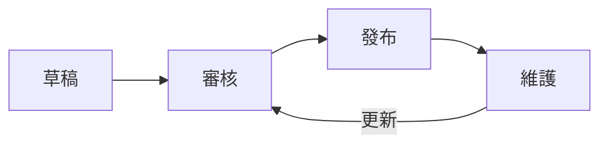

# 標準化文檔管理

建立標準化的文檔體系是確保評測工作可持續的基礎。

## 文檔類型

| 類型 | 用途 | 更新頻率 |
|------|------|----------|
| 評測標準 | 定義評測規範 | 季度 |
| 操作手冊 | 指導日常操作 | 月度 |
| 評測報告 | 記錄評測結果 | 每次評測 |
| 知識庫 | 沉澱經驗知識 | 持續 |

---

## 文檔結構

### 評測標準模板

```markdown
# [評測項目] 評測標準

## 版本資訊
- 版本：v1.0
- 日期：2026-02-01
- 作者：評測團隊

## 評測目標
[描述評測目標]

## 評測範圍
[定義評測範圍]

## 指標定義
[列出評測指標及閾值]

## 執行流程
[說明評測步驟]

## 附錄
[補充資料]
```

### 報告模板

```markdown
# [項目名稱] 評測報告

## 摘要
- 評測日期：
- 版本：
- 結論：通過/不通過

## 評測結果
| 指標 | 目標 | 實際 | 結果 |
|------|------|------|------|
| ... | ... | ... | ... |

## 問題發現
[列出發現的問題]

## 建議
[改進建議]
```

---

## 版本管理



### 版本規則

```yaml
versioning:
  major: "重大變更，不向後兼容"
  minor: "新增內容，向後兼容"
  patch: "錯誤修正"
  
  example: "v2.1.3"
```

---

## 存儲規範

```
/docs
  /standards      # 評測標準
  /reports        # 評測報告
    /2026
      /Q1
  /guides         # 操作手冊
  /knowledge      # 知識庫
```

---

## 最佳實踐

!!! success "文檔管理要點"
    1. 統一使用模板
    2. 及時更新維護
    3. 便於搜索查找
    4. 定期審核清理

!!! tip "工具推薦"
    - Git：版本控制
    - MkDocs：文檔站點
    - Confluence：團隊知識庫
