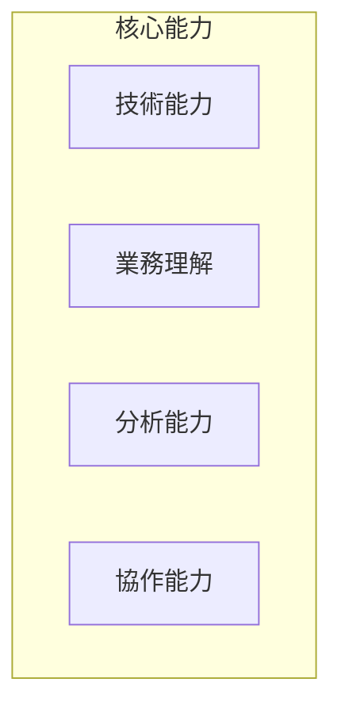
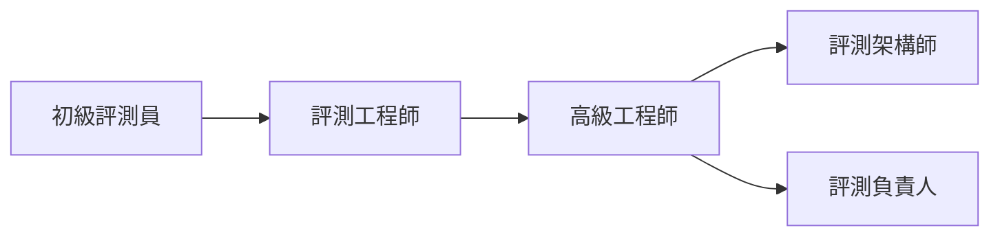

# 人才培養計畫

建立 AI 評測團隊需要系統性的人才培養計畫。

## 能力模型



---

## 角色定義

| 角色 | 職責 | 能力要求 |
|------|------|----------|
| 評測工程師 | 設計執行評測 | 程式設計、指標設計 |
| 數據標註員 | 標註審核數據 | 領域知識、細心 |
| 分析師 | 分析評測結果 | 統計分析、可視化 |
| 項目負責人 | 統籌評測項目 | 項目管理、溝通 |

---

## 培訓課程

### 基礎課程

```yaml
basic_courses:
  - name: "LLM 基礎知識"
    duration: "4 hours"
    topics: ["模型原理", "應用場景"]
    
  - name: "評測指標入門"
    duration: "4 hours"
    topics: ["常見指標", "計算方法"]
    
  - name: "評測工具實戰"
    duration: "8 hours"
    topics: ["RAGAS", "DeepEval"]
```

### 進階課程

```yaml
advanced_courses:
  - name: "評測體系設計"
    duration: "8 hours"
    
  - name: "安全評測專題"
    duration: "4 hours"
    
  - name: "自動化評測流程"
    duration: "8 hours"
```

---

## 成長路徑



| 級別 | 年資 | 核心能力 |
|------|------|----------|
| 初級 | 0-1年 | 執行評測任務 |
| 中級 | 1-3年 | 設計評測方案 |
| 高級 | 3-5年 | 架構評測體系 |
| 專家 | 5年+ | 引領行業實踐 |

---

## 最佳實踐

!!! success "培養要點"
    1. 理論與實踐結合
    2. 建立導師制度
    3. 鼓勵知識分享
    4. 提供成長機會
