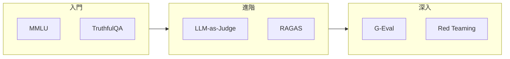

# 經典必讀

## 概述

本頁匯集 LLM 評測領域的奠基性論文，涵蓋評測方法論、Benchmark 設計、安全評估等核心主題。這些論文為後續研究奠定了理論基礎，是深入了解評測領域的必備閱讀清單。

---

## 評測方法論

### Judging LLM-as-a-Judge (2023)

**核心貢獻**：系統性分析 LLM 作為評判者的可行性與偏見

| 資訊 | 內容 |
|------|------|
| 作者 | Zheng et al. (LMSYS) |
| 發布 | NeurIPS 2023 |
| 連結 | [arXiv:2306.05685](https://arxiv.org/abs/2306.05685) |

**關鍵要點**：

- 提出 MT-Bench 多輪對話評測基準
- 發現 GPT-4 與人類評判有 80%+ 一致性
- 識別 Position Bias、Verbosity Bias 等問題

---

### G-Eval: Using GPT-4 for NLG Evaluation (2023)

**核心貢獻**：使用思維鏈（CoT）提升 LLM 評判品質

| 資訊 | 內容 |
|------|------|
| 作者 | Liu et al. (Microsoft) |
| 發布 | EMNLP 2023 |
| 連結 | [arXiv:2303.16634](https://arxiv.org/abs/2303.16634) |

**關鍵要點**：

- 提出基於 CoT 的評估框架
- 在多個 NLG 任務上超越傳統指標
- 提供機率加權的評分方法

---

## Benchmark 設計

### MMLU: Measuring Massive Multitask Language Understanding (2021)

**核心貢獻**：建立大規模、多領域的知識評測基準

| 資訊 | 內容 |
|------|------|
| 作者 | Hendrycks et al. (UC Berkeley) |
| 發布 | ICLR 2021 |
| 連結 | [arXiv:2009.03300](https://arxiv.org/abs/2009.03300) |

**關鍵要點**：

- 涵蓋 57 個學科、14,000+ 問題
- 成為 LLM 能力評測的標準基準
- 揭示模型在專業領域的能力差距

---

### BIG-Bench: Beyond the Imitation Game (2022)

**核心貢獻**：協作式建構大規模、多樣化評測集

| 資訊 | 內容 |
|------|------|
| 作者 | BIG-Bench Collaboration |
| 發布 | TMLR 2023 |
| 連結 | [arXiv:2206.04615](https://arxiv.org/abs/2206.04615) |

**關鍵要點**：

- 204 個任務、450+ 貢獻者
- 涵蓋推理、知識、語言等多維度
- 開源協作模式的典範

---

## RAG 評測

### RAGAS: Automated Evaluation of RAG (2023)

**核心貢獻**：建立 RAG 系統的自動化評測框架

| 資訊 | 內容 |
|------|------|
| 作者 | Es et al. |
| 發布 | EMNLP 2023 |
| 連結 | [arXiv:2309.15217](https://arxiv.org/abs/2309.15217) |

**關鍵要點**：

- 提出 Faithfulness、Context Relevancy 等指標
- 無需人工標註的評測方法
- 成為 RAG 評測的事實標準

---

## 安全評測

### TruthfulQA: Measuring Truthfulness (2022)

**核心貢獻**：評估模型生成真實資訊的能力

| 資訊 | 內容 |
|------|------|
| 作者 | Lin et al. (Oxford) |
| 發布 | ACL 2022 |
| 連結 | [arXiv:2109.07958](https://arxiv.org/abs/2109.07958) |

**關鍵要點**：

- 識別 LLM 容易產生幻覺的問題類型
- 揭示「模仿人類錯誤」的有趣現象
- 為誠實性評測奠定基礎

---

### Red Teaming Language Models (2022)

**核心貢獻**：使用 LLM 生成對抗性測試案例

| 資訊 | 內容 |
|------|------|
| 作者 | Perez et al. (Anthropic) |
| 發布 | EMNLP 2022 |
| 連結 | [arXiv:2202.03286](https://arxiv.org/abs/2202.03286) |

**關鍵要點**：

- 提出 LLM 自動生成紅隊攻擊的方法
- 識別多種有害輸出模式
- 為自動化安全測試開創先河

---

## 延伸閱讀建議

!!! tip "閱讀建議"
    建議按照 入門 → 進階 → 深入 的順序閱讀，逐步建立完整的評測知識體系。
