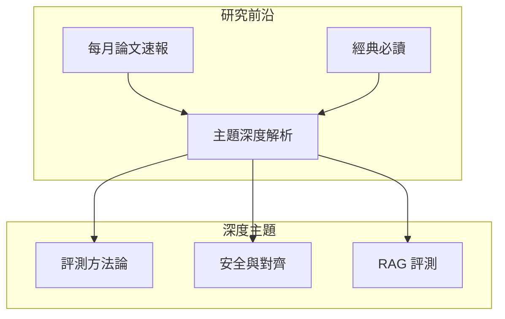

# 研究前沿

## 概述

本專區聚焦於 LLM 評測領域的最新研究進展，涵蓋學術論文解讀、新興評測方法論探索，以及業界最佳實踐。無論你是研究人員、工程師還是技術決策者，都能在這裡找到有價值的前沿資訊。

!!! tip "如何使用本專區"
    - **每月論文速報**：快速掌握當月重要論文摘要與核心觀點
    - **主題深度解析**：針對特定議題的深入技術分析
    - **經典必讀**：評測領域的奠基性論文與必備知識

---

## 專區架構

---

## 內容導覽

### 📅 每月論文速報

追蹤最新學術動態，每月精選重要論文：

| 月份 | 主題焦點 | 論文數量 |
|------|----------|----------|
| [2026-M01](monthly/2026/m01.md) | LLM-as-Judge 新進展 | 8 篇 |
| [2026-M02](monthly/2026/m02.md) | 多模態評測框架 | 10 篇 |

---

### 🔬 主題深度解析

#### 評測方法論

- [LLM-as-Judge](topics/llm-as-judge.md) - 以大型語言模型作為評判者的理論與實踐
- [自動化評測框架](topics/auto-evaluation.md) - 建構可擴展的自動評測系統

#### 安全與對齊

- [紅隊攻防](topics/red-teaming.md) - AI 安全測試的攻擊與防禦策略
- [對齊評估](topics/alignment.md) - 價值觀對齊的量化評估方法

#### RAG 評測

- [檢索品質](topics/retrieval-quality.md) - 檢索階段的評估指標與優化
- [生成品質](topics/generation-quality.md) - 基於檢索的生成品質評估

---

### 📚 經典必讀

探索奠定評測領域基礎的重要論文：[經典必讀](classics.md)

---

## 研究資源

### 重要會議與期刊

| 名稱 | 類型 | 評測相關 Track |
|------|------|----------------|
| ACL | 會議 | NLP Evaluation |
| EMNLP | 會議 | Evaluation Metrics |
| NeurIPS | 會議 | Benchmarks |
| TACL | 期刊 | Evaluation Methods |
| JMLR | 期刊 | ML Evaluation |

### 預印本平台

- [arXiv cs.CL](https://arxiv.org/list/cs.CL/recent) - 計算語言學
- [arXiv cs.AI](https://arxiv.org/list/cs.AI/recent) - 人工智慧
- [arXiv cs.LG](https://arxiv.org/list/cs.LG/recent) - 機器學習

---

## 貢獻指南

!!! info "歡迎投稿"
    如果你有興趣分享論文解讀或研究筆記，歡迎透過 GitHub Issues 提交建議。

### 內容標準

1. **原創分析**：提供獨立見解，非單純翻譯
2. **結構清晰**：使用標準化的論文解讀模板
3. **程式碼復現**：盡可能附上可執行的程式碼範例
4. **引用規範**：正確標註論文來源與參考資料
