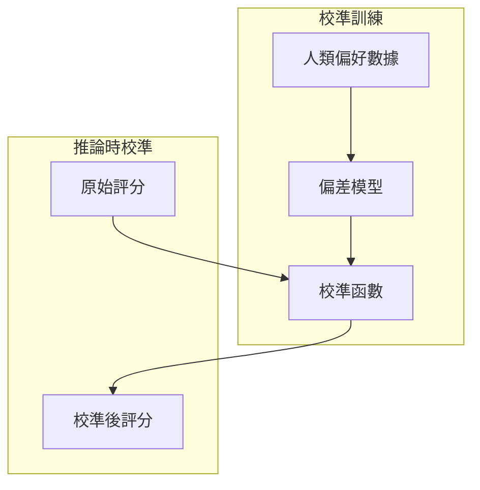

# 2026 年 1 月論文速報

## 本月焦點

本月重點關注 **LLM-as-Judge** 的最新研究進展，包括評判可靠性提升、偏見緩解策略，以及多評判者一致性分析。

!!! tip "閱讀建議"
    每篇論文摘要包含：核心問題、方法創新、關鍵結果、實務應用建議

---

## 精選論文

### 1. JudgeBench: A Benchmark for Evaluating LLM-based Judges

**來源**：arXiv preprint  
**作者**：Stanford NLP Group  
**發布日期**：2026-01-15

#### 核心問題

現有的 LLM-as-Judge 評估缺乏統一的 benchmark，難以比較不同評判模型的效能。

#### 方法創新


- 建立涵蓋 12 個評估維度的標準測試集
- 設計 Position Bias / Verbosity Bias 專項測試
- 提出 Judge Agreement Rate (JAR) 指標

#### 關鍵結果

| 模型 | JAR Score | Position Bias | Length Bias |
|------|-----------|---------------|-------------|
| GPT-4o | 0.87 | -0.12 | -0.08 |
| Claude 3.5 | 0.85 | -0.09 | -0.05 |
| Gemini Ultra | 0.82 | -0.15 | -0.11 |

#### 實務應用

!!! success "建議採用"
    在部署 LLM-as-Judge 前，建議使用 JudgeBench 進行基線測試，識別潛在偏見。

---

### 2. Self-Consistency Improves LLM Judges

**來源**：ICLR 2026  
**作者**：Google DeepMind  
**發布日期**：2026-01-22

#### 核心問題

單次評判結果變異度大，影響評測可靠性。

#### 方法創新

採用 Self-Consistency 策略，對同一評判任務多次採樣並聚合結果：

```python
def self_consistent_judge(prompt, n_samples=5):
    """
    多次採樣評判，透過投票或加權平均提升一致性
    """
    scores = []
    for _ in range(n_samples):
        score = llm_judge(prompt, temperature=0.7)
        scores.append(score)
    
    # 使用中位數減少極端值影響
    return np.median(scores)
```

#### 關鍵結果

- 5 次採樣可將評判一致性提升 23%
- 計算成本增加 5 倍，但可透過並行化緩解
- 對主觀評估任務效果最顯著

#### 實務應用

!!! tip "成本效益分析"
    對於高風險評估任務（如安全評測），建議採用 n=5；一般任務可使用 n=3。

---

### 3. Calibrating LLM Judges with Human Preferences

**來源**：ACL 2026  
**作者**：Anthropic  
**發布日期**：2026-01-28

#### 核心問題

LLM 評判分數與人類偏好存在系統性偏差。

#### 方法創新

提出 **Preference-Aligned Calibration (PAC)** 方法：



1. 收集人類成對比較數據
2. 學習 LLM 評分與人類偏好的映射函數
3. 推論時自動校準評分

#### 關鍵結果

| 任務類型 | 校準前相關係數 | 校準後相關係數 |
|----------|----------------|----------------|
| 摘要品質 | 0.68 | 0.84 |
| 對話連貫性 | 0.72 | 0.89 |
| 程式碼品質 | 0.75 | 0.88 |

#### 實務應用

!!! warning "注意事項"
    校準需要領域特定的人類偏好數據，冷啟動成本較高。

---

## 快速瀏覽

### 其他值得關注的論文

| 論文標題 | 關鍵詞 | 一句話摘要 |
|----------|--------|------------|
| Multi-Agent Debate for Better Judgment | 多智能體 | 讓多個 LLM 辯論後達成共識，提升評判品質 |
| Contrastive Learning for Judge Training | 對比學習 | 使用對比學習微調評判模型 |
| Chain-of-Thought Judging | CoT | 強制評判模型輸出推理過程，提升可解釋性 |
| Domain-Specific Judge Adapters | 領域適應 | 使用 LoRA 快速適應特定領域評估 |
| Uncertainty-Aware LLM Judges | 不確定性 | 評判時同時輸出置信度分數 |

---

## 延伸閱讀

- [LLM-as-Judge 深度解析](../../topics/llm-as-judge.md)
- [自動化評測框架](../../topics/auto-evaluation.md)

---

## 下月預告

2 月將聚焦於：

- 多模態評測框架
- 視覺語言模型評估
- 跨模態一致性測試
