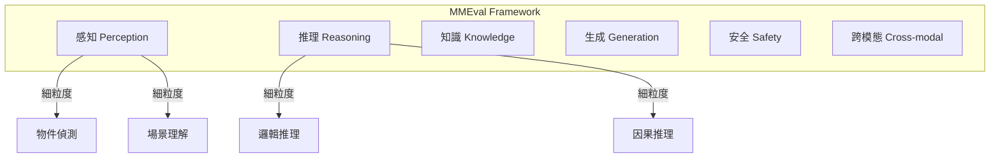
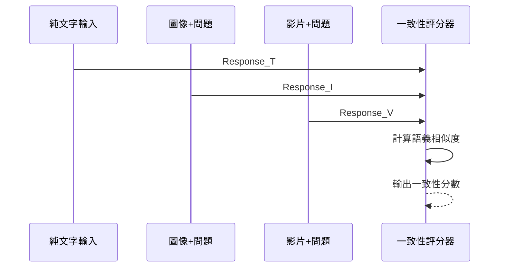
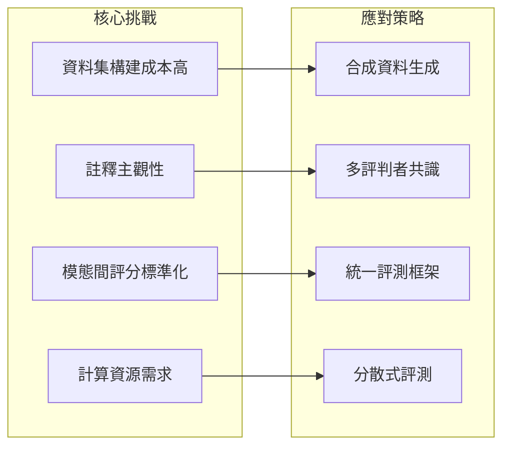

# 2026 年 2 月論文速報

## 本月焦點

本月重點關注 **多模態評測框架** 的最新進展，涵蓋視覺語言模型（VLM）評估、跨模態一致性測試，以及新興的 benchmark 設計方法。

!!! info "為什麼多模態評測重要？"
    隨著 GPT-4V、Gemini、Claude 3 等多模態模型快速發展，傳統的純文字評測已無法全面評估模型能力。

---

## 精選論文

### 1. MMEval: A Comprehensive Multimodal Evaluation Framework

**來源**：arXiv preprint  
**作者**：OpenAI Research  
**發布日期**：2026-02-05

#### 核心問題

現有多模態 benchmark 覆蓋面不足，難以全面評估 VLM 的各項能力。

#### 方法創新

提出六維度評測框架：



#### 關鍵結果

| 模型 | 感知 | 推理 | 知識 | 生成 | 安全 | 跨模態 | 總分 |
|------|------|------|------|------|------|--------|------|
| GPT-4o | 89.2 | 85.1 | 82.3 | 78.5 | 91.2 | 84.7 | 85.2 |
| Gemini 1.5 Pro | 87.8 | 83.6 | 80.1 | 76.2 | 88.5 | 82.1 | 83.1 |
| Claude 3 Opus | 86.5 | 84.2 | 81.5 | 77.8 | 92.1 | 81.5 | 83.9 |

#### 實務應用

!!! success "開源資源"
    完整評測套件已開源，支援自定義評估維度擴展。

---

### 2. Visual Hallucination Detection in VLMs

**來源**：CVPR 2026  
**作者**：Google Research  
**發布日期**：2026-02-12

#### 核心問題

VLM 經常產生視覺幻覺（Visual Hallucination），描述圖像中不存在的物件或屬性。

#### 方法創新

提出 **HalluDetect** 自動化檢測框架：

```python
def detect_hallucination(image, response, ground_truth_objects):
    """
    檢測 VLM 回應中的視覺幻覺
    """
    # 提取回應中提及的物件
    mentioned_objects = extract_objects(response)
    
    # 與真實物件比對
    hallucinated = mentioned_objects - ground_truth_objects
    missed = ground_truth_objects - mentioned_objects
    
    return {
        'hallucination_rate': len(hallucinated) / len(mentioned_objects),
        'recall': len(ground_truth_objects - missed) / len(ground_truth_objects),
        'hallucinated_objects': list(hallucinated)
    }
```

#### 關鍵結果

| 模型 | 幻覺率 | 召回率 | 精確率 |
|------|--------|--------|--------|
| GPT-4V | 8.2% | 92.1% | 91.8% |
| Gemini Pro Vision | 11.5% | 89.3% | 88.5% |
| LLaVA-1.6 | 15.3% | 85.7% | 84.7% |

!!! warning "常見幻覺類型"
    - **物件幻覺**：描述不存在的物件
    - **屬性幻覺**：錯誤描述物件的顏色、大小、位置
    - **關係幻覺**：錯誤描述物件間的空間或語義關係

---

### 3. Cross-Modal Consistency Testing

**來源**：NeurIPS 2026  
**作者**：Meta AI  
**發布日期**：2026-02-18

#### 核心問題

多模態模型在不同模態輸入下，對相同問題的回答可能不一致。

#### 方法創新

設計 **ConsistencyTest** 評測套件：



#### 關鍵結果

跨模態一致性分數（0-100）：

| 模型 | 文字↔圖像 | 圖像↔影片 | 文字↔影片 | 平均 |
|------|-----------|-----------|-----------|------|
| GPT-4o | 91.2 | 87.5 | 85.3 | 88.0 |
| Gemini 1.5 | 89.5 | 88.1 | 86.2 | 87.9 |
| Claude 3 | 90.1 | 85.2 | 84.1 | 86.5 |

#### 實務應用

!!! tip "一致性測試建議"
    在部署多模態應用前，務必測試不同模態輸入的回答一致性，尤其是客服、教育等對一致性要求高的場景。

---

## 快速瀏覽

### 其他值得關注的論文

| 論文標題 | 關鍵詞 | 一句話摘要 |
|----------|--------|------------|
| Video Understanding Benchmark | 影片理解 | 長影片理解能力的系統性評測 |
| Chart & Graph QA Evaluation | 圖表問答 | 評估 VLM 對商業圖表的理解能力 |
| Medical Imaging VLM Benchmark | 醫學影像 | 專業醫學影像領域的安全評測 |
| OCR-Integrated Evaluation | OCR | 結合 OCR 的文字識別準確性評估 |
| 3D Scene Understanding | 3D 理解 | 從 2D 圖像推理 3D 空間的評測 |

---

## 產業趨勢觀察

### 多模態評測的挑戰



### 未來展望

1. **端到端評測**：從輸入到輸出的全流程評估
2. **動態 Benchmark**：持續更新防止資料洩露
3. **個人化評測**：針對特定應用場景的定制評估

---

## 延伸閱讀

- [生成品質評測](../../topics/generation-quality.md)
- [檢索品質評測](../../topics/retrieval-quality.md)

---

## 下月預告

3 月將聚焦於：

- Agent 系統評測
- 工具調用準確性評估
- 多步推理追蹤
