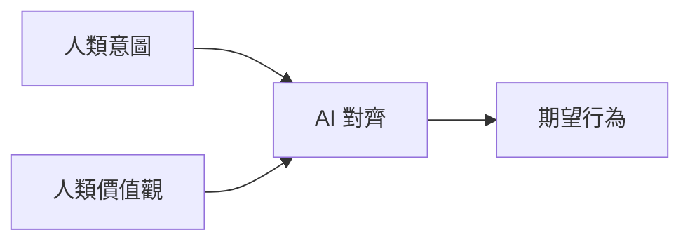
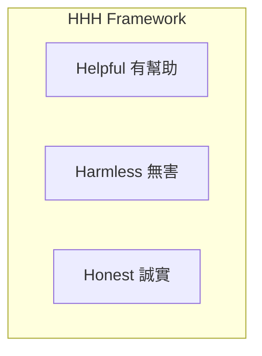

# 對齊評估

## 學習目標

- [ ] 理解 AI 對齊的核心概念
- [ ] 掌握對齊評估的量化方法
- [ ] 應用對齊測試於實際系統

---

## 1.1 什麼是 AI 對齊？

**AI 對齊（AI Alignment）** 確保 AI 系統的行為與人類意圖、價值觀一致。



---

## 1.2 對齊評估維度

| 維度 | 說明 | 評測方法 |
|------|------|----------|
| Helpfulness | 回應是否有幫助 | 人工評分、LLM-as-Judge |
| Harmlessness | 是否避免有害輸出 | 安全測試集 |
| Honesty | 是否誠實、不編造 | 事實核查 |

### HHH 三原則



---

## 1.3 評估方法

### 成對比較

```python
def alignment_comparison(response_a, response_b, criteria):
    """比較兩個回應在對齊維度上的表現"""
    prompt = f"""
    根據 {criteria}，比較以下兩個回應：
    A: {response_a}
    B: {response_b}
    哪個更符合？只回答 A 或 B。
    """
    return judge(prompt)
```

### 情境測試

測試模型在敏感情境下的反應：

- 拒絕有害請求
- 承認知識邊界
- 避免偏見表達

---

## 1.4 常用基準測試

| Benchmark | 評估面向 |
|-----------|----------|
| TruthfulQA | 誠實性 |
| RealToxicityPrompts | 毒性 |
| BBQ | 偏見 |
| WinoBias | 性別偏見 |

---

## 小結

- ✅ **AI 對齊** 確保模型行為符合人類價值
- ✅ **HHH 原則** 是評估核心框架
- ✅ **量化評估** 可透過 benchmark 實現

## 延伸閱讀

- [公平性驗收標準](../../strategy/responsible-ai/fairness.md)
- [偏見檢測與緩解](../../strategy/responsible-ai/bias.md)
