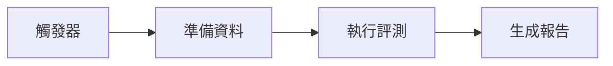

# 自動化評測框架

## 學習目標

- [ ] 設計可擴展的自動化評測管線
- [ ] 整合多種評測工具與指標
- [ ] 建立持續評測的 CI/CD 流程

---

## 1.1 自動化評測概述

### 為什麼需要自動化評測？

| 面向 | 人工評測 | 自動化評測 |
|------|----------|------------|
| 成本 | 高 | 低 |
| 速度 | 慢 | 快 |
| 一致性 | 主觀差異 | 一致 |

!!! info "自動化評測的價值"
    - **規模化**：每日處理數萬筆評測
    - **即時性**：模型更新後立即獲得反饋
    - **可追溯**：完整的評測歷史記錄

---

## 1.2 評測管線設計



### 核心元件

| 元件 | 功能 | 常見工具 |
|------|------|----------|
| 測試集管理 | 儲存與版本控制 | Git LFS, DVC |
| 評測引擎 | 執行評測邏輯 | RAGAS, DeepEval |
| 結果儲存 | 持久化結果 | PostgreSQL |
| 視覺化 | 展示趨勢 | Grafana |

---

## 1.3 評測管線實作

```python
from dataclasses import dataclass
from typing import List, Dict

@dataclass
class EvalConfig:
    model_name: str
    test_set_path: str
    metrics: List[str]

class AutoEvaluator:
    def __init__(self, config: EvalConfig):
        self.config = config
    
    def run(self) -> Dict:
        results = []
        for item in self._load_test_set():
            response = self._generate(item['prompt'])
            scores = self._compute_metrics(item, response)
            results.append(scores)
        return self._aggregate(results)
```

---

## 1.4 CI/CD 整合

### GitHub Actions 範例

```yaml
name: LLM Evaluation
on:
  push:
    branches: [main]
jobs:
  evaluate:
    runs-on: ubuntu-latest
    steps:
      - uses: actions/checkout@v4
      - name: Run evaluation
        run: python scripts/run_eval.py
```

!!! tip "最佳實踐"
    - 使用 secrets 管理 API 金鑰
    - 設定評測結果門檻

---

## 小結

- ✅ **自動化評測** 提供規模化、一致性的模型評估
- ✅ **評測管線** 包含觸發、準備、執行、報告四個階段
- ✅ **CI/CD 整合** 實現評測自動化與持續監控

## 延伸閱讀

- [RAGAS 完整指南](../../benchmarking/tools/ragas.md)
- [評測流程自動化](../../strategy/automation/workflow.md)
