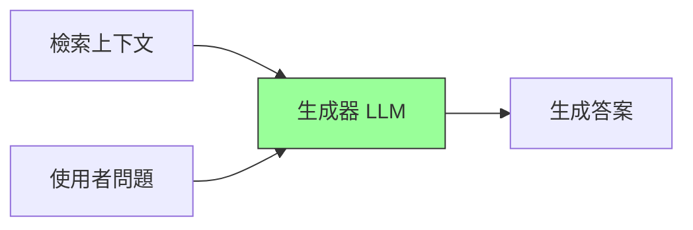
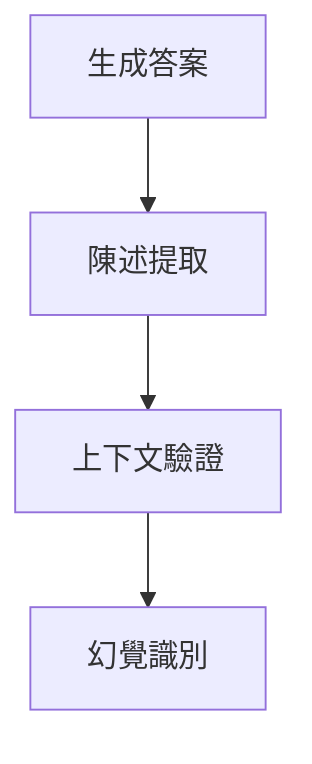

# 生成品質評測

## 學習目標

- [ ] 理解 RAG 生成階段的評測重點
- [ ] 掌握生成品質的核心指標
- [ ] 應用評測框架優化生成結果

---

## 1.1 RAG 生成階段概述



!!! info "生成品質的挑戰"
    生成器需要正確理解上下文、忠實引用資訊、並產生流暢且有用的回應。

---

## 1.2 核心評測指標

| 指標 | 說明 | 評測重點 |
|------|------|----------|
| Faithfulness | 忠實度 | 答案是否源自上下文 |
| Answer Relevancy | 答案相關性 | 答案是否回應問題 |
| Answer Correctness | 答案正確性 | 與標準答案的一致程度 |

### Faithfulness 計算

```python
def faithfulness_score(answer, contexts):
    """
    評估答案是否忠實於上下文
    1. 將答案分解為獨立陳述
    2. 檢查每個陳述是否有上下文支持
    """
    statements = extract_statements(answer)
    supported = 0
    for stmt in statements:
        if is_supported_by_context(stmt, contexts):
            supported += 1
    return supported / len(statements)
```

---

## 1.3 幻覺檢測



### 常見幻覺類型

| 類型 | 說明 |
|------|------|
| 事實幻覺 | 生成不存在的事實 |
| 誇大幻覺 | 過度延伸上下文資訊 |
| 矛盾幻覺 | 與上下文衝突的陳述 |

---

## 1.4 評測工具

### RAGAS 生成指標

```python
from ragas.metrics import faithfulness, answer_relevancy

result = evaluate(
    dataset,
    metrics=[faithfulness, answer_relevancy]
)
print(f"Faithfulness: {result['faithfulness']:.3f}")
print(f"Relevancy: {result['answer_relevancy']:.3f}")
```

### LLM-as-Judge 評測

```python
JUDGE_PROMPT = """
評估答案品質（1-5分）：
- 問題：{question}
- 上下文：{contexts}
- 答案：{answer}

請從完整性、準確性、流暢性三個維度評分。
"""
```

---

## 小結

- ✅ **生成品質** 評測忠實度、相關性、正確性
- ✅ **幻覺檢測** 是關鍵的品質把關
- ✅ **多維度評估** 結合自動指標與 LLM-as-Judge

## 延伸閱讀

- [檢索品質評測](retrieval-quality.md)
- [DeepEval 完整指南](../../benchmarking/tools/deepeval.md)
