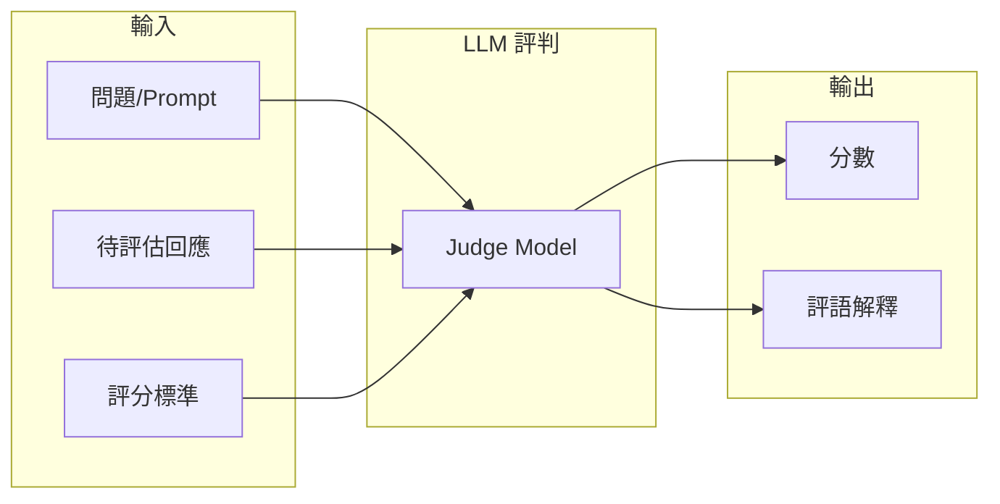
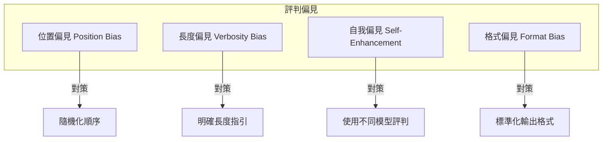
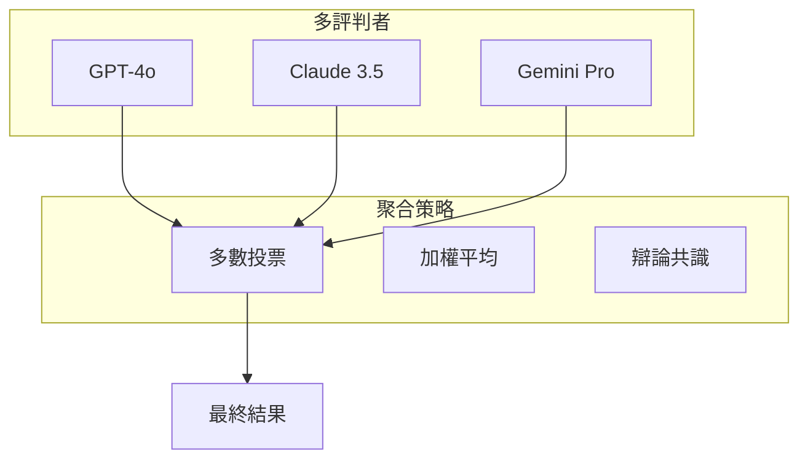

# LLM-as-Judge：以大型語言模型作為評判者

## 學習目標

完成本章節後，你將能夠：

- [ ] 理解 LLM-as-Judge 的核心原理與適用場景
- [ ] 識別並緩解常見的評判偏見
- [ ] 設計有效的評判提示詞（Judging Prompt）
- [ ] 實作多評判者共識機制

## 前置知識

開始之前，請確保你已經：

- 具備基本的 LLM API 調用經驗
- 了解傳統評測指標（BLEU、ROUGE 等）的局限性
- 熟悉 Prompt Engineering 基礎

---

## 1.1 什麼是 LLM-as-Judge？

### 概念說明

**LLM-as-Judge** 是一種利用大型語言模型作為自動評估器的方法論，讓 LLM 扮演「評審」角色，對其他模型的輸出進行品質評估。

!!! info "為什麼需要 LLM-as-Judge？"
    傳統的自動評測指標（如 BLEU、ROUGE）主要依賴表面字符匹配，難以評估語義品質、創意性、有用性等維度。人工評估雖然準確，但成本高、難以規模化。LLM-as-Judge 提供了一個平衡點。

### 核心架構



### 應用場景

| 場景 | 適用性 | 說明 |
|------|--------|------|
| 摘要品質評估 | ✅ 高 | 評估資訊保留度與流暢性 |
| 對話連貫性 | ✅ 高 | 多輪對話的上下文一致性 |
| 安全性檢測 | ✅ 高 | 識別有害內容 |
| 事實準確性 | ⚠️ 中 | 需搭配外部知識驗證 |
| 數學推理 | ❌ 低 | 建議使用確定性驗證 |

---

## 1.2 評判偏見分析

### 常見偏見類型

LLM-as-Judge 存在多種系統性偏見，必須在設計時加以考量：



### 偏見檢測方法

#### Position Bias 測試

```python
def test_position_bias(judge_model, response_a, response_b, question):
    """
    測試評判模型是否存在位置偏見
    """
    # 順序 A: response_a 在前
    prompt_ab = f"""
    問題：{question}
    
    回應 A：{response_a}
    回應 B：{response_b}
    
    請判斷哪個回應更好。只輸出 "A" 或 "B"。
    """
    result_ab = judge_model(prompt_ab)
    
    # 順序 B: response_b 在前
    prompt_ba = f"""
    問題：{question}
    
    回應 A：{response_b}
    回應 B：{response_a}
    
    請判斷哪個回應更好。只輸出 "A" 或 "B"。
    """
    result_ba = judge_model(prompt_ba)
    
    # 如果兩次結果不一致，存在位置偏見
    return result_ab != result_ba
```

!!! warning "Position Bias 後果"
    研究顯示，某些 LLM 對第一個出現的回應有 10-15% 的偏好傾向，這會嚴重影響成對比較的可靠性。

---

## 1.3 評判提示詞設計

### 單點評分（Point-wise Scoring）

對單個回應進行絕對評分：

```python
POINTWISE_PROMPT = """
你是一位專業的品質評估專家。請根據以下標準評估回應品質。

## 評分標準
- 5分：卓越 - 完全滿足需求，提供額外價值
- 4分：良好 - 正確且有幫助
- 3分：合格 - 基本正確但可改進
- 2分：不足 - 有明顯錯誤或遺漏
- 1分：失敗 - 完全無法使用

## 待評估內容
**問題**：{question}
**回應**：{response}

## 輸出格式
請先提供評分理由（2-3句話），再給出分數。
格式：
理由：[你的分析]
分數：[1-5]
"""
```

### 成對比較（Pairwise Comparison）

比較兩個回應的相對品質：

```python
PAIRWISE_PROMPT = """
你是一位公正的評審。請比較以下兩個回應，判斷哪個更好。

## 評估維度
1. 準確性：資訊是否正確
2. 完整性：是否涵蓋關鍵要點
3. 清晰度：表達是否易懂
4. 有用性：對使用者是否有幫助

## 待比較內容
**問題**：{question}

**回應 A**：
{response_a}

**回應 B**：
{response_b}

## 輸出格式
請先逐維度分析，再給出最終判斷。
格式：
分析：[你的分析]
結論：A 更好 / B 更好 / 平手
"""
```

### 參考答案輔助評判

```python
REFERENCE_PROMPT = """
你是一位評估專家。請參考標準答案，評估待評估回應的品質。

**問題**：{question}
**標準答案**：{reference}
**待評估回應**：{response}

請評估回應與標準答案的一致程度，並指出任何錯誤或遺漏。
評分範圍：0-100分
"""
```

---

## 1.4 多評判者共識機制

### 為什麼需要多評判者？

單一評判者的結果變異性高，採用多評判者可提升可靠性：



### 實作範例

```python
from typing import List, Dict
import numpy as np

def multi_judge_consensus(
    judges: List[callable],
    question: str,
    response: str,
    method: str = "majority"
) -> Dict:
    """
    多評判者共識評估
    
    Args:
        judges: 評判模型列表
        question: 問題
        response: 待評估回應
        method: 聚合方法 (majority / weighted / debate)
    """
    scores = []
    reasons = []
    
    for judge in judges:
        result = judge(question, response)
        scores.append(result['score'])
        reasons.append(result['reason'])
    
    if method == "majority":
        # 多數投票（適用於分類判斷）
        from collections import Counter
        final_score = Counter(scores).most_common(1)[0][0]
    elif method == "weighted":
        # 加權平均（依據歷史準確率）
        weights = [0.4, 0.35, 0.25]  # 預設權重
        final_score = np.average(scores, weights=weights)
    elif method == "debate":
        # 辯論共識（讓模型看到彼此評估後重新判斷）
        final_score = debate_consensus(judges, question, response, scores, reasons)
    
    return {
        'final_score': final_score,
        'individual_scores': scores,
        'agreement_rate': 1 - np.std(scores) / np.mean(scores),
        'reasons': reasons
    }
```

---

## 1.5 實務案例

### 案例：客服回應品質評估

```python
# 評判提示詞
CUSTOMER_SERVICE_JUDGE = """
你是一位客服品質評估專家。請評估以下客服回應。

## 評估維度與權重
- 問題解決度 (40%)：是否解決客戶問題
- 專業度 (25%)：回應是否專業準確
- 同理心 (20%)：是否展現對客戶的理解
- 效率 (15%)：回應是否簡潔有效

## 客戶問題
{customer_query}

## 客服回應
{agent_response}

## 輸出
請針對每個維度評分（1-10分），並計算加權總分。
"""

# 使用範例
result = evaluate_response(
    customer_query="我的訂單三天了還沒到，能幫我查一下嗎？",
    agent_response="非常抱歉讓您久等了！我已經幫您查詢，您的訂單目前在配送中，預計明天送達。如果明天仍未收到，請隨時聯繫我們，我們會優先處理。"
)
```

---

## 常見問題

??? question "Q1：LLM-as-Judge 的成本如何控制？"
    **建議策略**：
    
    1. 使用較小的模型進行初步篩選
    2. 只對邊緣案例使用大模型評判
    3. 批次處理降低 API 調用次數
    
    ```python
    # 分層評判策略
    def tiered_judge(response):
        # 第一層：小模型快速篩選
        quick_score = small_model_judge(response)
        if quick_score < 3 or quick_score > 4:
            return quick_score
        # 第二層：邊緣案例用大模型
        return large_model_judge(response)
    ```

??? question "Q2：如何驗證 LLM-as-Judge 的準確性？"
    **驗證方法**：
    
    1. 準備人工標註的黃金測試集
    2. 計算 LLM 評判與人工評判的相關係數
    3. 分析不一致案例的模式
    
    目標：Spearman 相關係數 > 0.8

??? question "Q3：自我評判可靠嗎？"
    **答案**：有風險。研究顯示 LLM 對自己的輸出有 5-10% 的自我增強偏見。
    
    **建議**：使用不同廠商或不同版本的模型進行交叉評判。

---

## 小結

本章節重點回顧：

- ✅ **LLM-as-Judge** 是利用 LLM 自動評估輸出品質的方法論
- ✅ **主要偏見** 包括位置偏見、長度偏見、自我偏見
- ✅ **提示詞設計** 分為單點評分、成對比較、參考答案輔助
- ✅ **多評判者共識** 可有效提升評判可靠性

## 延伸閱讀

- [Judging LLM-as-a-Judge with MT-Bench and Chatbot Arena](https://arxiv.org/abs/2306.05685)
- [Large Language Models are not Fair Evaluators](https://arxiv.org/abs/2305.17926)
- [G-Eval: NLG Evaluation using GPT-4 with Better Human Alignment](https://arxiv.org/abs/2303.16634)
