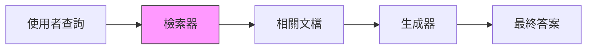
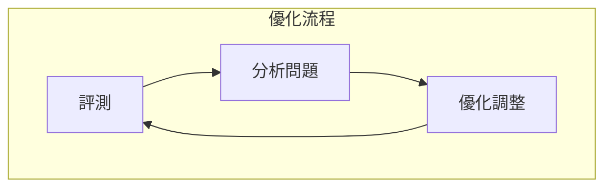

# 檢索品質評測

## 學習目標

- [ ] 理解 RAG 系統中檢索階段的重要性
- [ ] 掌握檢索品質的評測指標
- [ ] 應用評測工具優化檢索系統

---

## 1.1 RAG 檢索階段概述



!!! info "檢索品質的重要性"
    **垃圾進，垃圾出**：即使生成器很強大，如果檢索到的文檔不相關，最終答案品質也會下降。

---

## 1.2 核心評測指標

| 指標 | 說明 | 計算方式 |
|------|------|----------|
| Context Recall | 相關資訊召回比例 | 召回相關塊數 / 總相關塊數 |
| Context Precision | 檢索結果精確度 | 相關塊數 / 檢索塊數 |
| Hit Rate | 命中率 | 包含答案的查詢比例 |
| MRR | 平均倒數排名 | 1 / 第一個相關結果的排名 |

### 計算範例

```python
def context_precision(retrieved_docs, relevant_docs):
    """計算檢索精確度"""
    relevant_count = sum(
        1 for doc in retrieved_docs if doc in relevant_docs
    )
    return relevant_count / len(retrieved_docs)

def mrr(ranked_results, ground_truth):
    """計算平均倒數排名"""
    for rank, doc in enumerate(ranked_results, 1):
        if doc in ground_truth:
            return 1.0 / rank
    return 0.0
```

---

## 1.3 評測工具

### RAGAS Context 指標

```python
from ragas.metrics import context_precision, context_recall

# 評測資料格式
eval_data = {
    "question": "...",
    "contexts": ["chunk1", "chunk2"],
    "answer": "...",
    "ground_truth": "..."
}

# 執行評測
result = evaluate(eval_data, metrics=[context_precision, context_recall])
```

---

## 1.4 優化策略

| 問題 | 優化方向 |
|------|----------|
| 召回率低 | 增加 chunk 重疊、使用混合檢索 |
| 精確度低 | 調整相似度閾值、重新排序 |
| 排名不佳 | 引入 Re-ranker |



---

## 小結

- ✅ **檢索品質** 直接影響 RAG 系統最終效果
- ✅ **核心指標** 包括 Recall、Precision、MRR
- ✅ **持續優化** 透過評測驅動迭代改進

## 延伸閱讀

- [RAGAS 完整指南](../../benchmarking/tools/ragas.md)
- [生成品質評測](generation-quality.md)
