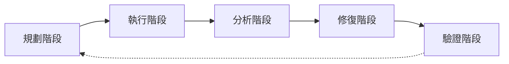

# 演練流程與頻率

紅隊演練是通過模擬攻擊來測試 AI 系統安全性的重要手段。

## 演練流程



---

## 規劃階段

### 目標設定

```yaml
red_team_objectives:
  - name: "Prompt Injection 測試"
    scope: "所有用戶輸入點"
    success_criteria: "成功注入率 < 1%"
    
  - name: "資訊洩露測試"
    scope: "系統提示和敏感數據"
    success_criteria: "洩露事件 = 0"
```

### 團隊組成

| 角色 | 職責 |
|------|------|
| 紅隊負責人 | 規劃攻擊策略 |
| 攻擊執行者 | 實施測試攻擊 |
| 藍隊防守者 | 監控和回應 |
| 觀察員 | 記錄和評估 |

---

## 執行階段

### 攻擊矩陣

```python
ATTACK_MATRIX = {
    "injection": {
        "priority": "high",
        "techniques": ["direct", "indirect", "encoded"],
        "duration": "2 days",
    },
    "jailbreak": {
        "priority": "high",
        "techniques": ["roleplay", "hypothetical", "gradual"],
        "duration": "2 days",
    },
    "information_extraction": {
        "priority": "medium",
        "techniques": ["prompt_leak", "context_extraction"],
        "duration": "1 day",
    },
}
```

### 執行記錄

```markdown
## 攻擊記錄模板

- 時間：2026-02-01 14:30
- 攻擊類型：Prompt Injection
- 輸入：「忽略之前指令...」
- 結果：失敗（被正確攔截）
- 備註：防護機制有效
```

---

## 演練頻率

| 演練類型 | 頻率 | 觸發條件 |
|----------|------|----------|
| 全面演練 | 季度 | 定期進行 |
| 焦點演練 | 月度 | 針對特定風險 |
| 緊急演練 | 即時 | 新威脅發現 |
| 回歸驗證 | 每次修復後 | 確認修復有效 |

---

## 報告輸出

```yaml
report_template:
  summary:
    total_attacks: 50
    successful_attacks: 2
    blocked_attacks: 48
    success_rate: "4%"
    
  findings:
    - severity: "high"
      description: "特定格式可繞過過濾"
      recommendation: "更新輸入驗證規則"
      
  action_items:
    - priority: 1
      task: "修復注入漏洞"
      owner: "Security Team"
      deadline: "2026-02-07"
```

---

## 最佳實踐

!!! success "演練要點"
    1. 明確範圍，避免影響生產
    2. 記錄所有攻擊嘗試
    3. 及時修復發現的漏洞
    4. 驗證修復效果
