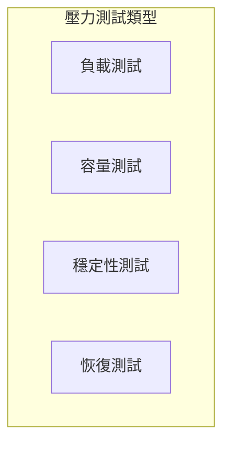

# 壓力測試標準

壓力測試用於驗證 AI 系統在極端條件下的穩定性和可靠性。

## 測試類型



---

## 負載測試

### 指標定義

| 指標 | 說明 | 目標 |
|------|------|------|
| QPS | 每秒查詢數 | ≥ 100 |
| P99 延遲 | 99% 請求延遲 | < 3s |
| 錯誤率 | 請求失敗比例 | < 1% |

### 測試腳本

```python
import asyncio
import time
from dataclasses import dataclass

@dataclass
class LoadTestResult:
    total_requests: int
    successful: int
    failed: int
    avg_latency: float
    p99_latency: float

async def load_test(
    endpoint: str,
    qps: int,
    duration_seconds: int
) -> LoadTestResult:
    """執行負載測試"""
    latencies = []
    failed = 0
    
    for _ in range(qps * duration_seconds):
        start = time.time()
        try:
            # 發送請求
            await send_request(endpoint)
            latencies.append(time.time() - start)
        except Exception:
            failed += 1
    
    return LoadTestResult(
        total_requests=len(latencies) + failed,
        successful=len(latencies),
        failed=failed,
        avg_latency=sum(latencies) / len(latencies),
        p99_latency=sorted(latencies)[int(len(latencies) * 0.99)],
    )
```

---

## 容量測試

### 測試場景

```yaml
capacity_test_scenarios:
  - name: "正常負載"
    qps: 50
    duration: "10m"
    
  - name: "峰值負載"
    qps: 200
    duration: "5m"
    
  - name: "極限負載"
    qps: 500
    duration: "2m"
```

---

## 穩定性測試

### 長時間運行

| 測試項目 | 持續時間 | 監控指標 |
|----------|----------|----------|
| 記憶體洩漏 | 24h | 記憶體使用趨勢 |
| 連接池 | 24h | 連接數穩定性 |
| 回應品質 | 24h | 錯誤率變化 |

---

## 恢復測試

### 故障注入

```yaml
fault_injection:
  - type: "API 限流"
    action: "觸發 429 錯誤"
    expected: "優雅降級"
    
  - type: "網路中斷"
    action: "斷開上游連接"
    expected: "快速恢復"
    
  - type: "資源耗盡"
    action: "模擬記憶體不足"
    expected: "自動重啟"
```

---

## 報告模板

```markdown
## 壓力測試報告

### 測試環境
- 日期：2026-02-01
- 環境：staging
- 配置：4 核 8G

### 測試結果
| 場景 | QPS | P99 延遲 | 錯誤率 | 結果 |
|------|-----|----------|--------|------|
| 正常 | 50 | 1.2s | 0.1% | ✅ |
| 峰值 | 200 | 2.8s | 0.5% | ✅ |
| 極限 | 500 | 5.1s | 3.2% | ⚠️ |

### 建議
- 建議 QPS 上限設為 300
- 需要增加快取緩解延遲
```

---

## 最佳實踐

!!! success "測試要點"
    1. 逐步提升負載，觀察拐點
    2. 監控系統資源使用
    3. 記錄詳細的測試數據
    4. 定期執行回歸測試
