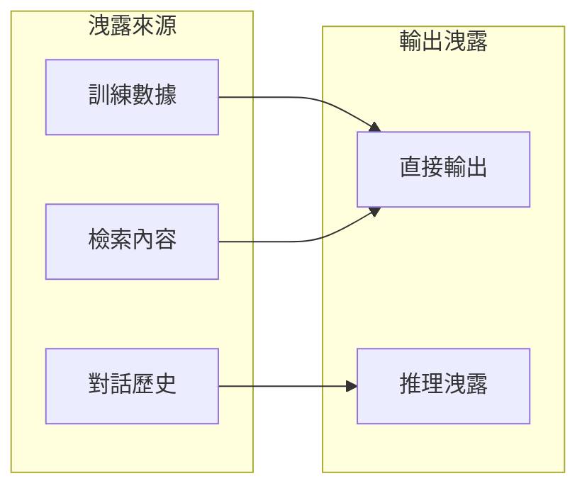

# PII 洩露防護

個人可識別資訊（PII）洩露是 AI 系統面臨的重大合規風險。

## PII 類型

| 類型 | 範例 | 風險等級 |
|------|------|----------|
| 身分證號 | A123456789 | 高 |
| 手機號碼 | 0912-345-678 | 高 |
| 電子郵件 | user@example.com | 中 |
| 住址 | 台北市XX路XX號 | 中 |
| 姓名 | 王小明 | 低-中 |

---

## 洩露途徑



---

## 防護策略

### 1. 輸入過濾

```python
import re

PII_PATTERNS = {
    "tw_id": r'[A-Z][12]\d{8}',
    "phone": r'09\d{2}[-.]?\d{3}[-.]?\d{3}',
    "email": r'[\w.-]+@[\w.-]+\.\w+',
}

def mask_pii_input(text: str) -> str:
    """遮蔽輸入中的 PII"""
    for pii_type, pattern in PII_PATTERNS.items():
        text = re.sub(pattern, f'[{pii_type.upper()}]', text)
    return text
```

### 2. 輸出過濾

```python
def filter_pii_output(text: str) -> str:
    """過濾輸出中的 PII"""
    for pii_type, pattern in PII_PATTERNS.items():
        text = re.sub(pattern, '[已遮蔽]', text)
    return text
```

### 3. 上下文控制

```python
CONTEXT_RULES = """
重要規則：
1. 不要在回覆中包含用戶的個人資訊
2. 不要透露其他用戶的資訊
3. 使用泛化描述替代具體數據
"""
```

---

## 監控指標

| 指標 | 閾值 | 動作 |
|------|------|------|
| PII 檢出率 | > 0 | 即時告警 |
| 遮蔽成功率 | 100% | 監控 |
| 誤報率 | < 5% | 調優 |

---

## 合規要求

!!! warning "法規遵循"
    - 個資法：需保護個人資料
    - GDPR：歐盟用戶資料保護
    - 行業規範：金融、醫療等有額外要求

---

## 最佳實踐

!!! success "防護要點"
    1. 輸入輸出雙重過濾
    2. 最小化 PII 存儲
    3. 定期審計 PII 處理
    4. 建立洩露響應流程
