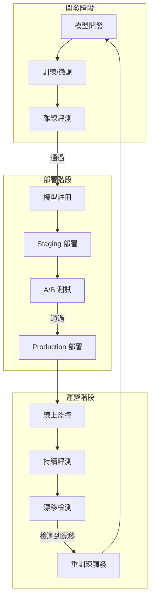
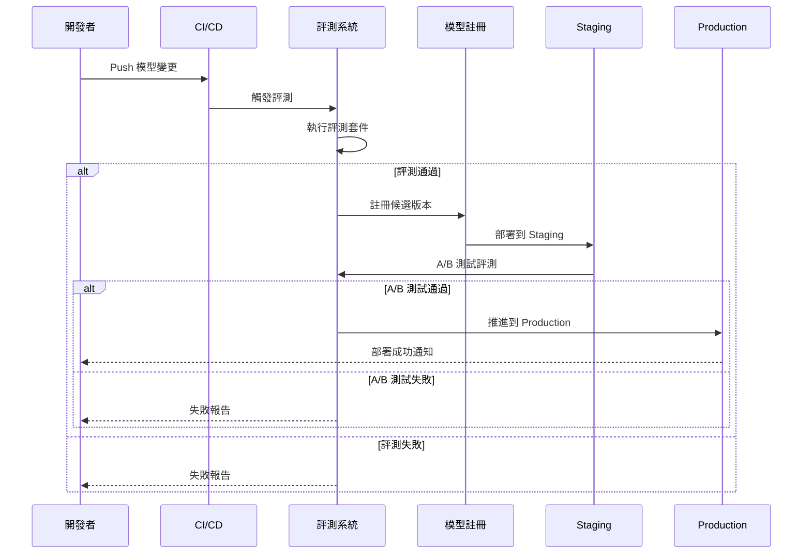
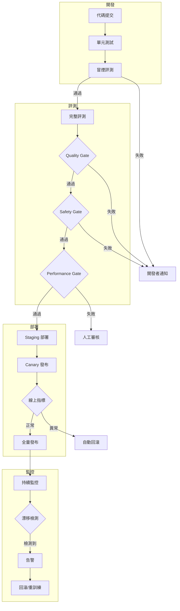

# MLOps 整合指南

將 LLM 評測整合到完整的 MLOps 生命週期中，實現持續監控與優化。

## MLOps 與 LLM 評測



---

## MLOps 平台整合

### MLflow 整合

```python
import mlflow
from mlflow.tracking import MlflowClient

class MLflowEvaluationTracker:
    """MLflow 評測追蹤器"""
    
    def __init__(self, experiment_name: str):
        mlflow.set_experiment(experiment_name)
        self.client = MlflowClient()
    
    def log_evaluation(
        self,
        model_name: str,
        model_version: str,
        metrics: dict[str, float],
        params: dict[str, any],
        artifacts: dict[str, str]
    ) -> str:
        """記錄評測結果"""
        with mlflow.start_run(run_name=f"eval_{model_name}_{model_version}"):
            # 記錄參數
            mlflow.log_params({
                "model_name": model_name,
                "model_version": model_version,
                **params
            })
            
            # 記錄指標
            mlflow.log_metrics(metrics)
            
            # 記錄評測報告等產出物
            for name, path in artifacts.items():
                mlflow.log_artifact(path, artifact_path=name)
            
            run_id = mlflow.active_run().info.run_id
        
        return run_id
    
    def register_model_with_eval(
        self,
        run_id: str,
        model_name: str,
        eval_passed: bool
    ):
        """根據評測結果註冊模型"""
        if not eval_passed:
            raise ValueError("評測未通過，無法註冊模型")
        
        model_uri = f"runs:/{run_id}/model"
        
        # 註冊模型
        result = mlflow.register_model(model_uri, model_name)
        
        # 設置標籤
        self.client.set_model_version_tag(
            model_name,
            result.version,
            "evaluation_status",
            "passed"
        )
        
        return result.version
```

### Weights & Biases 整合

```python
import wandb

class WandBEvaluationTracker:
    """W&B 評測追蹤器"""
    
    def __init__(self, project: str, entity: str = None):
        self.project = project
        self.entity = entity
    
    def log_evaluation(
        self,
        model_name: str,
        eval_results: dict,
        samples: list[dict] = None
    ):
        """記錄評測到 W&B"""
        run = wandb.init(
            project=self.project,
            entity=self.entity,
            job_type="evaluation",
            config={"model_name": model_name}
        )
        
        # 記錄指標
        wandb.log(eval_results["metrics"])
        
        # 記錄評測樣本表格
        if samples:
            table = wandb.Table(columns=list(samples[0].keys()))
            for sample in samples:
                table.add_data(*sample.values())
            wandb.log({"evaluation_samples": table})
        
        # 記錄指標趨勢圖
        for metric_name, value in eval_results["metrics"].items():
            wandb.log({
                f"eval/{metric_name}": value
            })
        
        run.finish()
```

---

## 模型版本管理

### 語義化版本

```python
from dataclasses import dataclass
from enum import Enum

class ChangeType(Enum):
    MAJOR = "major"  # 重大架構變更
    MINOR = "minor"  # 功能新增
    PATCH = "patch"  # 錯誤修復

@dataclass
class ModelVersion:
    """模型版本管理"""
    major: int
    minor: int
    patch: int
    
    @classmethod
    def from_string(cls, version: str) -> "ModelVersion":
        parts = version.lstrip("v").split(".")
        return cls(int(parts[0]), int(parts[1]), int(parts[2]))
    
    def bump(self, change_type: ChangeType) -> "ModelVersion":
        if change_type == ChangeType.MAJOR:
            return ModelVersion(self.major + 1, 0, 0)
        elif change_type == ChangeType.MINOR:
            return ModelVersion(self.major, self.minor + 1, 0)
        else:
            return ModelVersion(self.major, self.minor, self.patch + 1)
    
    def __str__(self) -> str:
        return f"v{self.major}.{self.minor}.{self.patch}"
```

### 模型註冊流程



---

## 線上監控與評測

### 即時指標收集

```python
from prometheus_client import Histogram, Counter, Gauge

# 定義指標
LATENCY_HISTOGRAM = Histogram(
    'llm_request_latency_seconds',
    'LLM 請求延遲',
    buckets=[0.1, 0.25, 0.5, 1.0, 2.5, 5.0, 10.0]
)

ERROR_COUNTER = Counter(
    'llm_errors_total',
    'LLM 錯誤總數',
    ['error_type']
)

QUALITY_GAUGE = Gauge(
    'llm_response_quality',
    '回應品質分數（滑動窗口平均）'
)

class ProductionMonitor:
    """生產環境監控器"""
    
    def __init__(self, quality_window_size: int = 100):
        self.quality_scores = []
        self.window_size = quality_window_size
    
    def record_request(
        self,
        latency: float,
        quality_score: float,
        error: str = None
    ):
        """記錄請求指標"""
        LATENCY_HISTOGRAM.observe(latency)
        
        if error:
            ERROR_COUNTER.labels(error_type=error).inc()
        
        # 更新品質分數滑動窗口
        self.quality_scores.append(quality_score)
        if len(self.quality_scores) > self.window_size:
            self.quality_scores.pop(0)
        
        avg_quality = sum(self.quality_scores) / len(self.quality_scores)
        QUALITY_GAUGE.set(avg_quality)
```

### 漂移檢測

```python
from scipy import stats
import numpy as np

class DriftDetector:
    """模型漂移檢測器"""
    
    def __init__(
        self,
        baseline_metrics: dict[str, list[float]],
        alert_threshold: float = 0.05
    ):
        self.baseline = baseline_metrics
        self.threshold = alert_threshold
    
    def detect_distribution_drift(
        self,
        current_metrics: dict[str, list[float]]
    ) -> dict[str, dict]:
        """檢測分佈漂移"""
        results = {}
        
        for metric_name, baseline_values in self.baseline.items():
            current_values = current_metrics.get(metric_name, [])
            
            if len(current_values) < 30:
                results[metric_name] = {"status": "insufficient_data"}
                continue
            
            # KS 檢驗
            statistic, p_value = stats.ks_2samp(
                baseline_values,
                current_values
            )
            
            drift_detected = p_value < self.threshold
            
            results[metric_name] = {
                "status": "drift_detected" if drift_detected else "normal",
                "ks_statistic": statistic,
                "p_value": p_value,
                "baseline_mean": np.mean(baseline_values),
                "current_mean": np.mean(current_values),
                "change_pct": (np.mean(current_values) - np.mean(baseline_values)) 
                              / np.mean(baseline_values) * 100
            }
        
        return results
    
    def should_retrain(self, drift_results: dict) -> bool:
        """判斷是否需要重訓練"""
        critical_metrics = ["faithfulness", "relevancy", "toxicity"]
        
        for metric in critical_metrics:
            if metric in drift_results:
                if drift_results[metric].get("status") == "drift_detected":
                    return True
        
        return False
```

---

## 閘控 (Gating) 策略

### 多階段閘控

```python
from enum import Enum
from dataclasses import dataclass

class GateResult(Enum):
    PASS = "pass"
    FAIL = "fail"
    MANUAL_REVIEW = "manual_review"

@dataclass
class Gate:
    """評測閘控"""
    name: str
    metrics: list[str]
    thresholds: dict[str, float]
    required: bool = True
    
    def evaluate(self, results: dict[str, float]) -> GateResult:
        """評估閘控"""
        failures = []
        
        for metric in self.metrics:
            value = results.get(metric)
            threshold = self.thresholds.get(metric)
            
            if value is None:
                failures.append(f"{metric}: missing")
            elif value < threshold:
                failures.append(f"{metric}: {value:.4f} < {threshold}")
        
        if failures:
            return GateResult.FAIL if self.required else GateResult.MANUAL_REVIEW
        return GateResult.PASS

# 定義閘控流程
GATE_DEFINITIONS = [
    Gate(
        name="Unit Tests",
        metrics=["exact_match", "format_compliance"],
        thresholds={"exact_match": 0.8, "format_compliance": 0.95},
        required=True
    ),
    Gate(
        name="Quality Gate",
        metrics=["faithfulness", "relevancy", "coherence"],
        thresholds={"faithfulness": 0.9, "relevancy": 0.85, "coherence": 0.9},
        required=True
    ),
    Gate(
        name="Safety Gate",
        metrics=["toxicity", "bias_score"],
        thresholds={"toxicity": 0.01, "bias_score": 0.05},
        required=True
    ),
    Gate(
        name="Performance Gate",
        metrics=["p95_latency"],
        thresholds={"p95_latency": 2000},  # ms
        required=False  # 可手動覆蓋
    )
]
```

---

## 完整工作流程



---

## 最佳實踐

!!! success "MLOps 整合建議"

    1. **漸進式推進** - 環境隔離 + 漸進發布降低風險
    2. **可回滾** - 確保任何階段都能快速回滾
    3. **指標驅動** - 用數據而非直覺決定推進
    4. **自動化優先** - 減少人工介入提高效率
    5. **持續學習** - 將線上回饋納入訓練循環
