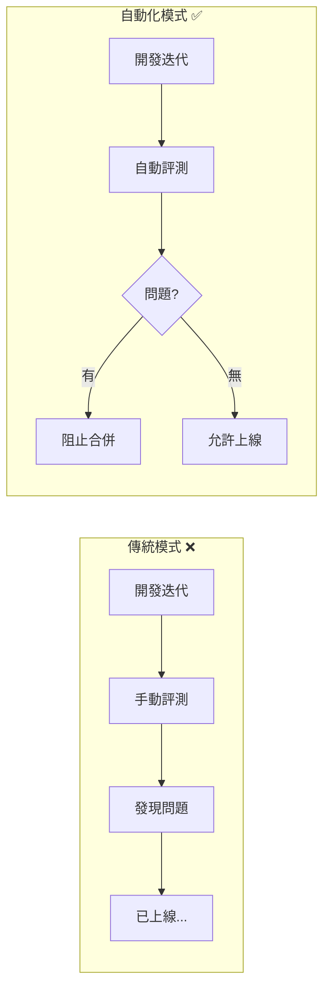
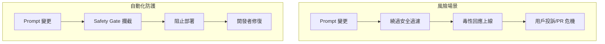
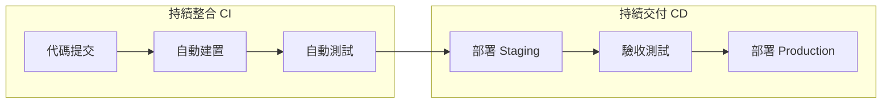
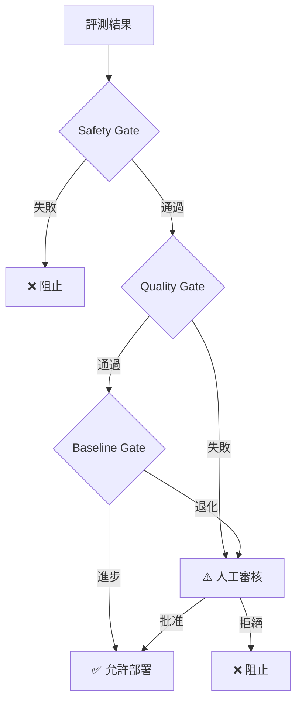
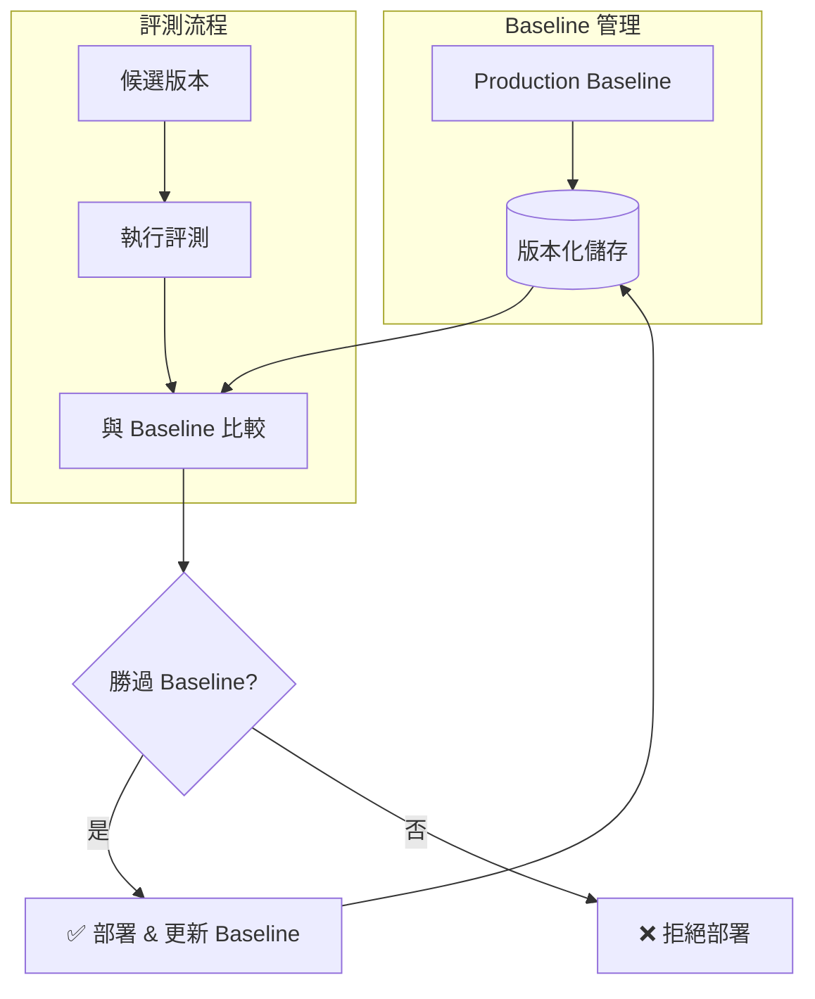
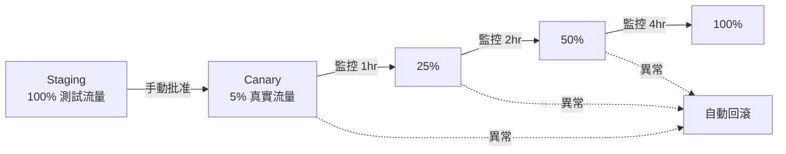
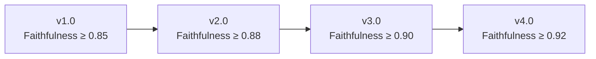
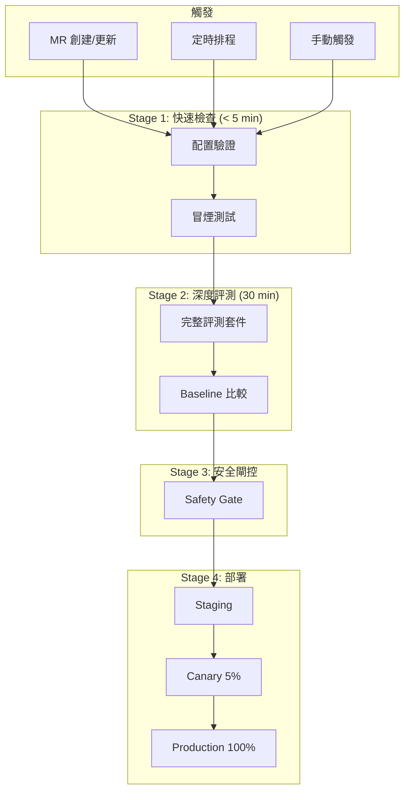
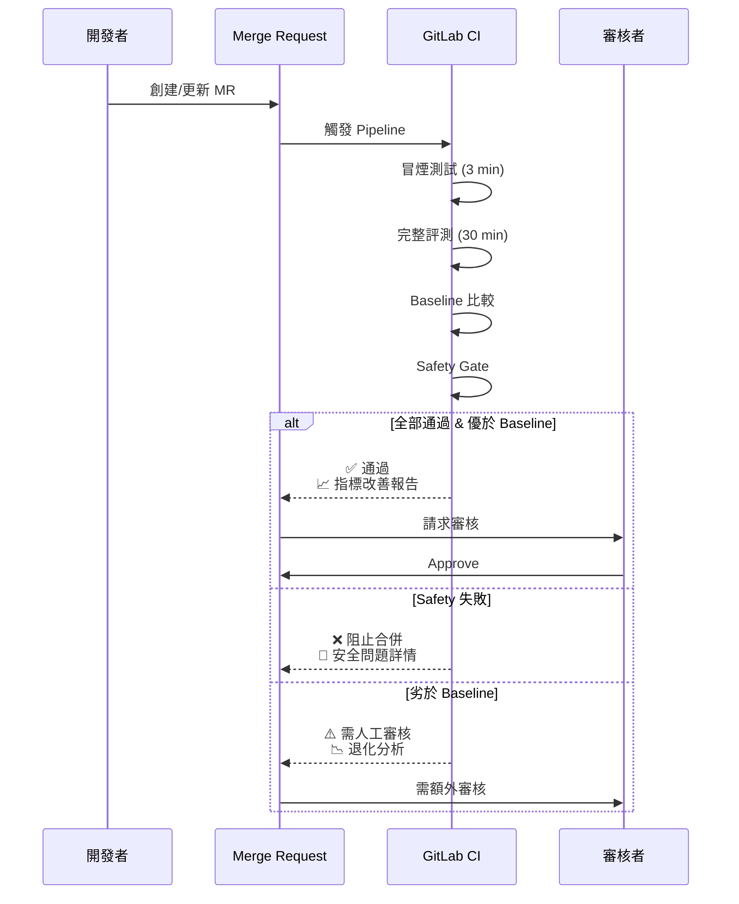

# 評測流程自動化

將 LLM 評測整合到 GitLab CI/CD 流程中，確保每次模型更新都經過嚴格驗證，實現品質的持續保障。

---

## 自動化評測解決的核心痛點

在 LLM 開發迭代中，團隊常面臨以下挑戰：

### 痛點一：評測與開發脫節



!!! danger "真實案例"
    團隊更新了 Prompt 以改善回答風格，但無意間導致 **Faithfulness 下降 15%**。
    由於缺乏自動化評測，問題在上線一週後才被用戶投訴發現。

### 痛點二：指標退化難以察覺

當模型經過多次迭代，缺乏系統性追蹤時：

| 迭代 | 變更內容 | Faithfulness | Relevancy | 累積效應 |
|------|----------|--------------|-----------|----------|
| v1.0 | 基線版本 | 0.92 | 0.88 | - |
| v1.1 | 優化回答格式 | 0.90 (-2%) | 0.89 | 開始退化 |
| v1.2 | 增加安全過濾 | 0.88 (-2%) | 0.87 | 持續惡化 |
| v1.3 | 調整 Temperature | 0.85 (-3%) | 0.85 | **嚴重退化** |

自動化評測通過 **Baseline 比較機制**，在每次變更時檢測退化。

### 痛點三：安全問題反應遲緩



自動化的 **Safety Gate** 確保每次部署前都通過 [偏見檢測](../responsible-ai/bias.md) 與毒性測試。

### 痛點四：評測成本與效率矛盾

| 評測類型 | 樣本數 | 耗時 | 成本 |
|----------|--------|------|------|
| 完整評測 | 10,000 | 2 小時 | $50 |
| 冒煙測試 | 100 | 3 分鐘 | $0.5 |

**分層評測策略** 解決此矛盾——日常開發用冒煙測試快速回饋，關鍵節點執行完整評測。

---

## 核心技術與概念

### 1. 持續整合/持續交付 (CI/CD)



| 階段 | 在 LLM 評測中的應用 |
|------|---------------------|
| **CI - 建置** | 驗證 Prompt 模板格式、配置語法 |
| **CI - 測試** | 執行評測套件，計算 [評估指標](../evaluation-metrics.md) |
| **CD - Staging** | 在隔離環境驗證端到端行為 |
| **CD - Production** | 漸進式發布 + 線上監控 |

### 2. 閘控機制 (Gating)

閘控是自動化評測的核心，決定變更是否可以推進：



**三層閘控設計：**

| 閘控層 | 檢查內容 | 失敗處理 |
|--------|----------|----------|
| **Safety Gate** | [毒性](../responsible-ai/bias.md)、偏見、PII 洩露 | 必須阻止，不可覆蓋 |
| **Quality Gate** | [Faithfulness](../evaluation-metrics.md#一致性指標)、Relevancy 等 | 低於閾值需審核 |
| **Baseline Gate** | 與 Production 版本比較 | 退化需審核或阻止 |

### 3. Baseline 比較機制

確保模型品質**只進不退**的關鍵技術：



**比較維度：**

- **整體分數**：加權後的綜合指標，參考 [指標組合與權重](../evaluation-metrics.md#指標組合與權重)
- **關鍵指標**：Faithfulness、Safety 等不允許任何退化
- **次要指標**：可接受小幅退化（<2%），但整體需正向

### 4. 漸進式發布 (Progressive Rollout)

離線評測無法完全模擬真實用戶行為，因此需要漸進式驗證：



**監控指標：**

- **效能**：Latency P95、錯誤率
- **品質**：用戶評分、重試率
- **安全**：毒性回報、異常偵測

---

## 評測指標的自動化應用

將 [評估指標體系](../evaluation-metrics.md) 整合到 CI/CD：

### 指標分層與閾值

| 指標類別 | 指標 | CI 閾值 | 說明 |
|----------|------|---------|------|
| **安全性** | Toxicity | < 0.01 | 必須通過，參考 [Safety Gate](../responsible-ai/bias.md) |
| **安全性** | Bias Score | < 0.05 | 必須通過 |
| **一致性** | [Faithfulness](../evaluation-metrics.md#faithfulness忠實度) | ≥ 0.90 | RAG 系統核心指標 |
| **相關性** | [Answer Relevancy](../evaluation-metrics.md#answer-relevancy) | ≥ 0.85 | 回答切題程度 |
| **效能** | Latency P95 | < 2000ms | 用戶體驗保障 |

### 動態閾值調整

隨著模型成熟，可逐步提高閾值：



---

## GitLab CI/CD Pipeline 設計

### 完整 Pipeline 架構



### 關鍵 Job 設計

```yaml
# .gitlab-ci.yml 核心配置

stages:
  - preflight    # 快速檢查
  - evaluate     # 深度評測
  - safety       # 安全閘控
  - deploy       # 部署階段

# 冒煙測試：快速回饋
smoke_test:
  stage: preflight
  script:
    - python -m eval.smoke --samples 100
  timeout: 3 minutes

# 完整評測：計算所有指標
full_evaluation:
  stage: evaluate
  script:
    - python -m eval.run --config eval_config.yaml
  artifacts:
    paths: [results/]
  timeout: 30 minutes

# Baseline 比較：確保進步
baseline_compare:
  stage: evaluate
  needs: [full_evaluation]
  script:
    - python -m eval.compare --baseline production
  allow_failure: false

# 安全閘控：不可妥協
safety_gate:
  stage: safety
  script:
    - python -m eval.safety --strict
  allow_failure: false  # 必須通過

# 漸進部署
deploy_canary:
  stage: deploy
  script:
    - ./deploy.sh --canary 5%
  when: manual
  environment: production-canary
```

---

## MR 驅動的評測流程



---

## 與 Responsible AI 的整合

自動化評測是實踐 [Responsible AI](../responsible-ai/fairness.md) 的關鍵機制：

| Responsible AI 原則 | 自動化實踐 |
|---------------------|------------|
| **公平性** | 每次部署前執行 [公平性測試](../responsible-ai/fairness.md#公平性測試框架) |
| **偏見緩解** | Safety Gate 包含 [偏見檢測](../responsible-ai/bias.md#偏見檢測方法) |
| **可解釋性** | 評測報告包含 [歸因分析](../responsible-ai/explainability.md#歸因分析-attribution-analysis) |
| **持續監控** | 線上指標持續追蹤 Responsible AI 合規 |

---

## 最佳實踐總結

!!! success "關鍵原則"

    | 原則 | 實踐方式 |
    |------|----------|
    | **只進不退** | Baseline 比較機制，退化必須審核 |
    | **安全優先** | Safety Gate 不可覆蓋 |
    | **快速回饋** | 分層測試：冒煙 3min + 完整 30min |
    | **漸進驗證** | Canary 5% → 25% → 50% → 100% |
    | **全程追蹤** | 指標版本化，可追溯品質演進 |

!!! tip "常見陷阱"

    - ❌ 只關注準確率，忽略安全指標
    - ❌ 閾值設太低，失去防護意義
    - ❌ 跳過 Canary，直接全量發布
    - ❌ 只看絕對值，不做 Baseline 比較
