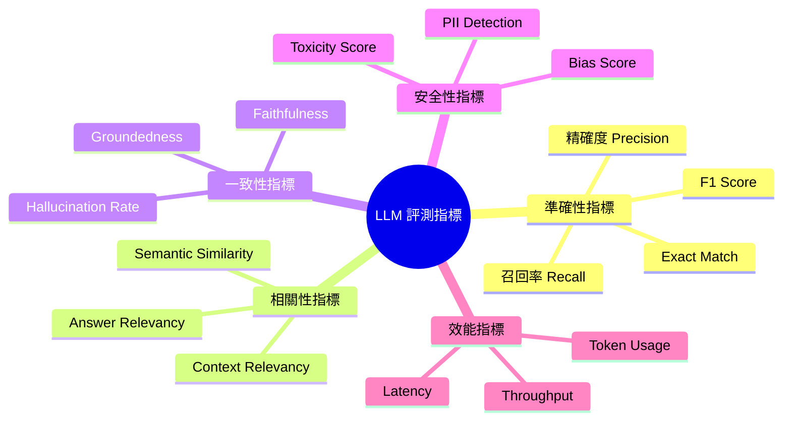
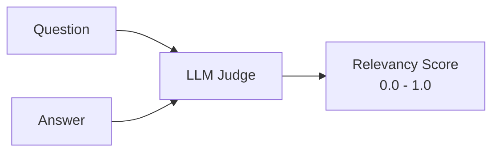
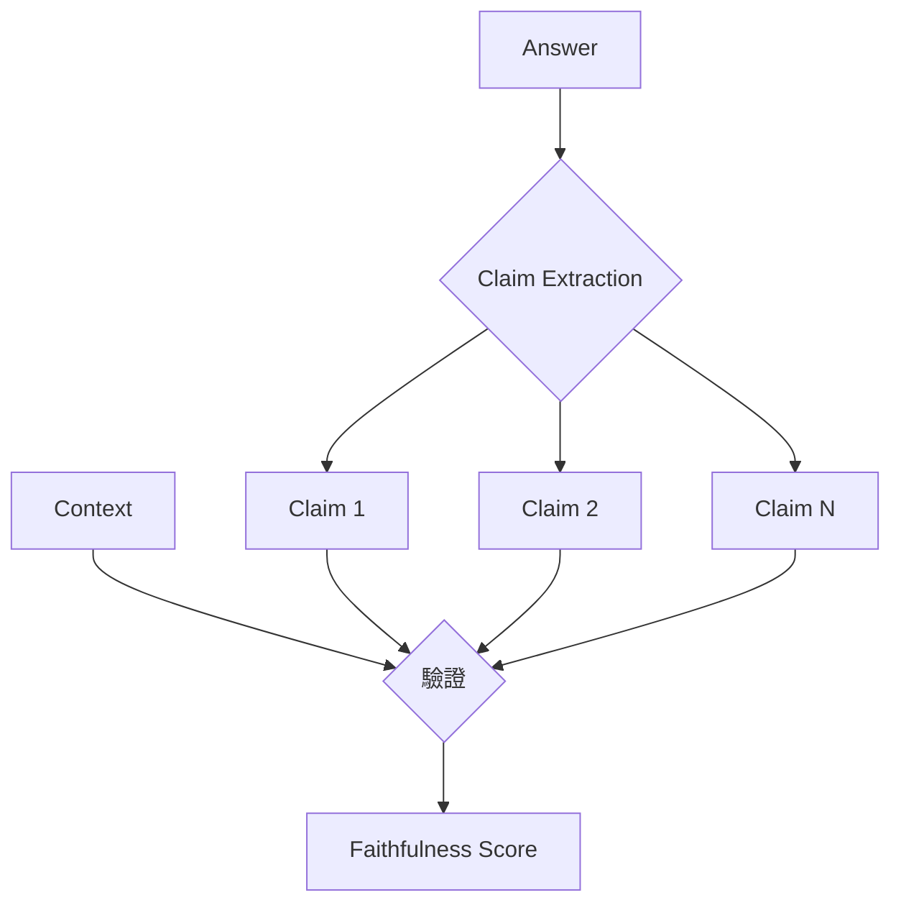
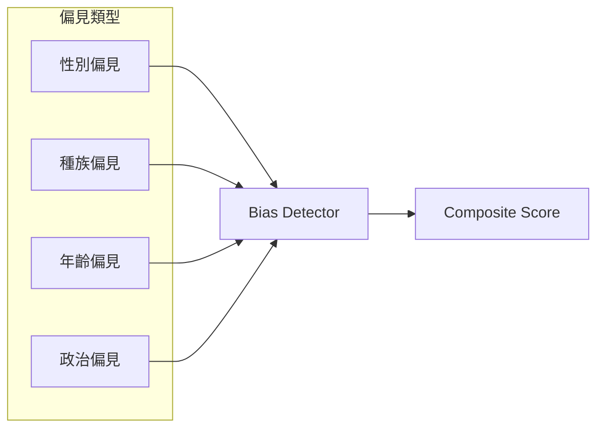

# 評估指標體系

建立完整的評估指標體系是 LLM 評測的核心基礎。本文將介紹各類指標的定義、計算方式與應用場景。

## 指標分類概覽



---

## 準確性指標

### Exact Match (EM)

衡量模型輸出與標準答案完全一致的比例。

$$
EM = \frac{\text{完全匹配的樣本數}}{\text{總樣本數}}
$$

```python
def exact_match(predictions: list[str], references: list[str]) -> float:
    """計算 Exact Match 分數"""
    matches = sum(1 for p, r in zip(predictions, references) 
                  if p.strip().lower() == r.strip().lower())
    return matches / len(predictions)
```

!!! note "適用場景"
    - 抽取式問答（Extractive QA）
    - 實體識別任務
    - 結構化輸出驗證

### F1 Score

基於 Token 級別的精確度與召回率的調和平均。

$$
F1 = 2 \times \frac{Precision \times Recall}{Precision + Recall}
$$

```python
def token_f1(prediction: str, reference: str) -> float:
    """計算 Token 級別的 F1 分數"""
    pred_tokens = set(prediction.lower().split())
    ref_tokens = set(reference.lower().split())
    
    if not pred_tokens or not ref_tokens:
        return 0.0
    
    common = pred_tokens & ref_tokens
    precision = len(common) / len(pred_tokens)
    recall = len(common) / len(ref_tokens)
    
    if precision + recall == 0:
        return 0.0
    return 2 * precision * recall / (precision + recall)
```

---

## 相關性指標

### Answer Relevancy

評估回答與問題的相關程度，常用於 RAG 系統評測。



**評測 Prompt 範例：**

```text
評估以下回答與問題的相關性。
評分標準：
- 1.0: 回答完全切題，直接回應問題
- 0.7: 回答大致相關，但有部分偏離
- 0.4: 回答部分相關，需要補充
- 0.0: 回答完全無關

問題：{question}
回答：{answer}

相關性分數（0.0-1.0）：
```

### Context Relevancy

評估檢索內容與問題的相關程度。

| 分數範圍 | 含義 | 建議動作 |
|----------|------|----------|
| 0.9 - 1.0 | 高度相關 | 理想狀態 |
| 0.7 - 0.9 | 相關 | 可接受 |
| 0.5 - 0.7 | 部分相關 | 需優化檢索 |
| < 0.5 | 不相關 | 檢查 Embedding 或索引 |

---

## 一致性指標

### Faithfulness（忠實度）

衡量回答是否忠於提供的上下文，是 RAG 系統最關鍵的指標之一。



$$
Faithfulness = \frac{\text{可由 Context 支持的 Claims 數}}{\text{總 Claims 數}}
$$

!!! warning "幻覺風險"
    Faithfulness < 0.8 表示模型可能產生幻覺（Hallucination），需要：
    
    - 檢查 Prompt 設計是否強調「僅基於提供的資訊回答」
    - 驗證 Context 是否包含足夠資訊
    - 考慮添加後處理驗證步驟

### Groundedness

與 Faithfulness 類似，但更關注事實陳述的可追溯性。

```python
def groundedness_score(answer: str, sources: list[str]) -> dict:
    """
    計算 Groundedness 分數
    返回：整體分數與各句子的 grounding 狀態
    """
    sentences = split_into_sentences(answer)
    grounded = []
    
    for sentence in sentences:
        is_grounded = any(
            semantic_similarity(sentence, source) > 0.85 
            for source in sources
        )
        grounded.append({
            "sentence": sentence,
            "is_grounded": is_grounded
        })
    
    score = sum(1 for g in grounded if g["is_grounded"]) / len(grounded)
    return {"score": score, "details": grounded}
```

---

## 安全性指標

### Toxicity Score

檢測輸出中的有害、冒犯或不當內容。

| 類別 | 說明 | 閾值建議 |
|------|------|----------|
| 仇恨言論 | 針對特定群體的攻擊 | < 0.01 |
| 暴力內容 | 描述或鼓勵暴力 | < 0.01 |
| 性露骨 | 不當的性描述 | < 0.01 |
| 自我傷害 | 可能導致傷害的內容 | < 0.001 |

### Bias Score

評估輸出中的偏見程度。



---

## 效能指標

### Latency 分布

```python
# 建議監控的 Latency 百分位
latency_percentiles = {
    "p50": "中位數延遲，日常體驗",
    "p90": "90% 請求的延遲上限",
    "p95": "SLA 常用閾值",
    "p99": "極端情況監控"
}
```

| 應用場景 | P50 目標 | P99 目標 |
|----------|----------|----------|
| 即時對話 | < 500ms | < 2s |
| 文件摘要 | < 2s | < 10s |
| 批次處理 | < 10s | < 60s |

### Token 使用效率

$$
Token\ Efficiency = \frac{\text{有效輸出 Token}}{\text{總消耗 Token}}
$$

---

## 指標組合與權重

不同應用場景應採用不同的指標組合：

=== "客服對話系統"

    | 指標 | 權重 | 門檻 |
    |------|------|------|
    | Answer Relevancy | 30% | ≥ 0.85 |
    | Faithfulness | 25% | ≥ 0.90 |
    | Toxicity | 20% | < 0.01 |
    | Latency (P95) | 15% | < 3s |
    | User Satisfaction | 10% | ≥ 4.0/5.0 |

=== "知識問答系統"

    | 指標 | 權重 | 門檻 |
    |------|------|------|
    | Faithfulness | 35% | ≥ 0.95 |
    | Context Relevancy | 25% | ≥ 0.80 |
    | Exact Match / F1 | 20% | ≥ 0.70 |
    | Groundedness | 15% | ≥ 0.90 |
    | Latency | 5% | < 5s |

=== "創意寫作助手"

    | 指標 | 權重 | 門檻 |
    |------|------|------|
    | Creativity Score | 30% | ≥ 0.70 |
    | Coherence | 25% | ≥ 0.85 |
    | Toxicity | 20% | < 0.01 |
    | Style Consistency | 15% | ≥ 0.80 |
    | User Preference | 10% | ≥ 3.5/5.0 |

---

## 最佳實踐

!!! success "指標設計建議"

    1. **不要過度依賴單一指標** - 使用指標組合降低優化偏差
    2. **設定合理閾值** - 基於業務需求而非技術可達
    3. **持續校準** - 定期使用人工評測驗證自動指標
    4. **版本化追蹤** - 記錄指標定義變化與評測結果
    5. **A/B 測試驗證** - 指標改善需與線上效果對應
