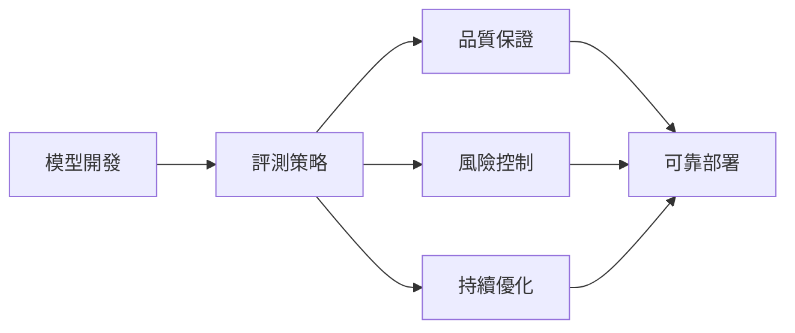
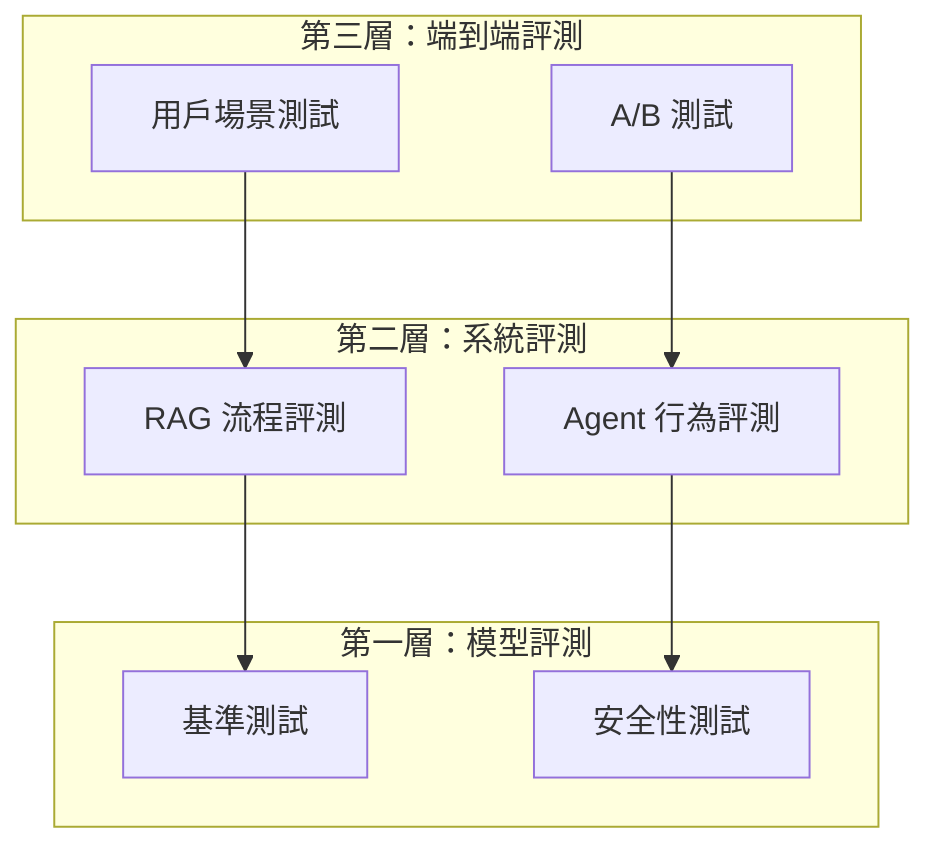

# 評測策略與框架設計

建立完善的 LLM 評測體系是確保 AI 系統品質與安全的關鍵基礎。本章節將從指標設計、負責任 AI 標準到自動化流程，提供完整的評測策略指南。

## 為什麼需要評測策略？

傳統軟體測試關注確定性輸入輸出，而 LLM 評測面臨獨特挑戰：

| 挑戰 | 說明 |
|------|------|
| **非確定性輸出** | 相同輸入可能產生不同回應 |
| **品質多維度** | 需同時考量準確性、安全性、相關性等 |
| **上下文敏感** | 回應品質依賴對話歷史與情境 |
| **評估主觀性** | 「好」的回應難以量化定義 |

## 本章涵蓋內容

-   :material-chart-line:{ .lg .middle } **評估指標體系**

    ---

    定義 LLM 評測的核心指標分類與計算方式

    [:octicons-arrow-right-24: 了解指標](evaluation-metrics.md)

-   :material-scale-balance:{ .lg .middle } **Responsible AI 標準**

    ---

    公平性、偏見檢測與可解釋性的驗收標準

    [:octicons-arrow-right-24: 負責任 AI](responsible-ai/fairness.md)

-   :material-robot:{ .lg .middle } **自動化與 CI/CD**

    ---

    將評測整合到開發流程的最佳實踐

    [:octicons-arrow-right-24: 自動化流程](automation/workflow.md)

---

## 評測策略設計原則

### 1. 分層評測架構

### 2. 核心設計原則

!!! tip "評測策略五原則"
    
    1. **可量化** - 每個評測維度都應有明確的數值指標
    2. **可重複** - 相同條件下應產生一致的評測結果
    3. **可追蹤** - 評測結果應與模型版本、數據集版本關聯
    4. **可比較** - 支援跨版本、跨模型的橫向比較
    5. **可執行** - 評測流程應可自動化執行

### 3. 評測覆蓋度矩陣

| 評測維度 | 離線評測 | 線上評測 | 人工評測 |
|----------|:--------:|:--------:|:--------:|
| 準確性 | ✅ | ✅ | ✅ |
| 相關性 | ✅ | ✅ | ✅ |
| 安全性 | ✅ | ✅ | ⚠️ |
| 效能 | ✅ | ✅ | ❌ |
| 用戶體驗 | ❌ | ✅ | ✅ |

---

## 快速開始

1. **建立指標體系** → [評估指標體系](evaluation-metrics.md)
2. **設定安全基線** → [公平性驗收標準](responsible-ai/fairness.md)
3. **自動化整合** → [評測流程自動化](automation/workflow.md)
