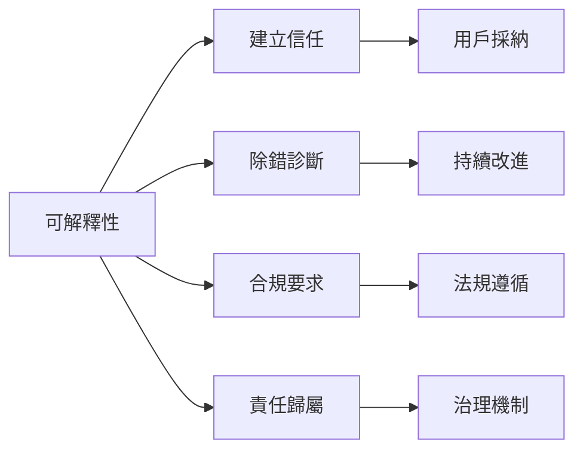
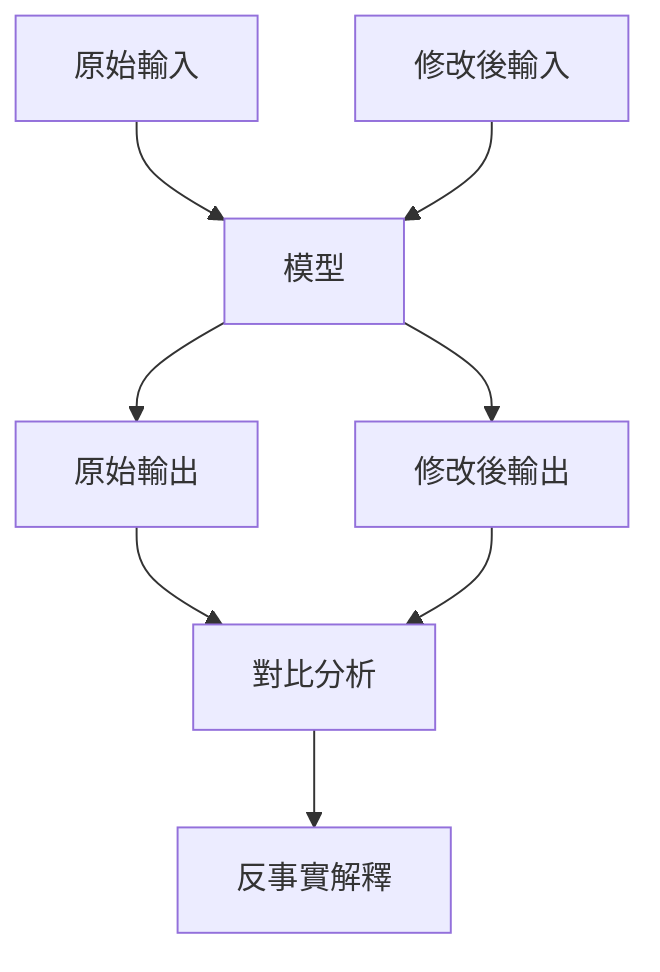
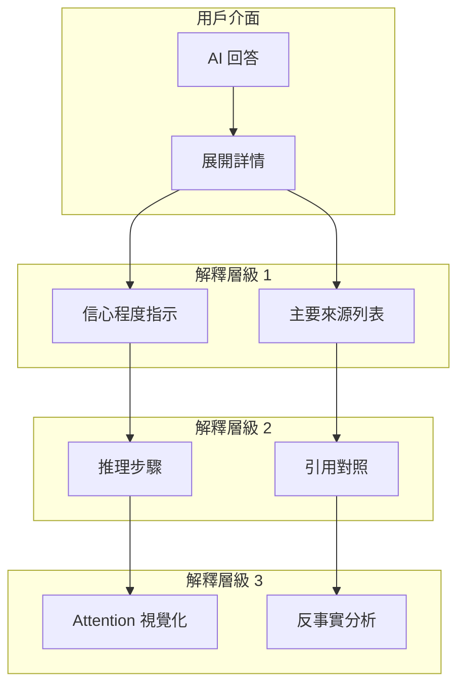

# 可解釋性要求

可解釋性（Explainability）使 AI 決策過程透明化，是建立用戶信任與滿足監管要求的關鍵。

## 為什麼需要可解釋性？



!!! warning "高風險場景的可解釋性要求"
    在醫療、金融、法律等高風險領域，AI 決策的可解釋性不僅是最佳實踐，更可能是法規強制要求（如 EU AI Act）。

---

## 可解釋性層級

### 1. 全局可解釋性 (Global Explainability)

理解模型整體行為模式。

| 方法 | 適用對象 | 說明 |
|------|----------|------|
| 特徵重要性 | 技術團隊 | 哪些輸入因素影響最大 |
| 決策規則提取 | 審計人員 | 模型遵循的隱含規則 |
| 模型蒸餾 | 研究人員 | 用簡單模型近似複雜模型 |

### 2. 局部可解釋性 (Local Explainability)

解釋單一預測的原因。

```python
def generate_local_explanation(
    model,
    input_text: str,
    output: str
) -> dict:
    """生成局部可解釋性報告"""
    return {
        "input": input_text,
        "output": output,
        "attention_weights": get_attention_visualization(model, input_text),
        "key_tokens": extract_influential_tokens(model, input_text, output),
        "reasoning_chain": extract_reasoning_steps(output),
        "confidence": model.get_confidence(input_text, output)
    }
```

### 3. 反事實可解釋性 (Counterfactual)

「如果輸入不同，結果會如何改變？」



---

## LLM 可解釋性方法

### Chain-of-Thought (CoT) 解釋

讓模型展示推理過程。

```python
COT_PROMPT = """
請回答以下問題，並展示你的推理過程。

問題：{question}

請按以下格式回答：
思考過程：
1. [第一步推理]
2. [第二步推理]
...

最終答案：[你的答案]
"""
```

!!! success "CoT 的優點"
    - 使推理過程可審查
    - 有助於發現邏輯錯誤
    - 提高複雜問題的準確性

### 歸因分析 (Attribution Analysis)

識別輸出中各部分來源於哪些輸入。

```python
class AttributionAnalyzer:
    """歸因分析器"""
    
    def analyze(
        self, 
        query: str, 
        context: list[str], 
        response: str
    ) -> list[dict]:
        """分析回應各部分的歸因"""
        sentences = split_sentences(response)
        attributions = []
        
        for sentence in sentences:
            sources = []
            for i, ctx in enumerate(context):
                similarity = semantic_similarity(sentence, ctx)
                if similarity > 0.7:
                    sources.append({
                        "context_id": i,
                        "similarity": similarity,
                        "excerpt": extract_relevant_excerpt(ctx, sentence)
                    })
            
            attributions.append({
                "sentence": sentence,
                "sources": sources,
                "is_grounded": len(sources) > 0
            })
        
        return attributions
```

### Attention 視覺化

展示模型關注的輸入區域。

```python
def visualize_attention(
    model,
    input_text: str,
    output_text: str,
    layer: int = -1
) -> dict:
    """生成 Attention 視覺化數據"""
    tokens = tokenize(input_text)
    attention_weights = model.get_attention_weights(input_text, output_text)
    
    return {
        "tokens": tokens,
        "attention_matrix": attention_weights[layer].tolist(),
        "visualization_url": generate_heatmap(tokens, attention_weights[layer])
    }
```

---

## 可解釋性評估指標

### 忠實度 (Faithfulness)

解釋是否真實反映模型決策過程。

$$
Faithfulness = Corr(\Delta_{explanation}, \Delta_{prediction})
$$

當移除解釋中標記為重要的元素時，預測應該相應改變。

### 理解度 (Comprehensibility)

人類是否能理解所提供的解釋。

| 評估方式 | 測量對象 |
|----------|----------|
| 用戶調查 | 主觀理解程度（1-5 分） |
| 任務測試 | 用戶能否基於解釋預測模型行為 |
| 時間測量 | 用戶理解解釋所需時間 |

### 完整度 (Completeness)

解釋是否涵蓋決策的所有關鍵因素。

---

## 實作範例

### RAG 系統可解釋性輸出

```python
@dataclass
class ExplainableRAGResponse:
    """可解釋的 RAG 回應"""
    answer: str
    sources: list[Source]
    reasoning_steps: list[str]
    confidence: float
    warnings: list[str]
    
    def to_user_display(self) -> dict:
        return {
            "answer": self.answer,
            "sources": [
                {
                    "title": s.title,
                    "excerpt": s.relevant_excerpt,
                    "relevance": s.relevance_score
                }
                for s in self.sources[:3]  # 展示前 3 個來源
            ],
            "confidence_level": self._confidence_to_text(),
            "reasoning": self.reasoning_steps
        }
    
    def _confidence_to_text(self) -> str:
        if self.confidence > 0.9:
            return "高度確信"
        elif self.confidence > 0.7:
            return "較有把握"
        elif self.confidence > 0.5:
            return "不太確定"
        else:
            return "僅供參考"
```

### 解釋性 UI 設計



---

## 合規性要求

### EU AI Act 要求

對於高風險 AI 系統：

- [ ] 提供系統功能與限制的清晰說明
- [ ] 記錄決策過程以供審計
- [ ] 確保人類可理解 AI 決策基礎
- [ ] 設置人工監督機制

### 金融監管要求

- **模型可解釋性報告**：定期提交監管機構
- **決策追溯**：保留所有決策記錄至少 5 年
- **客戶知情權**：用戶有權了解影響其決策的因素

---

## 最佳實踐

!!! tip "可解釋性設計建議"

    1. **分層解釋** - 根據受眾提供不同詳細程度的解釋
    2. **即時可用** - 解釋應與回應同時生成
    3. **可追溯** - 保留解釋記錄以供事後審查
    4. **用戶控制** - 讓用戶選擇解釋的詳細程度
    5. **持續驗證** - 定期測試解釋的忠實度與準確性
