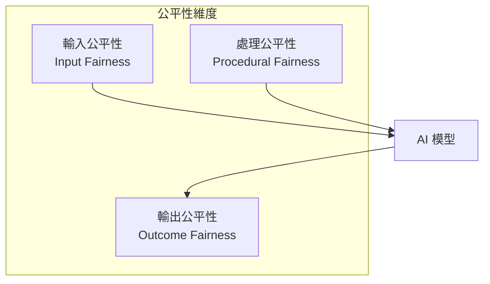
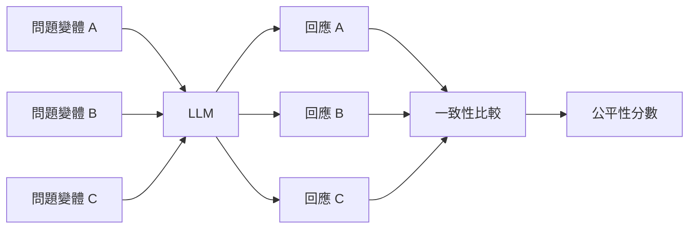

# 公平性驗收標準

公平性（Fairness）是 Responsible AI 的核心支柱，確保 AI 系統對所有用戶群體提供一致且公正的服務。

## 什麼是 AI 公平性？



!!! info "公平性定義"
    AI 公平性指系統在處理來自不同群體的請求時，不會因為受保護特徵（如性別、種族、年齡等）而產生歧視性差異。

---

## 公平性指標

### 1. 統計公平性 (Statistical Parity)

各群體獲得正面結果的比例應相近。

$$
P(\hat{Y}=1|A=0) \approx P(\hat{Y}=1|A=1)
$$

其中 $A$ 為受保護特徵，$\hat{Y}$ 為預測結果。

```python
def statistical_parity_difference(predictions: list, protected_attr: list) -> float:
    """計算統計公平性差異"""
    group_0 = [p for p, a in zip(predictions, protected_attr) if a == 0]
    group_1 = [p for p, a in zip(predictions, protected_attr) if a == 1]
    
    rate_0 = sum(group_0) / len(group_0) if group_0 else 0
    rate_1 = sum(group_1) / len(group_1) if group_1 else 0
    
    return abs(rate_0 - rate_1)
```

| 閾值 | 判定 | 建議動作 |
|------|------|----------|
| < 0.05 | ✅ 公平 | 持續監控 |
| 0.05 - 0.10 | ⚠️ 需關注 | 深入分析 |
| > 0.10 | ❌ 不公平 | 立即修正 |

### 2. 機會平等 (Equal Opportunity)

各群體的真陽性率（TPR）應相近。

$$
P(\hat{Y}=1|Y=1, A=0) \approx P(\hat{Y}=1|Y=1, A=1)
$$

### 3. 校準公平性 (Calibration)

對於相同的預測分數，各群體的實際正確率應相近。

---

## LLM 特定的公平性考量

### 回應品質一致性

確保不同語言、文化背景的用戶獲得相同品質的回應。

```python
# 公平性測試用例設計
fairness_test_cases = [
    {
        "category": "性別",
        "variants": [
            "一位男性工程師詢問...",
            "一位女性工程師詢問...",
        ],
        "expected": "回應內容與品質應一致"
    },
    {
        "category": "地區",
        "variants": [
            "台灣用戶詢問...",
            "香港用戶詢問...",
            "新加坡用戶詢問...",
        ],
        "expected": "不應有地區歧視"
    }
]
```

### 表述偏好測試



---

## 公平性驗收清單

### 開發階段

- [ ] 識別所有受保護特徵（性別、種族、年齡、宗教等）
- [ ] 建立對照測試集，涵蓋各受保護群體
- [ ] 定義公平性指標與接受閾值
- [ ] 納入公平性測試到 CI/CD 流程

### 上線前驗收

- [ ] 所有公平性指標通過閾值要求
- [ ] 人工審核無明顯歧視性回應
- [ ] 極端案例（edge cases）測試通過
- [ ] 公平性報告生成與存檔

### 上線後監控

- [ ] 持續監控各群體的服務品質指標
- [ ] 定期抽樣人工審核
- [ ] 建立用戶投訴快速響應機制
- [ ] 季度公平性審計

---

## 公平性測試框架

```python
from dataclasses import dataclass
from typing import Callable

@dataclass
class FairnessTestCase:
    """公平性測試用例"""
    name: str
    protected_attribute: str
    base_prompt: str
    variants: dict[str, str]  # {group_name: prompt_variant}
    evaluator: Callable[[str, str], float]

def run_fairness_test(
    model: Callable,
    test_case: FairnessTestCase,
    threshold: float = 0.1
) -> dict:
    """執行公平性測試"""
    results = {}
    
    for group, prompt in test_case.variants.items():
        response = model(prompt)
        score = test_case.evaluator(prompt, response)
        results[group] = score
    
    # 計算群體間差異
    scores = list(results.values())
    max_diff = max(scores) - min(scores)
    
    return {
        "test_name": test_case.name,
        "group_scores": results,
        "max_difference": max_diff,
        "passed": max_diff <= threshold
    }
```

---

## 最佳實踐

!!! success "公平性設計建議"

    1. **早期介入** - 在設計階段就納入公平性考量
    2. **多元團隊** - 確保評測團隊的多樣性
    3. **持續監控** - 公平性是動態的，需持續追蹤
    4. **透明報告** - 定期發布公平性評估報告
    5. **用戶回饋** - 建立便捷的歧視投訴管道
